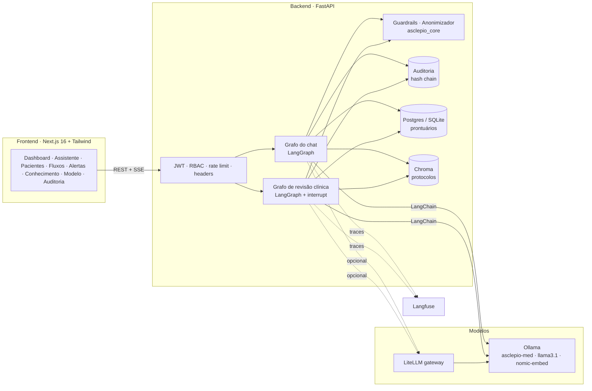

<p align="center">
  
</p>

<p align="center">
  <b>Assistente clínico com LLM fine-tunada + LangChain/LangGraph, guardrails, RAG com fontes, anonimização e auditoria.</b><br>
  Tech Challenge · FIAP Pós-Tech IA para Devs (8IADT) · Fase 3 · Hospital Universitário FIAP (fictício)
</p>

<p align="center">
  <a href="#-instalação-em-1-comando">Instalação</a> ·
  <a href="#-o-que-o-asclépio-faz">Funcionalidades</a> ·
  <a href="#-arquitetura">Arquitetura</a> ·
  <a href="#-fine-tuning">Fine-tuning</a> ·
  <a href="#-segurança-e-políticas">Segurança</a> ·
  <a href="#-documentação">Docs</a> ·
  <a href="docs/ROTEIRO_VIDEO.md">Roteiro do vídeo</a>
</p>

---

## 🎯 O desafio

> *"Criar um assistente virtual médico treinado com os dados próprios do hospital, capaz de auxiliar nas condutas clínicas, responder dúvidas de médicos e sugerir procedimentos com base nos protocolos internos — e organizar fluxos de decisão automatizados e seguros, coordenados com LangChain."*

| Requisito do desafio | Como o Asclépio atende |
|---|---|
| **Fine-tuning de LLM** com protocolos, FAQs e modelos de laudos/receitas | Pipeline `ml/` (LoRA/PEFT) → modelo **`asclepio-med`** servido no Ollama. Dados preparados com **pré-processamento, anonimização e curadoria** (`asclepio_core.anonymizer`). Relatório em [`docs/FINE_TUNING.md`](docs/FINE_TUNING.md). |
| **Assistente com LangChain** integrando a LLM customizada, consultando base estruturada e contextualizando com dados do paciente | Grafo de chat em LangGraph (`backend/asclepio_api/services/assistant.py`): RAG sobre protocolos (Chroma) + contexto do prontuário (SQL via SQLAlchemy) **anonimizado** antes de chegar à LLM. |
| **Fluxos de decisão automatizados e seguros** (verificar exames pendentes, sugerir tratamentos, emitir alertas) | Grafo **LangGraph** de revisão clínica com 10 nós, regras determinísticas (qSOFA/NEWS2/valores críticos), alertas à equipe e **validação humana obrigatória** (`interrupt`) antes de concluir. |
| **Segurança e validação**: limites (nunca prescrever sem validação humana), logging detalhado, explainability | Guardrails de entrada/saída em código testável; auditoria **append-only com cadeia de hashes**; citações `[n]` com documento/seção/score e visualização do **contexto exato enviado à LLM**; JWT + RBAC + rate limit + Langfuse. |
| **Código modularizado em Python + README completo** | Monorepo `uv` (core / backend / ml), FastAPI, testes, CI, Docker, docs e ADRs. Frontend Next.js para demonstração. |
| **Dataset anonimizado / sintético** | 24 prontuários sintéticos (Faker, PII fictícia de propósito), 16 protocolos, 10 modelos de documento, 167 FAQs, 233 instruções seed + amostras dos datasets sugeridos (**PubMedQA** e **MedQuAD**, ≤ 10 %) → dataset SFT em `data/processed/`. |
| **Diagrama do fluxo LangChain** | Gerados pelo próprio LangGraph em [`docs/diagramas/`](docs/diagramas/) e exibidos na UI (`/fluxos`). |

## 🚀 Instalação em 1 comando

**Opção A — instalador de 1 linha** (macOS ou Linux; no Windows use WSL2/Ubuntu). Instala o que faltar (git, Docker, Ollama), clona o repositório em `~/asclepio` e sobe tudo:

```bash
curl -fsSL https://raw.githubusercontent.com/rodrigogrosa/asclepio/main/install.sh | bash
```

> Variáveis opcionais: `ASCLEPIO_DIR=/outro/caminho`, `ASCLEPIO_FULL=1` (sobe também LiteLLM + Langfuse), `ASCLEPIO_NO_OLLAMA=1` (usa Ollama em container em vez de instalar). Exemplo: `ASCLEPIO_FULL=1 bash <(curl -fsSL https://raw.githubusercontent.com/rodrigogrosa/asclepio/main/install.sh)`.

**Opção B — já tem Docker** (e, de preferência, [Ollama](https://ollama.com) nativo — em Mac Apple Silicon usa a GPU Metal; o bootstrap detecta e usa automaticamente, senão sobe um Ollama em container):

```bash
git clone https://github.com/rodrigogrosa/asclepio.git && cd asclepio
make setup
```

O `make setup` (script [`scripts/bootstrap.sh`](scripts/bootstrap.sh)) verifica pré-requisitos, cria o `.env` com `SECRET_KEY` aleatório, decide Ollama host/container, baixa os modelos (`nomic-embed-text`, `llama3.1:8b`), cria o `asclepio-med` se os artefatos de fine-tuning existirem, constrói as imagens, sobe **Postgres + API + Web**, indexa a base de conhecimento e valida o `/health`.

| Serviço | URL | Credenciais demo |
|---|---|---|
| 🌐 Web (Next.js) | http://localhost:3000 | admins reais (senha gerada) ou demo `dra.ana@asclepio.fiap` / `Asclepio@2026` |
| 🔌 API (FastAPI / Swagger) | http://localhost:8000/docs | Bearer JWT |
| 📈 Métricas Prometheus | http://localhost:8000/metrics | — |

Personalize o hospital no `.env`: `APP_HOSPITAL_NAME="Hospital Santa Casa"`, `APP_HOSPITAL_SHORT_NAME=HSC` (aparece na interface e nos prompts). Em produção defina `SEED_DEMO_USERS=false`.

Outros perfis:

```bash
make up-full      # + LiteLLM (http://localhost:4000/ui) + Langfuse (http://localhost:3001, admin@asclepio.fiap / Asclepio@2026)
make down         # para tudo
make logs         # acompanha api/web
```

> **Usuários reais (admins)**: `admin@asclepio.fiap` e `rodrigo.grosa2011@gmail.com` — senhas iniciais fortes geradas pelo `make setup` (exibidas no final e guardadas no `.env`); no 1º acesso o sistema exige **troca de senha** e ativação do **app autenticador (MFA/TOTP)**.
> **Usuários de demonstração** (senha `Asclepio@2026`, só se `SEED_DEMO_USERS=true`): `dra.ana@asclepio.fiap` e `dr.marcos@asclepio.fiap` (médicos), `enf.carla@asclepio.fiap` (enfermagem), `auditor@asclepio.fiap` (auditor). O RBAC muda o que cada um vê e pode fazer.

### Desenvolvimento local (hot-reload, sem Docker)

```bash
make install   # uv sync --all-packages + npm install + pre-commit
make dev       # API em :8000 (uvicorn --reload) + Web em :3000
make check     # ruff + pytest + eslint + tsc  (o que a CI roda)
```

Sem Ollama/rede? `LLM_PROVIDER=fake EMBEDDINGS_PROVIDER=fake make api` sobe a API com um modelo determinístico (é assim que os testes e a CI rodam).

### Troubleshooting rápido

| Sintoma | Causa / solução |
|---|---|
| `Bind for 0.0.0.0:3000 failed: port is already allocated` | Outra aplicação (ou outro compose) usa a porta. Defina `WEB_PORT=3100` (ou `API_PORT`, `LITELLM_PORT`, `LANGFUSE_PORT`) no `.env` e rode `make up` de novo — o bootstrap ajusta o CORS automaticamente. |
| API usa `llama3.1:8b` e não `asclepio-med` | O modelo fine-tunado ainda não foi criado no Ollama: `make finetune` (ou só `make export` se já treinou). A UI mostra o badge "fine-tuned" quando ativo. |
| Ollama lento dentro do Docker (Mac) | Instale o Ollama nativo; o bootstrap detecta e usa `host.docker.internal` (variável `OLLAMA_BASE_URL_DOCKER`). `OLLAMA_BASE_URL` continua `localhost` para o `make dev`. |
| `/health` em `degraded` | Veja `make logs`: Ollama inacessível, base de conhecimento vazia ou banco indisponível. `make reindex` reindexa a base. |
| Quero tudo offline/sem Ollama | `LLM_PROVIDER=fake EMBEDDINGS_PROVIDER=fake` (modo determinístico usado pelos testes). |

## ✨ O que o Asclépio faz

<table>
<tr><td width="50%">

**🗣️ Assistente (chat)** — pergunte sobre protocolos, exames, documentos ou sobre um paciente selecionado. Respostas em streaming com **citações `[n]`** (documento › seção › score), badge do guardrail, intenção detectada, modelo usado, latência, confiança e contagem de PII redigida. Botão "ver contexto anonimizado" mostra **exatamente** o que a LLM recebeu.

**🧬 Fluxos clínicos (LangGraph)** — "Executar revisão clínica" em um paciente: carrega/anonimiza o prontuário → verifica exames pendentes/atrasados → triagem de risco (qSOFA, NEWS2, valores críticos) → alerta imediato se crítico → RAG nos protocolos → LLM sugere condutas citando fontes → guardrails → alertas à equipe → **pausa para validação humana** → finaliza e audita. Timeline de cada nó com duração e dados.

**🚨 Alertas** — criados por regras e fluxos (exames atrasados, valores críticos, gatilhos de protocolo), com reconhecimento pela equipe.

</td><td width="50%">

**📚 Base de conhecimento** — 16 protocolos, 10 modelos de documentos e 167 FAQs com busca semântica e visualização; reindexação pelo admin.

**🧠 Modelo** — model card do `asclepio-med`: base, LoRA, hiperparâmetros, loss, métricas **base vs fine-tuned** (ROUGE-L, BLEU, cobertura de termos, juiz LLM, conformidade com guardrails, latência) e métricas do RAG (hit@5, MRR); troca de modelo pelo admin.

**🧾 Auditoria** — toda ação (login, consulta a paciente, pergunta, bloqueio, fluxo, decisão, alerta, reindexação) fica em uma trilha **append-only com cadeia de hashes**; botão "verificar integridade" prova que nada foi alterado.

**🔭 Observabilidade** — logs estruturados (structlog) com `X-Request-ID`, métricas Prometheus, traces de LLM no **Langfuse**, gateway **LiteLLM** opcional.

</td></tr>
</table>

## 🏗️ Arquitetura



Mais detalhes, decisões e diagramas de sequência em [`docs/ARQUITETURA.md`](docs/ARQUITETURA.md) e nos ADRs em [`docs/adr/`](docs/adr/).

### Estrutura do repositório

```
asclepio/
├── packages/asclepio_core/   # anonimização (LGPD), regras clínicas, guardrails, base de conhecimento, dados sintéticos
├── backend/                  # FastAPI + LangChain/LangGraph (auth, pacientes, assistente, fluxos, alertas, RAG, auditoria)
├── frontend/                 # Next.js (identidade visual FIAP), modo mock para demo offline
├── ml/                       # prepare → train (LoRA) → export (Ollama) → evaluate; registry.json e relatórios
├── data/                     # knowledge_base/ (protocolos, modelos, FAQ) · synthetic/ · processed/ (dataset SFT)
├── docs/                     # relatório técnico, arquitetura, políticas, ADRs, diagramas, roteiro do vídeo, identidade
├── infra/                    # LiteLLM, Ollama init, Postgres init
├── docker-compose.yml · Makefile · scripts/bootstrap.sh · .github/workflows/ci.yml · .devcontainer/
```

## 🧠 Fine-tuning

```bash
make prepare   # dataset SFT (anonimizado, curado, estratificado; inclui amostras PubMedQA/MedQuAD) → data/processed/
make train     # LoRA (PEFT) sobre Qwen2.5-0.5B-Instruct por padrão (MPS/CUDA/CPU) → ml/runs/ + ml/registry.json
make export    # merge do adapter → ml/models/asclepio-med → `ollama create asclepio-med`
make eval      # base vs fine-tuned + RAG → ml/reports/eval_latest.json + gráficos em docs/assets/eval/
make finetune  # tudo acima
```


<!-- ML_RESULTS_START -->
Resultado real da última execução (Mac Apple Silicon, 21.74 min de treino, 1801 exemplos, com amostras PubMedQA/MedQuAD) — avaliação em 120 perguntas *held-out* + 15 prompts de segurança:

| Modelo | ROUGE-L | BLEU | Conformidade guardrails | Recusa correta | Latência |
|---|---|---|---|---|---|
| Base Qwen2.5-0.5B | 0.12 | 3.0 | 77% | 47% | 1.3 s |
| **asclepio-med (fine-tuned)** | **0.36** | **27.6** | **95%** | **80%** | 0.9 s |
| llama3.1:8b (referência) | 0.12 | 3.8 | 84% | 53% | 2.7 s |

RAG: hit@5 = 97%, MRR = 0.91. Gráficos em `docs/assets/eval/`.
<!-- ML_RESULTS_END -->

O processo completo (dados, anonimização, curadoria, LoRA, hiperparâmetros, avaliação e análise crítica) está em [`docs/FINE_TUNING.md`](docs/FINE_TUNING.md) e no [`ml/README.md`](ml/README.md). A API detecta o `asclepio-med` no Ollama e usa fallback (`llama3.1:8b`) se ele ainda não existir.

## 🔐 Segurança e políticas

- **Autenticação forte**: senhas bcrypt + **política de senha**, **bloqueio após 5 tentativas**, **MFA com app autenticador (TOTP)** com códigos de recuperação (obrigatório para admins), **sessões com refresh token rotativo e revogação** (logout imediato, detecção de reuso), troca de senha obrigatória no 1º acesso, gestão de usuários pelo admin — tudo auditado.
- **Autorização por perfil** (RBAC declarativo em [`core/policies.py`](backend/asclepio_api/core/policies.py)): o **médico** vê só o que é responsabilidade dele (pacientes, assistente, fluxos, alertas, protocolos); **IA & Modelos, base de conhecimento (gestão), usuários/profissionais, catálogos e configurações são exclusivos do admin**; auditor vê auditoria; só médico/admin **aprovam** fluxos. Médicos têm CRM e especialidade obrigatórios (catálogo administrável).
- **LGPD / anonimização**: CPF, CNS, RG, telefone, e-mail, endereço, datas de nascimento e nomes são redigidos antes de qualquer prompt; o usuário vê quantos dados foram removidos.
- **Guardrails**: bloqueio de *prompt injection*, recusa educada a pedidos de prescrição direta, redirecionamento fora de escopo, reescrita de linguagem prescritiva na saída, aviso de validação humana obrigatório, PII residual.
- **Auditoria**: trilha append-only com `prev_hash`/`hash` (SHA-256), verificação de integridade, `trace_id` ponta a ponta.
- **Infra**: headers de segurança, CORS restrito, limite de corpo, usuário não-root nos containers, `gitleaks` e `pip-audit` na CI, segredos só por `.env`.

Tudo documentado em [`docs/POLITICAS.md`](docs/POLITICAS.md).

## 🧪 Qualidade

`make check` roda **ruff**, **pytest** (core + API em modo fake + ml), **eslint** e **tsc**. A CI ([`.github/workflows/ci.yml`](.github/workflows/ci.yml)) repete isso, constrói as imagens Docker e roda gitleaks/pip-audit. Pre-commit configurado (`make install`).

## 📚 Documentação

| Documento | Conteúdo |
|---|---|
| [`docs/EVIDENCIAS.md`](docs/EVIDENCIAS.md) | **Onde cada exigência do Tech Challenge aparece no sistema** (tela + arquivo + comando) — guia para avaliação |
| [`docs/RELATORIO_TECNICO.md`](docs/RELATORIO_TECNICO.md) · [PDF](docs/RELATORIO_TECNICO.pdf) | Relatório técnico da Fase 3 (fine-tuning, assistente, diagramas, avaliação e resultados) — PDF com anexos via `make docs-pdf` |
| [`docs/FINE_TUNING.md`](docs/FINE_TUNING.md) | Processo de fine-tuning em detalhe, métricas e análise |
| [`docs/ARQUITETURA.md`](docs/ARQUITETURA.md) | Componentes, fluxos de dados, diagramas de sequência, decisões |
| [`docs/CONTRATO_API.md`](docs/CONTRATO_API.md) | Contrato REST/SSE (tipos e endpoints) |
| [`docs/POLITICAS.md`](docs/POLITICAS.md) | Políticas de autenticação, autorização, dados, guardrails e auditoria |
| [`docs/adr/`](docs/adr/) | Decisões de arquitetura (ADRs) |
| [`docs/ROTEIRO_VIDEO.md`](docs/ROTEIRO_VIDEO.md) | Roteiro do vídeo de demonstração (≤ 15 min) |
| [`docs/IDENTIDADE_VISUAL.md`](docs/IDENTIDADE_VISUAL.md) | Nome, logo, tokens e padrões de UI |
| [`data/knowledge_base/README.md`](data/knowledge_base/README.md) | Formato e conteúdo da base de conhecimento fictícia |
| [`CONTRIBUTING.md`](CONTRIBUTING.md) · [`SECURITY.md`](SECURITY.md) | Como contribuir · política de segurança |

## ⚠️ Aviso

Projeto **acadêmico**. Todo o conteúdo clínico (protocolos, doses, pacientes) é **fictício/sintético** e não deve ser usado para decisões reais. O Asclépio **não prescreve**: toda sugestão exige validação de um profissional habilitado.

## 📄 Licença

MIT — veja [`LICENSE`](LICENSE).
