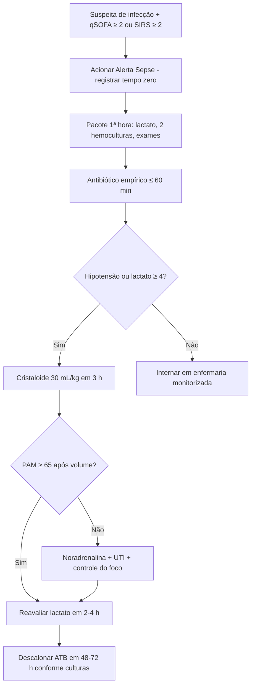

# PROT-001 — Protocolo de Sepse e Choque Séptico

## Objetivo
Padronizar o reconhecimento precoce, a estratificação e o tratamento da sepse e do choque séptico em pacientes adultos no Hospital Universitário FIAP (HU-FIAP), reduzindo o tempo porta-antibiótico, a mortalidade e a variabilidade de conduta entre equipes do Pronto-Socorro, enfermarias e UTI.

## Definições e critérios diagnósticos
- **Infecção suspeita ou confirmada:** foco clínico identificado ou forte suspeita (pulmonar, urinário, abdominal, pele/partes moles, cateter, SNC).
- **Sepse (Sepsis-3):** disfunção orgânica ameaçadora à vida causada por resposta desregulada à infecção, operacionalizada como aumento agudo ≥ 2 pontos no escore SOFA.
- **Choque séptico:** sepse com necessidade de vasopressor para manter PAM ≥ 65 mmHg **e** lactato > 2 mmol/L (18 mg/dL) apesar de ressuscitação volêmica adequada.
- **Triagem (enfermagem/PS):** qSOFA ≥ 2 (FR ≥ 22 irpm, PAS ≤ 100 mmHg, alteração do nível de consciência) ou SIRS ≥ 2 (T > 38 °C ou < 36 °C; FC > 90 bpm; FR > 20 irpm ou PaCO2 < 32 mmHg; leucócitos > 12.000 ou < 4.000/mm³) **com suspeita de infecção** aciona o "Alerta Sepse".
- O qSOFA não deve ser usado isoladamente para excluir sepse; baixa sensibilidade.

## Avaliação inicial
1. Acionar "Alerta Sepse" no sistema; registrar o **tempo zero** (chegada ao PS ou momento de reconhecimento na enfermaria).
2. Monitorização contínua: PA não invasiva a cada 5–15 min, FC, FR, SpO2, temperatura, diurese (sonda vesical se choque).
3. Anamnese dirigida ao foco infeccioso; história de internação recente, uso de antibióticos nos últimos 90 dias, dispositivos invasivos, imunossupressão, alergias.
4. Exame físico completo com atenção a perfusão periférica (tempo de enchimento capilar > 3 s, livedo, extremidades frias) e nível de consciência.
5. Avaliação médica em até 10 minutos do acionamento do alerta.

## Exames recomendados
- **Pacote 1ª hora:** lactato arterial ou venoso; 2 pares de hemoculturas (sítios diferentes, **antes** do antibiótico, sem atrasar a administração > 45 min); hemograma; PCR; creatinina, ureia, eletrólitos; bilirrubinas; coagulograma; gasometria arterial; glicemia; urina tipo I e urocultura; culturas de outros sítios suspeitos.
- **Imagem conforme foco:** radiografia de tórax, ultrassonografia point-of-care, TC de abdome quando indicado.
- **Lactato de controle** em 2–4 h se inicial > 2 mmol/L.
- Procalcitonina é opcional para guiar descalonamento, não para iniciar antibiótico.

## Conduta
1. **Antibiótico em até 1 hora** do reconhecimento (meta institucional: ≤ 60 min; choque séptico: imediatamente). Escolha empírica conforme foco e perfil de resistência do HU-FIAP (ver tabela); em choque sem foco definido, usar esquema de amplo espectro.
2. **Ressuscitação volêmica:** cristaloide balanceado (Ringer lactato preferencial) **30 mL/kg** nas primeiras 3 h se hipotensão ou lactato ≥ 4 mmol/L; reavaliar com parâmetros dinâmicos (elevação passiva das pernas, variação de pressão de pulso, US de veia cava) antes de bolus adicionais.
3. **Vasopressor:** noradrenalina é a 1ª escolha se PAM < 65 mmHg após ou durante a volemia; pode ser iniciada em acesso periférico calibroso por curto período enquanto se obtém acesso central. Associar vasopressina se noradrenalina ≥ 0,25–0,5 mcg/kg/min.
4. **Corticoide:** hidrocortisona 200 mg/dia em choque com necessidade persistente de vasopressor (≥ 4 h de noradrenalina ≥ 0,25 mcg/kg/min).
5. **Controle do foco** em até 6–12 h (drenagem de abscesso, retirada de cateter, desbridamento, desobstrução urinária).
6. **Reavaliação a cada 1 h** nas primeiras 6 h: PAM, diurese (alvo ≥ 0,5 mL/kg/h), lactato, perfusão.
7. **Descalonamento** em 48–72 h conforme culturas; duração habitual 7–10 dias.
8. Medidas de suporte: oxigênio para SpO2 92–96%, glicemia alvo 140–180 mg/dL, profilaxia de TEV (PROT-006), cabeceira elevada.

## Medicamentos e doses usuais
| Medicamento | Dose | Via | Observações |
|---|---|---|---|
| Ringer lactato / SF 0,9% | 30 mL/kg em até 3 h; bolus de 500 mL reavaliados | IV | Preferir balanceado; cautela em IC e DRC |
| Noradrenalina | 0,05–0,1 mcg/kg/min, titular até PAM ≥ 65 mmHg (máx. usual 1–2 mcg/kg/min) | IV contínua | 1ª linha; acesso central assim que possível |
| Vasopressina | 0,03 UI/min (dose fixa) | IV contínua | Associar se noradrenalina ≥ 0,25 mcg/kg/min |
| Hidrocortisona | 50 mg 6/6 h (200 mg/dia) | IV | Choque refratário; retirar ao suspender vasopressor |
| Piperacilina-tazobactam | 4,5 g 6/6 h (infusão estendida 4 h) | IV | Foco abdominal, pulmonar nosocomial, sem foco |
| Ceftriaxona | 1–2 g 1x/dia | IV | PAC sem fatores de risco (associar macrolídeo); ITU alta comunitária |
| Meropenem | 1 g 8/8 h | IV | Suspeita de ESBL, internação recente, choque grave |
| Vancomicina | Ataque 25 mg/kg, manutenção 15–20 mg/kg 12/12 h (nível 15–20) | IV | Suspeita de MRSA, cateter, infecção de partes moles grave |
| Cefepima | 2 g 8/8 h | IV | Neutropenia febril (ver protocolo oncológico) |

## Critérios de gravidade e alerta
- Lactato > 2 mmol/L (alerta) e ≥ 4 mmol/L (gravidade/UTI).
- PAS < 90 mmHg ou PAM < 65 mmHg ou queda de PAS > 40 mmHg do basal.
- FR ≥ 22 irpm; SpO2 < 90% em ar ambiente ou necessidade de O2 > 4 L/min.
- Alteração aguda do nível de consciência (Glasgow < 15).
- Diurese < 0,5 mL/kg/h por ≥ 2 h; creatinina > 2 mg/dL ou aumento ≥ 0,3 mg/dL.
- Plaquetas < 100.000/mm³; INR > 1,5; bilirrubina > 2 mg/dL.
- Necessidade de vasopressor em qualquer dose.
- Falha de clareamento do lactato (< 10–20% em 2 h).

## Critérios de internação, UTI e alta
- **Internação:** todo paciente com sepse (SOFA ≥ 2).
- **UTI (acionar time de resposta rápida):** choque séptico; lactato ≥ 4 mmol/L; necessidade de vasopressor; insuficiência respiratória com necessidade de VNI/IOT; disfunção de ≥ 2 órgãos; rebaixamento do nível de consciência.
- **Enfermaria com monitorização:** sepse sem choque, lactato < 4 mmol/L com clareamento, sem necessidade de O2 de alto fluxo.
- **Alta hospitalar:** afebril ≥ 48 h, estável hemodinamicamente sem vasopressor ≥ 24 h, lactato normalizado, via oral funcionante, possibilidade de terapia oral/sequencial, foco controlado e retorno ambulatorial agendado em 7 dias.

## Fluxograma

## Perguntas frequentes da equipe
**P:** Posso esperar o resultado da hemocultura para iniciar o antibiótico?
**R:** Não. As hemoculturas devem ser colhidas antes, mas nunca atrasar o antibiótico além de 45 minutos; a meta é ≤ 60 min do reconhecimento.

**P:** Qual o alvo de lactato na reavaliação?
**R:** Normalização (< 2 mmol/L) ou queda ≥ 10–20% a cada 2 h. Se não houver clareamento, reavaliar volemia, foco e antibiótico.

**P:** Quando iniciar noradrenalina?
**R:** Se PAM < 65 mmHg persistir durante ou após a volemia inicial; não é necessário completar os 30 mL/kg antes de iniciar em pacientes graves.

**P:** Paciente com insuficiência cardíaca também recebe 30 mL/kg?
**R:** Recomenda-se bolus fracionados de 250–500 mL com reavaliação dinâmica, podendo atingir a meta se houver resposta, sob monitorização estrita.

**P:** Quando suspender a hidrocortisona?
**R:** Ao desmamar o vasopressor, geralmente em 3–5 dias, sem necessidade de redução gradual.

## Referências
1. Evans L, et al. Surviving Sepsis Campaign: International Guidelines for Management of Sepsis and Septic Shock 2021. Crit Care Med. 2021.
2. Singer M, et al. The Third International Consensus Definitions for Sepsis and Septic Shock (Sepsis-3). JAMA. 2016.
3. Instituto Latino-Americano de Sepse (ILAS). Roteiro de implementação de protocolo assistencial gerenciado de sepse. 2022.
4. Comissão de Protocolos Clínicos HU-FIAP. Ata de revisão PROT-001, março/2026.

---
*Protocolo institucional fictício para fins acadêmicos (Tech Challenge FIAP). Não substitui diretrizes oficiais nem julgamento clínico.*
