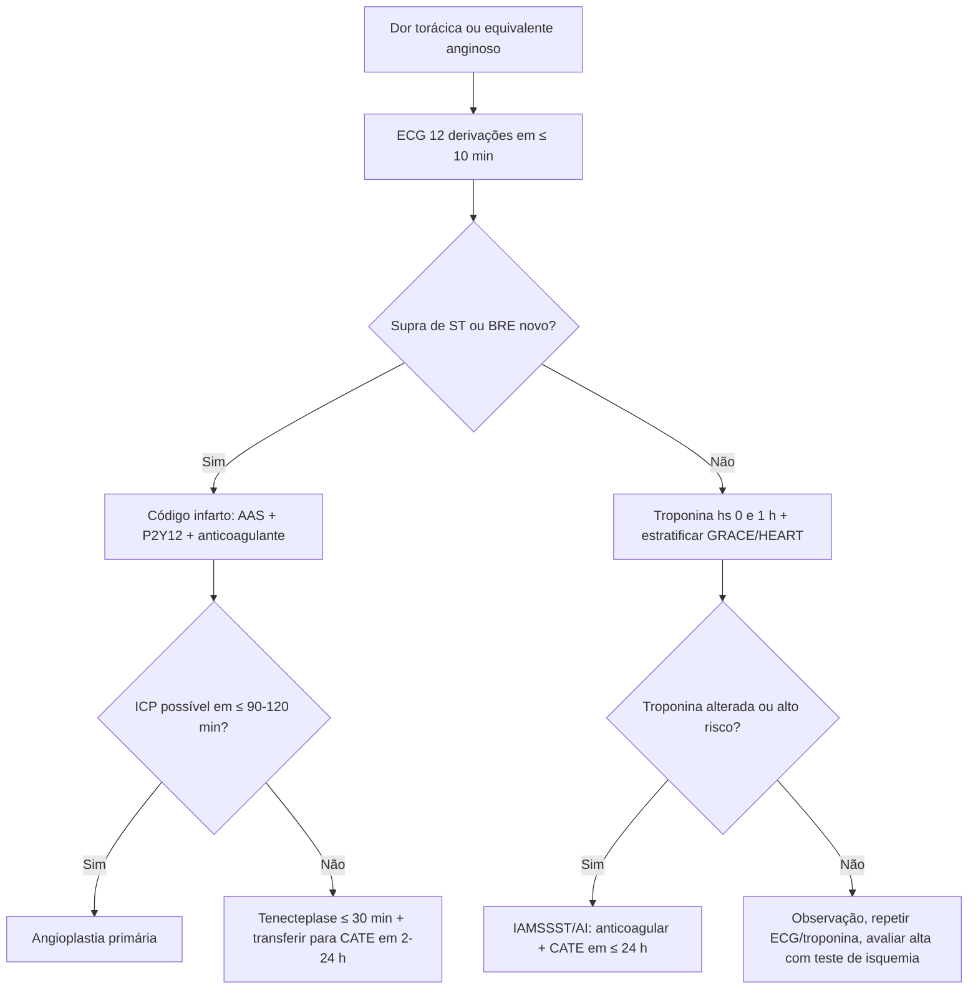

# PROT-002 — Protocolo de Síndrome Coronariana Aguda (SCA)

## Objetivo
Garantir reconhecimento rápido, estratificação de risco e tratamento oportuno da síndrome coronariana aguda no HU-FIAP, com metas institucionais de ECG em ≤ 10 minutos da chegada, reperfusão com tempo porta-balão ≤ 90 minutos (ou porta-agulha ≤ 30 minutos quando a angioplastia primária não for possível em até 120 minutos) e redução de eventos isquêmicos recorrentes.

## Definições e critérios diagnósticos
- **SCA:** espectro de isquemia miocárdica aguda — angina instável (AI), infarto sem supradesnivelamento de ST (IAMSSST) e infarto com supradesnivelamento de ST (IAMCSST).
- **IAMCSST:** dor torácica típica (ou equivalente) + supradesnivelamento de ST ≥ 1 mm em ≥ 2 derivações contíguas (≥ 2 mm em V2–V3 em homens ≥ 40 anos; ≥ 2,5 mm em homens < 40; ≥ 1,5 mm em mulheres), bloqueio de ramo esquerdo novo ou presumivelmente novo, ou padrão de IAM posterior (infra de ST V1–V3 com supra em V7–V9).
- **IAMSSST:** dor sugestiva + elevação/queda de troponina de alta sensibilidade acima do percentil 99, com ou sem alterações de ST-T.
- **Angina instável:** quadro clínico compatível sem elevação de troponina.
- **Quarta Definição Universal de IAM:** lesão miocárdica aguda com evidência clínica de isquemia.

## Avaliação inicial
1. Triagem: dor torácica, dispneia, síncope ou equivalente anginoso em > 30 anos → classificação vermelha/laranja; **ECG de 12 derivações em ≤ 10 min** interpretado por médico.
2. Monitorização cardíaca contínua, acesso venoso, oximetria; desfibrilador próximo.
3. Anamnese dirigida: características da dor, início (horário exato), fatores de risco, uso de cocaína, contraindicações à trombólise, sangramentos, uso de anticoagulante.
4. Exame físico: sinais de IC (Killip), sopros novos, pulsos assimétricos (dissecção), perfusão.
5. Escores: HEART ou TIMI para dor torácica indiferenciada; GRACE para IAMSSST (> 140 = alto risco).

## Exames recomendados
- ECG seriado (0, 15–30 min se primeiro não diagnóstico, e a cada recorrência de dor); derivações V3R, V4R, V7–V9 se suspeita de VD/posterior.
- Troponina de alta sensibilidade 0 e 1 h (ou 0 e 3 h conforme disponibilidade), com algoritmo rápido.
- Hemograma, creatinina, eletrólitos, glicemia, perfil lipídico, coagulograma, BNP.
- Radiografia de tórax (sem atrasar reperfusão); ecocardiograma à beira-leito se instabilidade ou dúvida.
- Cineangiocoronariografia: imediata no IAMCSST; em ≤ 2 h no IAMSSST de muito alto risco; ≤ 24 h no alto risco (GRACE > 140).

## Conduta
1. **Medidas gerais:** repouso, O2 apenas se SpO2 < 90%, analgesia com morfina se dor refratária, controle de ansiedade.
2. **Antiagregação:** AAS 150–300 mg mastigado imediatamente + segundo antiagregante (ticagrelor 180 mg ou clopidogrel 300–600 mg; prasugrel 60 mg apenas após anatomia conhecida e sem AVC prévio).
3. **Anticoagulação:** enoxaparina 1 mg/kg SC 12/12 h (30 mg IV em bolus no IAMCSST trombolisado < 75 anos) ou heparina não fracionada 60 UI/kg (máx. 4.000 UI) em bolus + 12 UI/kg/h se ICP prevista.
4. **IAMCSST — reperfusão:** angioplastia primária se porta-balão ≤ 90 min (≤ 120 min se transferência); senão, **tenecteplase** em ≤ 30 min da chegada, seguida de transferência para cateterismo em 2–24 h (estratégia fármaco-invasiva). Não trombolisar se > 12 h de sintomas sem dor persistente.
5. **IAMSSST:** estratégia invasiva conforme risco (imediata se choque, dor refratária, arritmia maligna, IC aguda, instabilidade elétrica/hemodinâmica).
6. **Terapias adjuvantes:** betabloqueador oral em 24 h se sem IC/choque/bradicardia; estatina de alta potência (atorvastatina 80 mg) na admissão; IECA/BRA nas primeiras 24 h se FE < 40%, HAS, DM ou DRC; nitrato para dor/IC/HAS (contraindicado com uso de inibidor de PDE-5 em 24–48 h e no IAM de VD).
7. **Pós-reperfusão:** dupla antiagregação por 12 meses (ajustar pelo risco de sangramento), reabilitação cardíaca, controle de fatores de risco, vacinação anti-influenza.

## Medicamentos e doses usuais
| Medicamento | Dose | Via | Observações |
|---|---|---|---|
| AAS | 150–300 mg ataque (mastigar); 100 mg/dia manutenção | VO | Alergia verdadeira: usar clopidogrel isolado |
| Ticagrelor | 180 mg ataque; 90 mg 12/12 h | VO | Preferido em ICP; evitar se fibrinólise em > 75 anos |
| Clopidogrel | 300–600 mg ataque; 75 mg/dia | VO | Com fibrinólise: 300 mg (< 75 anos) ou 75 mg (≥ 75) |
| Enoxaparina | 1 mg/kg 12/12 h (≥ 75 anos: 0,75 mg/kg; ClCr < 30: 1x/dia) | SC | Bolus 30 mg IV no IAMCSST trombolisado < 75 anos |
| Heparina não fracionada | 60 UI/kg bolus (máx. 4.000) + 12 UI/kg/h (máx. 1.000/h) | IV | Alvo TTPa 1,5–2x; preferida se ICP imediata ou DRC |
| Tenecteplase | 30–50 mg conforme peso (0,5 mg/kg; metade da dose se ≥ 75 anos) | IV bolus | Porta-agulha ≤ 30 min; checar contraindicações |
| Atorvastatina | 80 mg/dia | VO | Iniciar na admissão |
| Metoprolol | 25–50 mg 12/12 h (ou succinato 25–100 mg/dia) | VO | Não em Killip ≥ II, FC < 60, PAS < 100 |
| Nitroglicerina | 5–10 mcg/min, titular a cada 5 min até 200 mcg/min | IV | Dor refratária, IC, HAS; não em IAM de VD |
| Morfina | 2–4 mg a cada 5–15 min | IV | Dor refratária; pode atrasar absorção de antiagregante oral |

## Critérios de gravidade e alerta
- Supradesnivelamento de ST ou BRE novo: acionar Hemodinâmica imediatamente (código infarto).
- PAS < 90 mmHg, sinais de choque cardiogênico (Killip IV), FC > 100 ou < 50 bpm.
- Killip ≥ II (estertores, B3), edema agudo de pulmão.
- Arritmias ventriculares sustentadas, BAV de 2º grau Mobitz II ou 3º grau.
- Dor isquêmica refratária após 20 min de terapia otimizada.
- GRACE > 140 ou troponina com elevação > 5x o percentil 99.
- Sangramento maior (queda Hb ≥ 3 g/dL ou transfusão) em uso de antitrombóticos.
- Complicações mecânicas: sopro novo, hipotensão súbita (CIV, insuficiência mitral aguda, ruptura de parede livre).

## Critérios de internação, UTI e alta
- **Unidade coronariana/UTI:** todo IAMCSST nas primeiras 24–48 h; IAMSSST de alto/muito alto risco; instabilidade hemodinâmica ou elétrica; pós-trombólise.
- **Enfermaria monitorizada:** IAMSSST de risco intermediário após cateterismo sem intercorrências.
- **Alta precoce (48–72 h):** IAMCSST com ICP primária bem-sucedida, FE > 40%, sem arritmias, sem isquemia residual, revascularização completa ou planejada.
- **Alta do PS (dor torácica de baixo risco):** HEART ≤ 3, troponinas seriadas negativas, ECG normal, sem recorrência de dor — orientar retorno ambulatorial e teste de isquemia em até 72 h.
- **Pré-alta:** ecocardiograma, orientação de DAPT, reabilitação cardíaca, retorno em 7–14 dias.

## Fluxograma

## Perguntas frequentes da equipe
**P:** Qual é o tempo-alvo porta-balão e porta-agulha no HU-FIAP?
**R:** Porta-balão ≤ 90 min (≤ 120 min em transferência) e porta-agulha ≤ 30 min quando a ICP primária não estiver disponível nesse prazo.

**P:** Posso dar oxigênio de rotina no infarto?
**R:** Não. Oxigênio suplementar apenas se SpO2 < 90%; hiperóxia pode ser deletéria.

**P:** Qual a dose de ataque de clopidogrel no paciente trombolisado com mais de 75 anos?
**R:** 75 mg (sem ataque de 300 mg), conforme protocolo; ticagrelor não é recomendado junto com fibrinólise nessa faixa etária.

**P:** Quando a troponina de alta sensibilidade pode ser considerada negativa?
**R:** Com valores abaixo do limite de detecção na chegada (≥ 3 h do início da dor) ou sem variação significativa entre 0 e 1 h, associados a ECG e clínica de baixo risco.

**P:** Nitrato é contraindicado em quais situações?
**R:** Hipotensão (PAS < 90), IAM de ventrículo direito, bradicardia < 50 ou taquicardia > 100 sem IC, e uso de inibidor de PDE-5 nas últimas 24–48 h.

## Referências
1. Byrne RA, et al. 2023 ESC Guidelines for the management of acute coronary syndromes. Eur Heart J. 2023.
2. Nicolau JC, et al. Diretrizes da Sociedade Brasileira de Cardiologia sobre Angina Instável e Infarto Agudo do Miocárdio sem Supradesnível do Segmento ST. Arq Bras Cardiol. 2021.
3. Thygesen K, et al. Fourth Universal Definition of Myocardial Infarction. Circulation. 2018.
4. Rao SV, et al. 2025 ACC/AHA Guideline for the Management of Patients With Acute Coronary Syndromes. 2025.
5. Comissão de Protocolos Clínicos HU-FIAP. Revisão PROT-002, fevereiro/2026.

---
*Protocolo institucional fictício para fins acadêmicos (Tech Challenge FIAP). Não substitui diretrizes oficiais nem julgamento clínico.*
