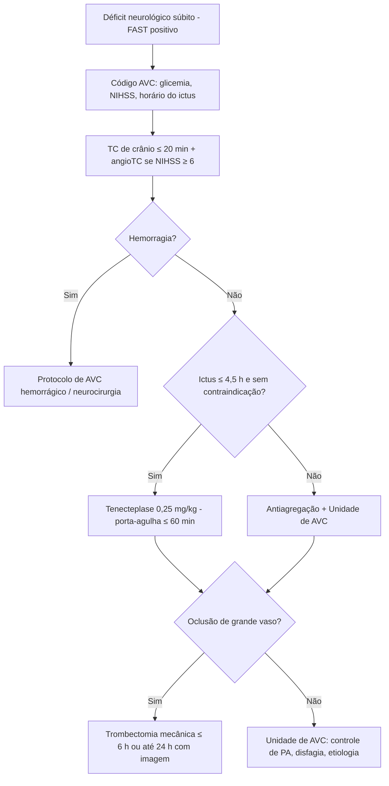

# PROT-003 — Protocolo de Acidente Vascular Cerebral Isquêmico Agudo

## Objetivo
Reduzir o tempo até a reperfusão e a incapacidade funcional no AVC isquêmico agudo no HU-FIAP por meio do "Código AVC", com metas: TC de crânio em ≤ 20 min da chegada, decisão e início da trombólise com tempo porta-agulha ≤ 60 min (meta ideal ≤ 45 min) e punção arterial para trombectomia ≤ 90 min.

## Definições e critérios diagnósticos
- **AVC isquêmico:** déficit neurológico focal de início súbito por oclusão arterial, confirmado por neuroimagem sem hemorragia.
- **AIT:** déficit transitório sem infarto em imagem; risco estratificado por ABCD2 (≥ 4 = alto risco).
- **Janelas terapêuticas:** trombólise IV até 4,5 h do início dos sintomas (ou do último momento visto bem); trombectomia mecânica até 6 h para oclusão de grande vaso (OGV) da circulação anterior, estendida até 24 h com seleção por imagem (perfusão/mismatch — critérios DAWN/DEFUSE-3).
- **Escalas:** NIHSS (gravidade: leve 0–4, moderado 5–15, grave 16–20, muito grave > 20); ASPECTS na TC (≥ 6 favorece trombectomia); mRS pré-mórbido (elegibilidade quando ≤ 2).
- **Trombolítico institucional:** o HU-FIAP padroniza **tenecteplase 0,25 mg/kg (máx. 25 mg) em bolus único** como alternativa equivalente à alteplase 0,9 mg/kg; a alteplase permanece disponível.

## Avaliação inicial
1. Triagem com escala pré-hospitalar (Cincinnati/FAST) → acionar **Código AVC** e registrar horário de início dos sintomas (ictus) ou último momento visto bem.
2. ABC, glicemia capilar imediata (corrigir se < 60 mg/dL — mimetiza AVC), monitorização, 2 acessos venosos, SpO2 ≥ 94%.
3. NIHSS pelo médico/neurologista em ≤ 10 min; peso estimado para dose.
4. Checklist de contraindicações à trombólise (hemorragia prévia, cirurgia maior < 14 dias, anticoagulante com INR > 1,7 ou DOAC < 48 h, plaquetas < 100.000, PA > 185/110 não controlada, glicemia < 50, AVC extenso < 3 meses, dissecção de aorta, endocardite).
5. Não aguardar resultados laboratoriais (exceto glicemia) para trombolisar se não houver suspeita de coagulopatia.

## Exames recomendados
- **TC de crânio sem contraste em ≤ 20 min** (excluir hemorragia; ASPECTS); **angioTC de crânio e pescoço** simultânea se NIHSS ≥ 6 ou suspeita de OGV; TC perfusão/RM se janela 6–24 h.
- Glicemia, hemograma, plaquetas, INR/TTPa, creatinina, eletrólitos, troponina, ECG (FA).
- Ecocardiograma, Holter/monitorização ≥ 24 h, doppler de carótidas/vertebrais e perfil lipídico durante a internação para etiologia (TOAST).
- Não atrasar imagem por exames laboratoriais.

## Conduta
1. **Pressão arterial:** se candidato à trombólise, reduzir para ≤ 185/110 mmHg antes e manter ≤ 180/105 por 24 h (labetalol ou nicardipina; no HU-FIAP, esmolol/nitroprussiato como alternativa). Se não trombolisado, tratar apenas se > 220/120 mmHg (reduzir 15% em 24 h).
2. **Trombólise IV:** tenecteplase 0,25 mg/kg bolus (máx. 25 mg) ou alteplase 0,9 mg/kg (máx. 90 mg; 10% em bolus, restante em 60 min), até 4,5 h, sem limite superior de idade. Suspender se cefaleia intensa, náusea, piora neurológica ou hipertensão aguda → TC imediata.
3. **Trombectomia mecânica:** OGV (carótida interna, M1, M2 proximal, basilar) com NIHSS ≥ 6, ASPECTS ≥ 6, mRS prévio ≤ 2, até 6 h; 6–24 h com imagem favorável. Trombólise prévia não deve atrasar a transferência para a Hemodinâmica.
4. **Antitrombótico:** AAS 160–300 mg em 24–48 h (após 24 h se trombolisado e TC de controle sem hemorragia); dupla antiagregação (AAS + clopidogrel) por 21 dias em AVC menor (NIHSS ≤ 3) ou AIT de alto risco; anticoagulação em FA após 2–14 dias conforme extensão do infarto.
5. **Cuidados na Unidade de AVC:** cabeceira 30°, disfagia rastreada antes de qualquer VO, glicemia 140–180 mg/dL, temperatura < 37,5 °C, SpO2 ≥ 94%, evitar hipotonicidade, profilaxia de TEV com compressão pneumática nas primeiras 24 h e enoxaparina após (PROT-006).
6. **Estatina de alta intensidade** e controle dos fatores de risco; reabilitação precoce (fisioterapia, fonoaudiologia, terapia ocupacional) em 24–48 h.
7. **Craniectomia descompressiva:** considerar em infarto maligno da ACM em < 60 anos dentro de 48 h.

## Medicamentos e doses usuais
| Medicamento | Dose | Via | Observações |
|---|---|---|---|
| Tenecteplase | 0,25 mg/kg bolus único (máx. 25 mg) | IV | Padrão institucional; até 4,5 h do ictus |
| Alteplase | 0,9 mg/kg (máx. 90 mg): 10% bolus + 90% em 60 min | IV | Alternativa; mesma janela |
| Labetalol | 10–20 mg em 1–2 min, repetir 1x; infusão 2–8 mg/min | IV | Controle pressórico pré/pós-trombólise |
| Nicardipina | 5 mg/h, titular 2,5 mg/h a cada 5–15 min (máx. 15 mg/h) | IV | Alternativa ao labetalol |
| Nitroprussiato | 0,3–0,5 mcg/kg/min, titular | IV | Se PA > 220/120 refratária; proteger da luz |
| AAS | 160–300 mg ataque; 100 mg/dia | VO/SNE | Após 24 h se trombolisado |
| Clopidogrel | 300 mg ataque; 75 mg/dia por 21 dias | VO/SNE | AVC menor ou AIT de alto risco, associado ao AAS |
| Atorvastatina | 40–80 mg/dia | VO/SNE | Iniciar na internação |
| Enoxaparina | 40 mg 1x/dia | SC | Profilaxia de TEV a partir de 24 h pós-trombólise |
| Glicose 50% | 20–30 mL se glicemia < 60 mg/dL | IV | Antes de qualquer outra medida |

## Critérios de gravidade e alerta
- NIHSS ≥ 16 ou piora ≥ 4 pontos em relação à avaliação anterior.
- Rebaixamento do nível de consciência (Glasgow ≤ 13), sinais de herniação (anisocoria).
- PA > 185/110 mmHg em candidato à trombólise; PA > 220/120 em não candidato.
- Glicemia < 60 mg/dL ou > 400 mg/dL.
- Oclusão de grande vaso na angioTC; ASPECTS < 6 (alto risco de transformação hemorrágica).
- Cefaleia súbita, vômitos ou hipertensão aguda durante/após trombólise (suspeita de hemorragia sintomática).
- Angioedema orolingual pós-trombolítico (risco de via aérea).
- Disfagia com risco de broncoaspiração; febre > 37,5 °C; SpO2 < 94%.

## Critérios de internação, UTI e alta
- **UTI/Unidade de AVC com monitorização:** todos os trombolisados/trombectomizados nas primeiras 24 h (NIHSS e PA a cada 15 min por 2 h, 30 min por 6 h, 1 h por 16 h); NIHSS ≥ 16; infarto maligno; necessidade de via aérea.
- **Unidade de AVC/enfermaria:** todos os demais AVC e AIT de alto risco (ABCD2 ≥ 4) para investigação etiológica em 24–48 h.
- **Alta:** déficit estável ou em melhora por ≥ 24 h, via de alimentação segura definida, etiologia investigada, prevenção secundária prescrita (antitrombótico, estatina, anti-hipertensivo), plano de reabilitação e retorno ambulatorial em 30 dias; mRS registrado na alta.

## Fluxograma

## Perguntas frequentes da equipe
**P:** Posso usar tenecteplase no AVC aqui no hospital?
**R:** Sim. Desde a versão 3.0 o PROT-003 padroniza tenecteplase 0,25 mg/kg (máx. 25 mg) em bolus como trombolítico de primeira escolha, com alteplase como alternativa.

**P:** Paciente acordou com o déficit; está fora da janela?
**R:** Não necessariamente. Considera-se o último momento visto bem; se houver OGV e imagem favorável (perfusão), a trombectomia pode ser indicada até 24 h e a trombólise guiada por RM (mismatch DWI-FLAIR) pode ser discutida com a neurologia.

**P:** Qual PA máxima aceitável antes da trombólise?
**R:** ≤ 185/110 mmHg; se não atingida com labetalol/nicardipina, a trombólise está contraindicada.

**P:** Quando iniciar o AAS no paciente trombolisado?
**R:** Após 24 h, desde que a TC de controle exclua transformação hemorrágica.

**P:** Paciente em uso de rivaroxabana pode ser trombolisado?
**R:** Apenas se a última dose tiver sido há > 48 h com função renal normal ou se houver dosagem específica do anti-Xa normal; caso contrário, priorizar trombectomia se houver OGV.

## Referências
1. Powers WJ, et al. Guidelines for the Early Management of Patients With Acute Ischemic Stroke: 2019 Update. AHA/ASA. Stroke. 2019.
2. Berge E, et al. European Stroke Organisation (ESO) guidelines on intravenous thrombolysis for acute ischaemic stroke. Eur Stroke J. 2021.
3. Sociedade Brasileira de Doenças Cerebrovasculares / Academia Brasileira de Neurologia. Diretrizes brasileiras para trombólise e trombectomia no AVC isquêmico agudo. 2022.
4. Ministério da Saúde. Linha de Cuidado do AVC no adulto. 2020.
5. Comissão de Protocolos Clínicos HU-FIAP. Revisão PROT-003, janeiro/2026.

---
*Protocolo institucional fictício para fins acadêmicos (Tech Challenge FIAP). Não substitui diretrizes oficiais nem julgamento clínico.*
