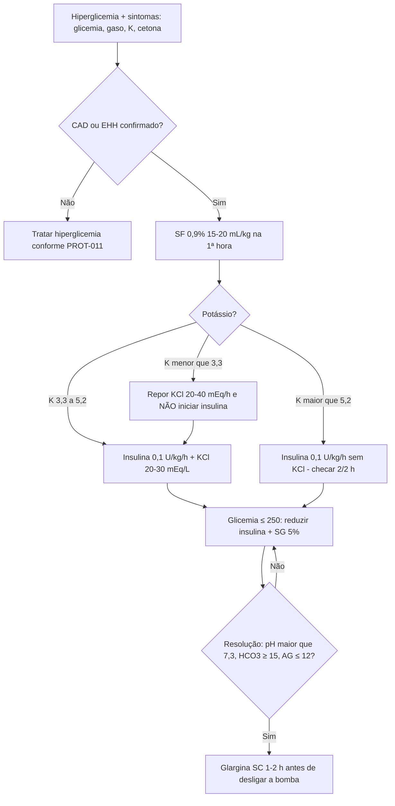

# PROT-004 — Protocolo de Cetoacidose Diabética (CAD) e Estado Hiperglicêmico Hiperosmolar (EHH)

## Objetivo
Padronizar o diagnóstico, a monitorização e o tratamento das emergências hiperglicêmicas em adultos no HU-FIAP, com foco em reposição volêmica segura, insulinoterapia IV contínua, correção de potássio antes da insulina quando indicado e prevenção de complicações (hipocalemia, hipoglicemia, edema cerebral).

## Definições e critérios diagnósticos
- **CAD:** glicemia > 250 mg/dL (ou ≥ 200 mg/dL em CAD euglicêmica — uso de iSGLT2, gestação, jejum), pH arterial ≤ 7,30 ou bicarbonato ≤ 18 mEq/L, cetonemia ≥ 3 mmol/L (ou cetonúria ≥ 2+), anion gap > 12.
- **Gravidade da CAD:** leve (pH 7,25–7,30; HCO3 15–18; alerta), moderada (pH 7,00–7,24; HCO3 10–14; sonolento), grave (pH < 7,00; HCO3 < 10; estupor/coma).
- **EHH:** glicemia > 600 mg/dL, osmolalidade efetiva > 320 mOsm/kg, pH > 7,30, HCO3 > 18, cetose ausente ou leve, alteração do sensório.
- **Anion gap** = Na − (Cl + HCO3); **osmolalidade efetiva** = 2×Na + glicemia/18.
- **Sódio corrigido** = Na medido + 1,6 × [(glicemia − 100)/100].
- Fatores precipitantes: infecção (30–50%), omissão de insulina, IAM, AVC, pancreatite, drogas (corticoide, iSGLT2, antipsicóticos).

## Avaliação inicial
1. ABC, nível de consciência (Glasgow), sinais de desidratação (turgor, mucosas, hipotensão, taquicardia), respiração de Kussmaul, hálito cetônico, dor abdominal.
2. Glicemia capilar e cetonemia capilar na triagem; gasometria venosa (pH venoso ≈ arterial − 0,03).
3. Dois acessos venosos calibrosos; monitorização cardíaca (hipercalemia/hipocalemia); peso.
4. Investigar causa precipitante: ECG, radiografia de tórax, culturas se febre, troponina, lipase.
5. Iniciar folha de controle de CAD (glicemia capilar 1/1 h; eletrólitos, gasometria e anion gap 2/2 h a 4/4 h).

## Exames recomendados
- Glicemia plasmática, gasometria (venosa suficiente para seguimento), sódio, potássio, cloro, bicarbonato, anion gap, ureia, creatinina, fósforo, magnésio, osmolalidade calculada.
- Cetonemia (beta-hidroxibutirato) preferível à cetonúria para monitorização.
- Hemograma (leucocitose até 25.000 pode ser por estresse), PCR, urina tipo I, urocultura, hemoculturas se febre, HbA1c.
- ECG na admissão e a cada alteração de potássio; troponina; lipase/amilase se dor abdominal; radiografia de tórax.

## Conduta
1. **Volume:** SF 0,9% ou Ringer lactato 15–20 mL/kg (1–1,5 L) na 1ª hora; depois 250–500 mL/h conforme hidratação e Na corrigido (Na alto/normal → SF 0,45%; Na baixo → SF 0,9%). Meta: corrigir o déficit (≈ 6 L) em 24 h; cautela em IC/DRC/idoso.
2. **Potássio (antes da insulina):** K < 3,3 mEq/L → **não iniciar insulina**; repor 20–40 mEq/h até K ≥ 3,3. K 3,3–5,2 → adicionar 20–30 mEq/L de soro para manter 4–5. K > 5,2 → não repor, checar 2/2 h.
3. **Insulina regular IV contínua** 0,1 U/kg/h (bolus de 0,1 U/kg opcional); meta de queda de glicemia 50–75 mg/dL/h. Se não cair 10% na 1ª hora, dobrar a taxa. Quando glicemia ≤ 250 mg/dL (CAD) ou ≤ 300 (EHH), reduzir para 0,02–0,05 U/kg/h e adicionar SG 5% (ou SG 10%) para manter glicemia 150–200 (CAD) / 200–300 (EHH) até resolução.
4. **Bicarbonato:** apenas se pH < 6,9 — 100 mEq em 400 mL de água destilada + 20 mEq KCl em 2 h; repetir até pH ≥ 7,0.
5. **Fósforo:** repor se < 1,0 mg/dL ou disfunção cardíaca/respiratória (20–30 mEq fosfato de potássio).
6. **Resolução da CAD:** glicemia < 200 mg/dL + 2 de: HCO3 ≥ 15, pH venoso > 7,3, anion gap ≤ 12. **Resolução do EHH:** osmolalidade < 315 e sensório normal.
7. **Transição para SC:** insulina basal (glargina 0,25–0,3 U/kg ou retomar dose prévia) aplicada **1–2 h antes** de desligar a bomba; iniciar esquema basal-bolus (0,5–0,8 U/kg/dia) conforme PROT-011; manter bomba até o paciente estar comendo.
8. Tratar causa precipitante; profilaxia de TEV (PROT-006); educação em diabetes antes da alta.

## Medicamentos e doses usuais
| Medicamento | Dose | Via | Observações |
|---|---|---|---|
| SF 0,9% / Ringer lactato | 15–20 mL/kg na 1ª h; 250–500 mL/h depois | IV | Ringer pode reduzir acidose hiperclorêmica |
| SF 0,45% | 250–500 mL/h | IV | Se Na corrigido normal/alto após 1ª hora |
| Insulina regular | 0,1 U/kg/h em bomba (50 U em 50 mL SF 0,9%) | IV contínua | Iniciar só com K ≥ 3,3 mEq/L |
| Cloreto de potássio 19,1% | 20–30 mEq por litro de soro; até 20–40 mEq/h se K < 3,3 | IV | Máx. 20 mEq/h em veia periférica; monitor |
| Glicose 5%/10% | Associar quando glicemia ≤ 250 (CAD) / ≤ 300 (EHH) | IV | Manter glicemia 150–200 até resolução |
| Bicarbonato de sódio 8,4% | 100 mEq + 20 mEq KCl em 2 h | IV | Somente pH < 6,9 |
| Fosfato de potássio | 20–30 mEq em 24 h | IV | Se P < 1,0 mg/dL |
| Insulina glargina | 0,25–0,3 U/kg | SC | 1–2 h antes de suspender insulina IV |
| Enoxaparina | 40 mg 1x/dia | SC | Profilaxia de TEV (alto risco de trombose no EHH) |

## Critérios de gravidade e alerta
- pH < 7,00 ou HCO3 < 10 mEq/L; anion gap > 20.
- K < 3,3 mEq/L (não iniciar insulina) ou K > 6,0 mEq/L com alteração no ECG (PROT-012).
- Glasgow < 13, convulsão, déficit focal (suspeitar edema cerebral, especialmente < 25 anos).
- Osmolalidade efetiva > 320 mOsm/kg; Na corrigido > 150 mEq/L.
- PAS < 90 mmHg após 1 L de cristaloide; diurese < 0,5 mL/kg/h.
- Queda de glicemia > 100 mg/dL/h (risco de edema cerebral) ou hipoglicemia < 70 mg/dL durante a infusão.
- Glicemia > 800 mg/dL; creatinina > 2 mg/dL; lactato > 4 mmol/L; suspeita de sepse associada (PROT-001).

## Critérios de internação, UTI e alta
- **UTI:** CAD grave (pH < 7,0, HCO3 < 10), EHH, Glasgow < 13, instabilidade hemodinâmica, K < 3,3 ou > 6,0, necessidade de insulina IV sem possibilidade de monitorização horária na enfermaria, idade > 65 anos com comorbidades.
- **Enfermaria com monitorização (sala de observação/semi-intensiva):** CAD leve a moderada com acompanhamento 1/1 h de glicemia disponível.
- **Alta hospitalar:** CAD/EHH resolvidos ≥ 24 h, aceitação de dieta, esquema de insulina SC estável, causa precipitante tratada, educação (técnica de aplicação, monitorização, dias de doença), insumos garantidos e retorno ambulatorial em 7–14 dias.

## Fluxograma

## Perguntas frequentes da equipe
**P:** Posso iniciar insulina com potássio de 3,0 mEq/L?
**R:** Não. Segundo o PROT-004, com K < 3,3 mEq/L deve-se repor potássio (20–40 mEq/h) e só iniciar insulina quando K ≥ 3,3, pelo risco de arritmia e parada.

**P:** Quando usar bicarbonato na CAD?
**R:** Apenas se pH < 6,9; 100 mEq em 2 h com 20 mEq de KCl, repetindo até pH ≥ 7,0. Não há benefício em pH maior.

**P:** Como fazer a transição de insulina IV para SC?
**R:** Aplicar insulina basal (glargina 0,25–0,3 U/kg ou dose habitual) 1–2 h antes de desligar a bomba, após critérios de resolução e com o paciente aceitando dieta.

**P:** A glicemia normalizou mas o anion gap continua alto. Suspendo a insulina?
**R:** Não. Reduza a taxa para 0,02–0,05 U/kg/h e associe soro glicosado; a insulina só é suspensa após fechar o anion gap e corrigir a acidose.

**P:** Paciente em uso de dapagliflozina com glicemia de 190 e acidose: pode ser CAD?
**R:** Sim, é a CAD euglicêmica; trate como CAD (volume, insulina com glicose) e suspenda o iSGLT2.

## Referências
1. Umpierrez GE, et al. Hyperglycemic Crises in Adults With Diabetes: A Consensus Report (ADA/EASD/JBDS/AACE/DTS). Diabetes Care. 2024.
2. Sociedade Brasileira de Diabetes. Diretriz da SBD — Cetoacidose diabética e estado hiperglicêmico hiperosmolar. 2023.
3. Kitabchi AE, et al. Hyperglycemic crises in adult patients with diabetes. Diabetes Care. 2009.
4. Comissão de Protocolos Clínicos HU-FIAP. Revisão PROT-004, março/2026.

---
*Protocolo institucional fictício para fins acadêmicos (Tech Challenge FIAP). Não substitui diretrizes oficiais nem julgamento clínico.*
