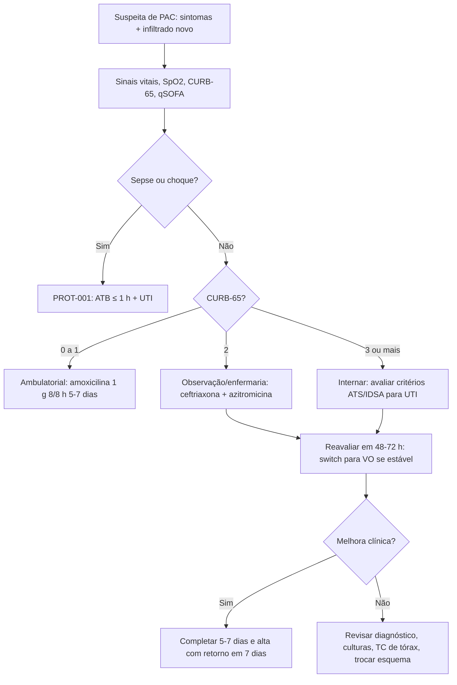

# PROT-005 — Protocolo de Pneumonia Adquirida na Comunidade (PAC) em Adultos

## Objetivo
Uniformizar o diagnóstico, a estratificação de gravidade, a escolha da antibioticoterapia empírica e os critérios de internação e alta de adultos com PAC no HU-FIAP, com meta de primeira dose de antibiótico em ≤ 4 h da chegada (≤ 1 h se sepse — PROT-001) e redução de internações desnecessárias.

## Definições e critérios diagnósticos
- **PAC:** infecção aguda do parênquima pulmonar adquirida fora do hospital (ou < 48 h da admissão), com sintomas respiratórios (tosse, expectoração, dispneia, dor pleurítica) e/ou sistêmicos (febre, calafrios, confusão no idoso) **e** infiltrado novo em imagem de tórax.
- **PAC grave (ATS/IDSA):** 1 critério maior (ventilação mecânica invasiva ou choque com vasopressor) **ou** ≥ 3 menores (FR ≥ 30, PaO2/FiO2 ≤ 250, infiltrado multilobar, confusão, ureia ≥ 43 mg/dL, leucócitos < 4.000, plaquetas < 100.000, T < 36 °C, hipotensão exigindo volume).
- **CURB-65:** Confusão, Ureia > 43 mg/dL (BUN > 19), FR ≥ 30, PA (PAS < 90 ou PAD ≤ 60), idade ≥ 65 — 0–1: ambulatorial; 2: internação breve/observação; ≥ 3: internação, avaliar UTI.
- **PSI/PORT:** classes I–II ambulatorial, III observação, IV–V internação.
- Fatores de risco para MRSA/Pseudomonas: isolamento prévio, internação com antibiótico IV nos últimos 90 dias, bronquiectasias, traqueostomia.

## Avaliação inicial
1. Sinais vitais completos, SpO2 em ar ambiente, nível de consciência, avaliação de sepse (qSOFA) e de hidratação.
2. Anamnese: início, comorbidades (DPOC, IC, DM, DRC, hepatopatia, imunossupressão), tabagismo, etilismo, vacinação, viagens, contato com aves/águas, internações e antibióticos recentes, aspiração.
3. Cálculo do CURB-65 e dos critérios ATS/IDSA; registrar decisão de local de tratamento.
4. Avaliar necessidade de isolamento respiratório (suspeita de influenza/COVID-19/tuberculose).

## Exames recomendados
- **Radiografia de tórax PA e perfil** em todos (MOD-002); TC de tórax se radiografia duvidosa, imunossuprimido ou complicação (derrame, abscesso).
- **Ambulatorial (CURB-65 0–1):** nenhum exame obrigatório além da imagem; considerar teste para influenza/COVID-19 em sazonalidade.
- **Internados:** hemograma, ureia, creatinina, eletrólitos, glicemia, PCR, gasometria arterial se SpO2 < 92%, hemoculturas (2 pares) e escarro (Gram/cultura) antes do antibiótico, antígeno urinário de pneumococo e Legionella na PAC grave, PCR para vírus respiratórios, lactato se sepse, HIV.
- Toracocentese diagnóstica se derrame > 10 mm em decúbito lateral ou loculado.

## Conduta
1. **Antibiótico empírico em ≤ 4 h** (≤ 1 h se sepse), após coleta de culturas nos internados, sem atrasar por exames:
   - **Ambulatorial sem comorbidade:** amoxicilina 1 g 8/8 h por 5–7 dias (alternativa: azitromicina 500 mg/dia 3–5 dias ou doxiciclina 100 mg 12/12 h).
   - **Ambulatorial com comorbidade:** amoxicilina-clavulanato 875/125 mg 12/12 h + azitromicina, ou levofloxacino 750 mg/dia.
   - **Enfermaria:** ceftriaxona 1–2 g IV 1x/dia + azitromicina 500 mg IV/VO 1x/dia (alternativa: levofloxacino 750 mg IV/VO).
   - **UTI/PAC grave:** ceftriaxona 2 g/dia + azitromicina 500 mg/dia (ou + levofloxacino); acrescentar vancomicina ou linezolida se risco de MRSA; piperacilina-tazobactam 4,5 g 6/6 h ou cefepima 2 g 8/8 h se risco de Pseudomonas.
   - **Aspirativa:** ceftriaxona ou amoxicilina-clavulanato; anaerobicida apenas se abscesso/empiema.
2. **Oseltamivir** 75 mg 12/12 h por 5 dias se suspeita/confirmação de influenza em internado, independentemente do tempo de sintomas.
3. **Corticoide:** hidrocortisona 200 mg/dia por 4–7 dias em PAC grave com necessidade de O2 ≥ 6 L/min ou VNI/VM (sem influenza); não usar em PAC não grave.
4. **Suporte:** O2 para SpO2 92–96% (88–92% se DPOC), hidratação, antitérmico, fisioterapia respiratória, profilaxia de TEV (PROT-006), mobilização precoce.
5. **Transição para VO (switch)** quando: estável hemodinamicamente, afebril ≥ 8 h, melhora clínica, via oral funcionante — geralmente em 48–72 h. **Duração total 5–7 dias** (mínimo 5 dias e ≥ 48 h afebril); 7–14 dias se MRSA/Pseudomonas, empiema ou abscesso.
6. Falha terapêutica (sem melhora em 72 h): revisar diagnóstico (TEP, IC, neoplasia, tuberculose), culturas, complicações (empiema), trocar esquema e TC de tórax.
7. Vacinação pneumocócica e anti-influenza na alta; cessação do tabagismo.

## Medicamentos e doses usuais
| Medicamento | Dose | Via | Observações |
|---|---|---|---|
| Amoxicilina | 1 g 8/8 h por 5–7 dias | VO | Ambulatorial sem comorbidade |
| Amoxicilina-clavulanato | 875/125 mg 12/12 h | VO | Comorbidades, aspiração |
| Ceftriaxona | 1–2 g 1x/dia | IV | Enfermaria (1 g) / grave (2 g) |
| Azitromicina | 500 mg 1x/dia por 3–5 dias | VO/IV | Associar ao betalactâmico em internados |
| Levofloxacino | 750 mg 1x/dia | VO/IV | Alergia a betalactâmico; atenção a QT e tendinopatia |
| Piperacilina-tazobactam | 4,5 g 6/6 h | IV | Risco de Pseudomonas |
| Vancomicina | 15–20 mg/kg 12/12 h (ataque 25 mg/kg) | IV | Risco de MRSA; dosar nível |
| Linezolida | 600 mg 12/12 h | VO/IV | Alternativa ao MRSA; checar plaquetas |
| Oseltamivir | 75 mg 12/12 h por 5 dias | VO | Ajustar se ClCr < 30 (75 mg 1x/dia) |
| Hidrocortisona | 200 mg/dia (50 mg 6/6 h) por 4–7 dias | IV | Apenas PAC grave hipoxêmica |

## Critérios de gravidade e alerta
- FR ≥ 30 irpm; SpO2 < 90% em ar ambiente ou PaO2/FiO2 ≤ 250; necessidade de O2 > 4 L/min.
- PAS < 90 mmHg ou PAD ≤ 60 mmHg; FC > 125 bpm; lactato > 2 mmol/L.
- Confusão mental nova; ureia ≥ 43 mg/dL (BUN ≥ 20).
- CURB-65 ≥ 3 ou PSI classe IV–V; ≥ 3 critérios menores ATS/IDSA.
- Infiltrado multilobar ou bilateral; derrame pleural > 10 mm; cavitação.
- Leucócitos < 4.000/mm³; plaquetas < 100.000/mm³; T < 36 °C.
- Ausência de melhora em 72 h ou piora em 24–48 h de antibiótico.

## Critérios de internação, UTI e alta
- **Ambulatorial:** CURB-65 0–1, SpO2 ≥ 92%, via oral preservada, suporte social, sem comorbidade descompensada.
- **Internação:** CURB-65 ≥ 2, hipoxemia, comorbidade descompensada, intolerância oral, derrame significativo, falha ambulatorial, vulnerabilidade social.
- **UTI:** 1 critério maior ou ≥ 3 menores ATS/IDSA; choque; necessidade de VNI/VM; lactato ≥ 4 mmol/L.
- **Alta:** estabilidade clínica ≥ 24 h (T ≤ 37,8 °C, FC ≤ 100, FR ≤ 24, PAS ≥ 90, SpO2 ≥ 90% em ar ambiente ou O2 domiciliar basal), nível de consciência basal, alimentação oral, antibiótico oral definido com duração, retorno em 7 dias e radiografia de controle em 6–8 semanas se > 50 anos ou tabagista.

## Fluxograma

## Perguntas frequentes da equipe
**P:** Preciso de hemocultura em todo paciente com PAC?
**R:** Não. Segundo o PROT-005, hemoculturas e escarro são indicados nos internados (especialmente PAC grave, risco de MRSA/Pseudomonas ou falha prévia); não são obrigatórios no tratamento ambulatorial.

**P:** Quando posso trocar o antibiótico IV para via oral?
**R:** Quando o paciente estiver hemodinamicamente estável, afebril há ≥ 8 h, com melhora clínica e deglutição preservada — em geral em 48–72 h.

**P:** Qual a duração mínima do tratamento?
**R:** 5 dias, desde que o paciente esteja afebril há ≥ 48 h e estável; 7–14 dias em MRSA, Pseudomonas, empiema ou abscesso.

**P:** Corticoide é indicado na PAC?
**R:** Apenas na PAC grave com hipoxemia importante (O2 ≥ 6 L/min ou suporte ventilatório), sem influenza, com hidrocortisona 200 mg/dia por 4–7 dias.

**P:** Qual o alvo de SpO2 no paciente com DPOC e pneumonia?
**R:** 88–92%, pelo risco de hipercapnia; nos demais, 92–96% (ver PROT-013).

## Referências
1. Metlay JP, et al. Diagnosis and Treatment of Adults with Community-acquired Pneumonia. An Official Clinical Practice Guideline of the ATS/IDSA. Am J Respir Crit Care Med. 2019.
2. Corrêa RA, et al. Recomendações para o manejo da pneumonia adquirida na comunidade 2018. Sociedade Brasileira de Pneumologia e Tisiologia. J Bras Pneumol. 2018.
3. Dequin PF, et al. Hydrocortisone in Severe Community-Acquired Pneumonia (CAPE COD). N Engl J Med. 2023.
4. Martin-Loeches I, et al. ERS/ESICM/ESCMID/ALAT guidelines for the management of severe community-acquired pneumonia. Eur Respir J. 2023.
5. Comissão de Protocolos Clínicos HU-FIAP. Revisão PROT-005, fevereiro/2026.

---
*Protocolo institucional fictício para fins acadêmicos (Tech Challenge FIAP). Não substitui diretrizes oficiais nem julgamento clínico.*
