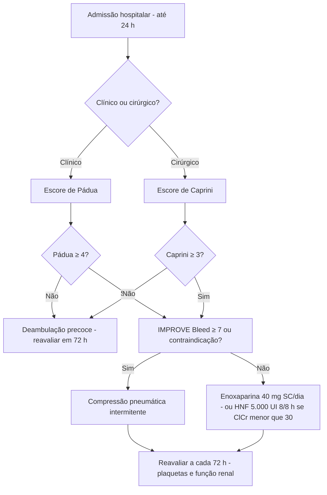

# PROT-006 — Protocolo de Profilaxia de Tromboembolismo Venoso (TEV) em Pacientes Internados

## Objetivo
Garantir que 100% dos pacientes adultos internados no HU-FIAP tenham o risco de TEV e de sangramento avaliados nas primeiras 24 h da admissão (e reavaliados a cada 72 h ou mudança clínica), com prescrição de profilaxia farmacológica e/ou mecânica adequada, reduzindo TVP, TEP e sangramentos evitáveis.

## Definições e critérios diagnósticos
- **TEV:** trombose venosa profunda (TVP) e/ou embolia pulmonar (TEP).
- **Pacientes clínicos — Escore de Pádua:** câncer ativo (3), TEV prévio (3), mobilidade reduzida ≥ 3 dias (3), trombofilia (3), trauma/cirurgia < 1 mês (2), idade ≥ 70 (1), IC ou insuficiência respiratória (1), IAM ou AVC isquêmico (1), infecção aguda/doença reumatológica (1), IMC ≥ 30 (1), terapia hormonal (1). **Alto risco ≥ 4.**
- **Pacientes cirúrgicos — Escore de Caprini:** baixo 0–1, moderado 2, alto 3–4, muito alto ≥ 5.
- **Risco de sangramento — IMPROVE Bleed:** úlcera gastroduodenal ativa (4,5), sangramento < 3 meses (4), plaquetas < 50.000 (4), idade ≥ 85 (3,5), insuficiência hepática INR > 1,5 (2,5), ClCr < 30 (2,5), UTI (2,5), cateter venoso central (2), doença reumática (2), câncer (2), sexo masculino (1), idade 40–84 (1,5). **Alto risco ≥ 7** → preferir profilaxia mecânica.
- **Contraindicações absolutas à profilaxia farmacológica:** sangramento ativo, plaquetas < 50.000/mm³ (relativa < 100.000 em neurocirurgia), coagulopatia grave (INR > 1,5 não terapêutico), HIT, cirurgia intracraniana/espinhal < 24 h, punção lombar/peridural nas últimas 12 h (HBPM) — respeitar intervalos.

## Avaliação inicial
1. Calcular Pádua (clínico) ou Caprini (cirúrgico) na admissão; registrar no prontuário e na prescrição (campo obrigatório da MOD-010).
2. Calcular IMPROVE Bleed; checar plaquetas, creatinina (ClCr por Cockcroft-Gault), peso, uso de anticoagulante prévio (se anticoagulado em dose plena, não há necessidade de profilaxia adicional).
3. Avaliar mobilidade (deambula ≥ 30 m sem auxílio?), presença de cateter central, neoplasia, gestação/puerpério.
4. Reavaliar a cada 72 h, na transferência de setor e no pós-operatório.

## Exames recomendados
- Hemograma com plaquetas (basal e a cada 2–3 dias nos primeiros 14 dias de heparina — vigilância de HIT: queda > 50% ou < 100.000).
- Creatinina e ClCr para ajuste da HBPM.
- Coagulograma se suspeita de coagulopatia ou uso prévio de anticoagulante.
- Doppler venoso de membros inferiores apenas se suspeita clínica de TVP (não rastrear rotineiramente).

## Conduta
1. **Clínico com Pádua ≥ 4 e sem contraindicação:** enoxaparina 40 mg SC 1x/dia (ou HNF 5.000 UI SC 8/8 h se ClCr < 30 mL/min ou IMC < 18); manter durante a internação ou até deambulação plena (habitualmente 6–14 dias).
2. **Clínico com Pádua < 4:** deambulação precoce; reavaliar em 72 h.
3. **Risco alto de TEV + alto risco de sangramento:** compressão pneumática intermitente (CPI) até que a profilaxia farmacológica seja segura; meias elásticas de compressão graduada são alternativa inferior.
4. **Cirúrgico:** Caprini 0–1 → deambulação; 2 → CPI; 3–4 → HBPM ou HNF + CPI; ≥ 5 → HBPM + CPI, considerar extensão por 4 semanas após cirurgia oncológica abdominal/pélvica e 35 dias em artroplastia de quadril (enoxaparina 40 mg/dia ou rivaroxabana 10 mg/dia).
5. **Obesidade (IMC ≥ 40):** enoxaparina 40 mg 12/12 h ou 0,5 mg/kg/dia.
6. **Insuficiência renal (ClCr < 30):** HNF 5.000 UI SC 8/8 h ou enoxaparina 30 mg/dia com cautela.
7. **UTI:** todos recebem profilaxia farmacológica salvo contraindicação; CPI quando contraindicada.
8. **AVC isquêmico:** CPI nas primeiras 24 h; HBPM a partir de 24 h se trombólise sem sangramento (PROT-003). **Hemorragia intracraniana:** CPI; HBPM após 48–72 h de estabilidade radiológica.
9. **Neuroeixo:** enoxaparina ≥ 12 h antes da punção/retirada de cateter peridural e ≥ 4 h após.
10. **Alta:** a profilaxia estendida não é rotina em pacientes clínicos; considerar em câncer ativo com mobilidade reduzida ou TEV prévio (discutir caso a caso).

## Medicamentos e doses usuais
| Medicamento | Dose | Via | Observações |
|---|---|---|---|
| Enoxaparina | 40 mg 1x/dia | SC | Padrão; 20 mg/dia se < 45 kg; 30 mg/dia se ClCr < 30 |
| Enoxaparina (obeso IMC ≥ 40) | 40 mg 12/12 h ou 0,5 mg/kg/dia | SC | Considerar anti-Xa em casos extremos |
| Heparina não fracionada | 5.000 UI 8/8 h (12/12 h se baixo peso) | SC | Preferir se ClCr < 30 mL/min ou diálise |
| Fondaparinux | 2,5 mg 1x/dia | SC | Alternativa em HIT; evitar se ClCr < 30 |
| Rivaroxabana | 10 mg 1x/dia | VO | Profilaxia pós-artroplastia (35 dias quadril, 14 dias joelho) |
| Dabigatrana | 110 mg na 1ª dose, depois 220 mg/dia | VO | Artroplastia; evitar se ClCr < 30 |
| Compressão pneumática intermitente | Contínua, retirar apenas para higiene/deambulação | Mecânica | Quando farmacológica contraindicada ou associada em muito alto risco |
| Sulfato de protamina | 1 mg para cada 100 UI de HNF (máx. 50 mg) | IV lento | Reversão em sangramento grave; reverte ~60% da HBPM |

## Critérios de gravidade e alerta
- Plaquetas < 50.000/mm³ ou queda > 50% do basal em uso de heparina (suspeitar HIT — escore 4T).
- Sangramento ativo, queda de Hb ≥ 2 g/dL sem causa aparente, hematúria macroscópica, melena.
- ClCr < 30 mL/min (ajustar ou trocar para HNF); INR > 1,5; TTPa > 1,5x o controle.
- Paciente de alto risco (Pádua ≥ 4 ou Caprini ≥ 5) **sem** profilaxia prescrita por > 24 h — indicador de qualidade.
- Sinais de TVP (edema assimétrico > 3 cm, dor à palpação, empastamento) ou TEP (dispneia súbita, taquicardia, SpO2 < 92%, dor pleurítica, síncope): investigar com doppler/angioTC e iniciar anticoagulação plena.
- Punção de neuroeixo planejada com HBPM nas últimas 12 h.

## Critérios de internação, UTI e alta
- Este protocolo aplica-se a todos os internados; não há critério de internação próprio.
- **UTI:** TEP com instabilidade (PAS < 90), TVP extensa iliofemoral com flegmasia, sangramento maior associado à profilaxia.
- **Suspensão/alta:** a profilaxia farmacológica é suspensa quando o paciente deambula plenamente e não há mais fator de risco agudo, ou na alta hospitalar; orientações de alta devem incluir sinais de TVP/TEP e, quando indicada profilaxia estendida, a técnica de autoaplicação e duração.

## Fluxograma

## Perguntas frequentes da equipe
**P:** Paciente com ClCr de 25 mL/min: qual profilaxia?
**R:** Segundo o PROT-006, preferir HNF 5.000 UI SC 8/8 h; a enoxaparina 30 mg/dia é alternativa com cautela.

**P:** Preciso prescrever profilaxia para paciente já anticoagulado com varfarina em dose terapêutica?
**R:** Não; anticoagulação plena (INR 2–3 ou DOAC em dose de tratamento) dispensa profilaxia adicional.

**P:** Qual o intervalo entre enoxaparina e punção peridural?
**R:** ≥ 12 h após a última dose profilática antes da punção/retirada do cateter e ≥ 4 h após o procedimento para a próxima dose.

**P:** Quando suspeitar de trombocitopenia induzida por heparina?
**R:** Queda > 50% das plaquetas ou < 100.000 entre o 5º e o 14º dia de heparina (ou antes, se exposição prévia); aplicar escore 4T, suspender heparina e discutir fondaparinux/argatrobana.

**P:** Paciente de alto risco com plaquetas de 70.000 pode receber enoxaparina?
**R:** Sim, entre 50.000 e 100.000 a profilaxia farmacológica é permitida com vigilância diária; abaixo de 50.000 usar CPI.

## Referências
1. Schünemann HJ, et al. American Society of Hematology 2018 guidelines for management of venous thromboembolism: prophylaxis for hospitalized and nonhospitalized medical patients. Blood Adv. 2018.
2. Kahn SR, et al. Prevention of VTE in Nonsurgical Patients: ACCP Evidence-Based Clinical Practice Guidelines (9th ed.). Chest. 2012.
3. Sociedade Brasileira de Angiologia e Cirurgia Vascular. Diretrizes de profilaxia de TEV em pacientes clínicos e cirúrgicos. 2022.
4. Barbar S, et al. A risk assessment model for the identification of hospitalized medical patients at risk for VTE: the Padua Prediction Score. J Thromb Haemost. 2010.
5. Comissão de Protocolos Clínicos HU-FIAP. Revisão PROT-006, janeiro/2026.

---
*Protocolo institucional fictício para fins acadêmicos (Tech Challenge FIAP). Não substitui diretrizes oficiais nem julgamento clínico.*
