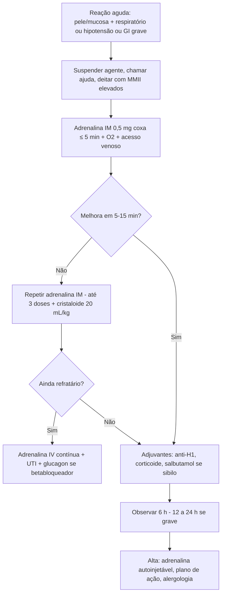

# PROT-007 — Protocolo de Anafilaxia

## Objetivo
Assegurar o reconhecimento imediato e o tratamento da anafilaxia em qualquer setor do HU-FIAP, com **adrenalina intramuscular como primeira medida** em ≤ 5 minutos do reconhecimento, reduzindo mortalidade, reações bifásicas e uso inadequado de anti-histamínicos/corticoides como terapia inicial.

## Definições e critérios diagnósticos
- **Anafilaxia (WAO 2020):** reação de hipersensibilidade sistêmica grave, de início rápido (minutos a poucas horas), potencialmente fatal. Altamente provável quando ocorre **um** dos critérios:
  1. Início agudo com acometimento de **pele/mucosa** (urticária, prurido, rubor, angioedema) **e** ≥ 1 de: comprometimento respiratório (dispneia, sibilos, estridor, hipoxemia) **ou** hipotensão/disfunção de órgão-alvo (síncope, incontinência) **ou** sintomas gastrointestinais graves (cólica intensa, vômitos repetidos) após alérgeno provável.
  2. Início agudo de **hipotensão** ou **broncoespasmo** ou **envolvimento laríngeo** após exposição a alérgeno conhecido/provável, mesmo sem lesões cutâneas.
- **Hipotensão no adulto:** PAS < 90 mmHg ou queda > 30% do basal.
- **Reação bifásica:** recorrência em 1–72 h (geralmente 8–10 h) sem nova exposição; ocorre em ~5%.
- Principais desencadeantes hospitalares: antibióticos betalactâmicos, AINE, contrastes iodados, bloqueadores neuromusculares, látex, quimioterápicos, hemoderivados, alimentos.

## Avaliação inicial
1. Reconhecer rapidamente (não aguardar hipotensão); **interromper o agente suspeito** (infusão, contraste, alimento).
2. Chamar ajuda; posicionar o paciente deitado com membros inferiores elevados (sentado se dispneia; decúbito lateral se vômitos/gestante); **não levantar subitamente** (risco de síndrome do ventrículo vazio).
3. ABC: via aérea (estridor, edema de língua/úvula, voz rouca), respiração (SpO2, sibilos), circulação (PA, FC, perfusão), pele, nível de consciência.
4. Monitorização contínua, O2 alto fluxo (10–15 L/min em máscara com reservatório) se comprometimento respiratório ou hipotensão, 2 acessos calibrosos.
5. Registrar horário do início, agente suspeito, dose e horário da adrenalina.

## Exames recomendados
- Diagnóstico é **clínico**; nenhum exame deve atrasar a adrenalina.
- **Triptase sérica:** colher 1–2 h após o início (ideal 30 min–2 h) e basal após 24 h; elevação > (1,2 × basal + 2 µg/L) confirma ativação mastocitária.
- Gasometria, lactato, eletrólitos e ECG se choque ou comorbidade cardiovascular; glicemia capilar.
- Registrar e notificar a reação (farmacovigilância/NOTIVISA) e encaminhar ao ambulatório de alergia para investigação (testes cutâneos/IgE específica após 4–6 semanas).

## Conduta
1. **Adrenalina IM 0,01 mg/kg (máx. 0,5 mg) da solução 1 mg/mL (1:1.000) na face anterolateral da coxa**, imediatamente; repetir a cada 5–15 min se não houver melhora (até 3 doses). Não há contraindicação absoluta à adrenalina na anafilaxia.
2. **Adrenalina IV** somente em choque refratário a ≥ 2 doses IM, por médico experiente, com monitorização: infusão 0,05–0,1 mcg/kg/min (ou bolus diluído 1:100.000 — 10 mcg/mL — 50–100 mcg em PCR iminente).
3. **Cristaloide:** SF 0,9% ou Ringer 500–1.000 mL rápido (20 mL/kg) se hipotensão; repetir conforme resposta.
4. **Broncoespasmo persistente:** salbutamol 4–8 jatos com espaçador ou 2,5–5 mg nebulizado, repetir a cada 20 min.
5. **Estridor/edema laríngeo:** adrenalina nebulizada 3–5 mL (1 mg/mL) como adjuvante; preparar via aérea avançada precocemente (cricotireoidostomia como resgate).
6. **Adjuvantes (após a adrenalina, não substitutos):** anti-H1 (difenidramina 25–50 mg IV ou prometazina 25 mg IM) para sintomas cutâneos; anti-H2 (ranitidina indisponível — usar famotidina 20 mg IV); corticoide (hidrocortisona 200 mg IV ou metilprednisolona 1–2 mg/kg) — benefício incerto na prevenção de bifásica.
7. **Usuário de betabloqueador com hipotensão refratária:** glucagon 1–5 mg IV em 5 min, seguido de 5–15 mcg/min.
8. **Observação:** mínimo 6 h após resolução em reações leves/moderadas; **12–24 h** se reação grave, necessidade de > 1 dose de adrenalina, asma grave, uso de betabloqueador ou reação bifásica prévia.
9. **Alta:** prescrição de adrenalina autoinjetável (ou ampola + seringa com orientação escrita) 0,3 mg IM, plano de ação escrito, identificação do alérgeno no prontuário (alerta de alergia), anti-H1 por 3 dias, prednisona 40 mg/dia por 3 dias opcional, encaminhamento à alergologia.

## Medicamentos e doses usuais
| Medicamento | Dose | Via | Observações |
|---|---|---|---|
| Adrenalina 1 mg/mL (1:1.000) | 0,01 mg/kg (máx. 0,5 mg) — adulto 0,3–0,5 mg; repetir 5–15 min | IM (coxa anterolateral) | Primeira linha; sem contraindicação absoluta |
| Adrenalina infusão | 0,05–0,1 mcg/kg/min, titular (1 mg em 100 mL = 10 mcg/mL) | IV contínua | Só em choque refratário; monitorização |
| Adrenalina nebulizada | 3–5 mL de 1 mg/mL | Inalatória | Adjuvante no estridor |
| SF 0,9% / Ringer | 500–1.000 mL em bolus (20 mL/kg); repetir | IV | Hipotensão |
| Salbutamol | 4–8 jatos ou 2,5–5 mg NBZ a cada 20 min | Inalatória | Broncoespasmo persistente |
| Difenidramina | 25–50 mg | IV/IM | Sintomas cutâneos; não trata hipotensão |
| Famotidina | 20 mg | IV | Anti-H2 adjuvante |
| Hidrocortisona | 200 mg | IV | Adjuvante; benefício incerto |
| Glucagon | 1–5 mg em 5 min; depois 5–15 mcg/min | IV | Usuários de betabloqueador refratários |
| Adrenalina autoinjetável | 0,3 mg | IM | Prescrição de alta (2 unidades) |

## Critérios de gravidade e alerta
- Estridor, rouquidão, edema de língua/úvula, sensação de "garganta fechando".
- SpO2 < 92%, FR > 25 irpm, sibilância difusa, uso de musculatura acessória.
- PAS < 90 mmHg ou queda > 30% do basal; FC > 120 bpm; síncope; incontinência.
- Sonolência, confusão, agitação (hipoperfusão cerebral).
- Necessidade de > 2 doses de adrenalina IM; ausência de resposta em 10–15 min.
- Paciente em uso de betabloqueador, IECA ou com asma não controlada; reação a medicamento IV (progressão rápida).
- Lactato > 2 mmol/L; sinais de reação bifásica durante a observação.

## Critérios de internação, UTI e alta
- **UTI:** choque refratário com adrenalina IV, via aérea comprometida/IOT, parada cardiorrespiratória revertida, reação grave com necessidade de monitorização prolongada.
- **Observação no PS (6–24 h):** conforme gravidade e fatores de risco (ver Conduta, item 8).
- **Internação em enfermaria:** reações moderadas com comorbidades ou sem suporte domiciliar para observação segura.
- **Alta:** assintomático por ≥ 6 h (ou 12–24 h nos de risco), sinais vitais normais, adrenalina autoinjetável e plano de ação entregues, registro do alérgeno e encaminhamento à alergologia.

## Fluxograma

## Perguntas frequentes da equipe
**P:** Posso dar anti-histamínico e corticoide primeiro e aguardar para ver se precisa de adrenalina?
**R:** Não. Segundo o PROT-007, a adrenalina IM é a primeira e única medida que salva vidas; anti-H1 e corticoide são adjuvantes aplicados depois.

**P:** Qual a via e o local da adrenalina?
**R:** Intramuscular, na face anterolateral da coxa, solução 1 mg/mL, 0,01 mg/kg até 0,5 mg no adulto; a via SC tem absorção errática e a IV em bolus não diluído é perigosa.

**P:** Por quanto tempo observar após a reação?
**R:** Mínimo 6 h após resolução; 12–24 h se reação grave, mais de uma dose de adrenalina, asma grave, uso de betabloqueador ou bifásica prévia.

**P:** Paciente com doença coronariana pode receber adrenalina?
**R:** Sim. A anafilaxia em si causa isquemia por hipotensão; não há contraindicação absoluta — usar a via IM na dose padrão com monitorização.

**P:** Quando colher triptase?
**R:** Entre 30 min e 2 h do início dos sintomas e uma amostra basal após 24 h; o resultado não altera o tratamento agudo.

## Referências
1. Cardona V, et al. World Allergy Organization Anaphylaxis Guidance 2020. World Allergy Organ J. 2020.
2. Shaker MS, et al. Anaphylaxis — a 2020 practice parameter update (AAAAI/ACAAI). J Allergy Clin Immunol. 2020.
3. Associação Brasileira de Alergia e Imunologia (ASBAI). Guia prático para o manejo da anafilaxia. 2021.
4. Resuscitation Council UK. Emergency treatment of anaphylaxis: guidelines for healthcare providers. 2021.
5. Comissão de Protocolos Clínicos HU-FIAP. Revisão PROT-007, março/2026.

---
*Protocolo institucional fictício para fins acadêmicos (Tech Challenge FIAP). Não substitui diretrizes oficiais nem julgamento clínico.*
