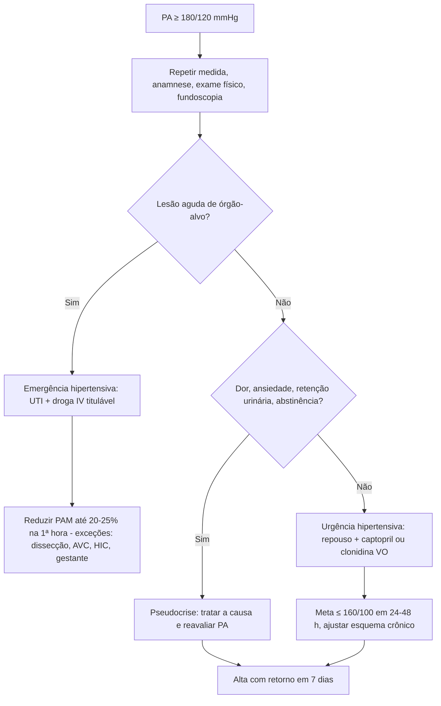

# PROT-008 — Protocolo de Crise Hipertensiva (Urgência e Emergência Hipertensiva)

## Objetivo
Diferenciar emergência hipertensiva, urgência hipertensiva e pseudocrise, evitando reduções pressóricas abruptas e iatrogênicas, e definir metas de redução da PA, fármacos parenterais e orais e o local de tratamento no HU-FIAP.

## Definições e critérios diagnósticos
- **Crise hipertensiva:** elevação acentuada da PA, em geral PAS ≥ 180 mmHg e/ou PAD ≥ 120 mmHg.
- **Emergência hipertensiva (EH):** crise com **lesão aguda e progressiva de órgão-alvo (LOA)** — encefalopatia hipertensiva, AVC isquêmico/hemorrágico, síndrome coronariana aguda, edema agudo de pulmão, dissecção de aorta, LRA rapidamente progressiva, eclâmpsia/pré-eclâmpsia grave, hipertensão maligna (retinopatia grau III/IV), crise por feocromocitoma/simpaticomiméticos. Exige redução em minutos a horas com droga IV em UTI.
- **Urgência hipertensiva (UH):** PA muito elevada sem LOA aguda; redução gradual em 24–48 h com medicação oral, geralmente sem internação.
- **Pseudocrise hipertensiva:** PA elevada em contexto de dor, ansiedade, retenção urinária, cefaleia tensional, abstinência ou suspensão de anti-hipertensivo, sem LOA; tratar a causa, não a PA.
- O valor absoluto da PA importa menos do que a velocidade de elevação e a presença de LOA.

## Avaliação inicial
1. Medir PA em ambos os braços (manguito adequado, paciente em repouso 5 min); repetir após 15–30 min em ambiente calmo se suspeita de pseudocrise.
2. Anamnese: sintomas de LOA (dor torácica, dispneia, déficit focal, cefaleia intensa, alteração visual, confusão, oligúria), adesão, suspensão de clonidina/betabloqueador, uso de cocaína/anfetamina/IMAO, gestação.
3. Exame físico: fundoscopia (papiledema, hemorragias, exsudatos), ausculta cardíaca e pulmonar (B3, estertores), pulsos e PA assimétricos (dissecção), déficit neurológico, edema.
4. Classificar em EH, UH ou pseudocrise em ≤ 30 min e definir o destino.

## Exames recomendados
- **Todos com suspeita de EH:** ECG, creatinina, ureia, eletrólitos, hemograma (anemia hemolítica microangiopática), urina tipo I (proteinúria, hematúria), troponina, BNP, glicemia; radiografia de tórax.
- **Dirigidos:** TC de crânio (déficit neurológico/encefalopatia — PROT-003), angioTC de aorta (dor torácica lancinante/assimetria de pulsos), ecocardiograma (EAP/SCA), beta-hCG em mulheres em idade fértil, metanefrinas se suspeita de feocromocitoma.
- **UH:** exames básicos conforme comorbidades (creatinina, eletrólitos, ECG se sintomas); fundoscopia.

## Conduta
1. **Emergência hipertensiva — metas gerais:** reduzir PAM em **no máximo 20–25% na 1ª hora**; depois para 160/100–110 mmHg nas próximas 2–6 h; normalizar em 24–48 h. Exceções:
   - **Dissecção de aorta:** PAS < 120 mmHg e FC < 60 bpm em 20 min (esmolol/labetalol **antes** do vasodilatador).
   - **AVC isquêmico:** tratar apenas se > 220/120 (ou > 185/110 se trombólise) — PROT-003.
   - **Hemorragia intracraniana:** PAS 130–150 mmHg, evitar queda > 90 mmHg em 1 h.
   - **Pré-eclâmpsia grave/eclâmpsia:** PA < 160/105 com hidralazina/labetalol + sulfato de magnésio; obstetrícia.
   - **EAP/SCA:** nitroglicerina IV + diurético de alça se congestão (PROT-002, PROT-009).
   - **Feocromocitoma/cocaína:** fentolamina ou nitroprussiato + benzodiazepínico; **evitar betabloqueador isolado**.
2. **Droga IV em bomba de infusão, monitorização contínua, UTI;** preferir nitroprussiato (1ª escolha geral no HU-FIAP pela disponibilidade), nitroglicerina (coronariano/EAP), esmolol/metoprolol (dissecção, taquiarritmia), hidralazina (gestante), labetalol quando disponível.
3. **Urgência hipertensiva:** repouso em ambiente calmo; captopril 25 mg VO (repetir em 1 h) ou clonidina 0,1–0,2 mg VO; meta: PA ≤ 160/100 mmHg em 24–48 h; otimizar/retomar esquema crônico; **evitar nifedipino sublingual** (quedas imprevisíveis, isquemia).
4. **Pseudocrise:** tratar dor/ansiedade/retenção; analgesia ou ansiolítico; reavaliar PA; orientação ambulatorial.
5. Em todos: investigar adesão e causas secundárias, ajustar terapia oral antes da alta, agendar retorno em ≤ 7 dias.

## Medicamentos e doses usuais
| Medicamento | Dose | Via | Observações |
|---|---|---|---|
| Nitroprussiato de sódio | 0,25–0,5 mcg/kg/min, titular até 10 mcg/kg/min | IV contínua | Proteger da luz; risco de cianeto > 48 h ou DRC; evitar em gestante |
| Nitroglicerina | 5–10 mcg/min, aumentar 5–10 mcg a cada 5 min (máx. 200 mcg/min) | IV contínua | SCA, EAP; cefaleia, taquifilaxia |
| Esmolol | 500 mcg/kg bolus em 1 min + 50–300 mcg/kg/min | IV | Dissecção de aorta, taquicardia; meia-vida curta |
| Metoprolol | 5 mg a cada 5 min (máx. 15 mg) | IV | Dissecção quando esmolol indisponível |
| Labetalol | 20 mg bolus; 20–80 mg a cada 10 min ou 0,5–2 mg/min (máx. 300 mg) | IV | AVC, gestante, encefalopatia |
| Hidralazina | 5–10 mg a cada 20 min (máx. 30 mg) | IV | Pré-eclâmpsia/eclâmpsia; evitar em SCA/dissecção |
| Fentolamina | 5–15 mg bolus | IV | Feocromocitoma, cocaína |
| Furosemida | 40–80 mg | IV | Somente se hipervolemia/EAP |
| Captopril | 25 mg, repetir em 1 h (máx. 50–100 mg) | VO | Urgência hipertensiva; evitar em estenose bilateral de a. renal/gestante |
| Clonidina | 0,1–0,2 mg; repetir 0,1 mg/h (máx. 0,6 mg) | VO | Urgência; sedação, rebote |

## Critérios de gravidade e alerta
- PA ≥ 180/120 mmHg com qualquer sinal de LOA: dor torácica, dispneia, déficit neurológico, confusão, convulsão, cefaleia intensa com papiledema, oligúria.
- PAS > 220 mmHg ou PAD > 140 mmHg mesmo assintomático — observar por mais tempo e repetir exames.
- Assimetria de PA > 20 mmHg entre os braços ou pulsos assimétricos (dissecção).
- Creatinina > 1,5x o basal, hematúria/proteinúria nova, esquizócitos ou plaquetas < 100.000 (hipertensão maligna/MAT).
- Troponina elevada, supradesnivelamento de ST, edema agudo de pulmão (SpO2 < 90%).
- Gestante com PA ≥ 160/110 mmHg ou sintomas de eclâmpsia iminente.
- Queda da PA > 25% na 1ª hora de tratamento (risco de hipoperfusão cerebral/renal).

## Critérios de internação, UTI e alta
- **UTI:** toda emergência hipertensiva (necessidade de droga IV titulável e monitorização de PA invasiva ou a cada 5–15 min).
- **Enfermaria:** UH com comorbidade descompensada, impossibilidade de seguimento ambulatorial rápido ou necessidade de investigação de hipertensão secundária.
- **Alta do PS (UH/pseudocrise):** PA ≤ 180/110 mmHg em queda, assintomático, exames sem LOA, esquema oral definido, retorno em 7 dias (UBS ou ambulatório de HAS) e orientações sobre sinais de alarme.
- **Alta da UTI/EH:** PA controlada com esquema oral por ≥ 24 h, LOA estabilizada, seguimento especializado agendado.

## Fluxograma

## Perguntas frequentes da equipe
**P:** Posso usar nifedipino sublingual para baixar rápido a pressão?
**R:** Não. O PROT-008 contraindica nifedipino sublingual por quedas imprevisíveis e risco de isquemia cerebral/coronariana; na urgência usar captopril ou clonidina VO.

**P:** Qual a meta de redução na emergência hipertensiva?
**R:** Redução de no máximo 20–25% da PAM na 1ª hora, depois 160/100–110 mmHg em 2–6 h e normalização em 24–48 h, exceto dissecção de aorta (PAS < 120 em 20 min) e AVC (ver PROT-003).

**P:** Paciente com PA 200/120 sem sintomas e exames normais precisa internar?
**R:** Não necessariamente; trata-se de urgência hipertensiva — reduzir gradualmente em 24–48 h com medicação oral, garantir retorno em 7 dias.

**P:** Qual a primeira droga na dissecção de aorta?
**R:** Betabloqueador IV (esmolol) para FC < 60 bpm, **antes** de vasodilatador (nitroprussiato), com meta de PAS < 120 mmHg em 20 min.

**P:** Quando suspeitar de hipertensão maligna?
**R:** PA muito elevada com retinopatia grau III/IV (hemorragias, exsudatos, papiledema), LRA progressiva e/ou anemia hemolítica microangiopática — é emergência hipertensiva.

## Referências
1. Barroso WKS, et al. Diretrizes Brasileiras de Hipertensão Arterial — 2020. Arq Bras Cardiol. 2021.
2. Whelton PK, et al. 2017 ACC/AHA Guideline for the Prevention, Detection, Evaluation, and Management of High Blood Pressure in Adults. Hypertension. 2018.
3. van den Born BJH, et al. ESC Council on Hypertension position document on the management of hypertensive emergencies. Eur Heart J Cardiovasc Pharmacother. 2019.
4. Comissão de Protocolos Clínicos HU-FIAP. Revisão PROT-008, fevereiro/2026.

---
*Protocolo institucional fictício para fins acadêmicos (Tech Challenge FIAP). Não substitui diretrizes oficiais nem julgamento clínico.*
