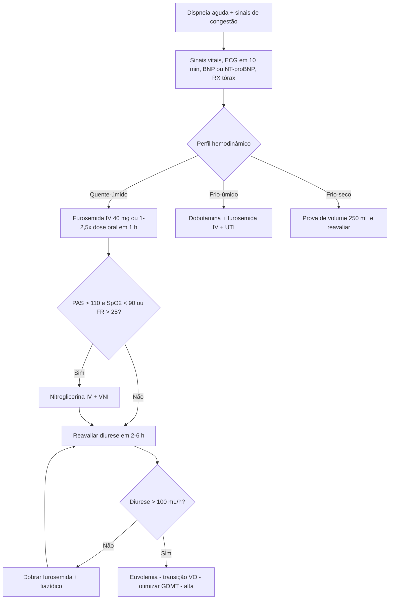

# PROT-009 — Protocolo de Insuficiência Cardíaca Aguda Descompensada

## Objetivo
Padronizar o reconhecimento, a classificação hemodinâmica e o tratamento da insuficiência cardíaca aguda descompensada (ICAD) em adultos atendidos no Hospital Universitário FIAP (HU-FIAP), reduzindo o tempo até a primeira dose de diurético, a permanência hospitalar e as readmissões em 30 dias, além de garantir a otimização da terapia modificadora de doença (GDMT) antes da alta.

## Definições e critérios diagnósticos
- **ICAD:** início rápido ou piora de sinais e sintomas de IC (dispneia, ortopneia, edema, ganho de peso, fadiga) que exige avaliação médica urgente, em paciente com IC prévia (descompensação) ou sem diagnóstico anterior (IC de novo).
- **Perfis hemodinâmicos (Stevenson):** combinam perfusão (quente = adequada; frio = hipoperfusão) e congestão (seco = sem congestão; úmido = congesto). Perfil **quente-úmido** (~70% dos casos), **frio-úmido** (gravidade máxima), **quente-seco** (compensado) e **frio-seco** (hipovolemia ou baixo débito).
- **Sinais de congestão:** ortopneia, turgência jugular, estertores, B3, hepatomegalia, edema, ascite, refluxo hepatojugular.
- **Sinais de hipoperfusão:** pressão de pulso estreita (< 25% da PAS), extremidades frias, sonolência, lactato > 2 mmol/L, PAS < 90 mmHg, piora de função renal.
- **Peptídeos natriuréticos:** BNP < 100 pg/mL ou NT-proBNP < 300 pg/mL tornam IC aguda improvável. NT-proBNP sugere IC quando > 450 pg/mL (< 50 anos), > 900 pg/mL (50–75 anos) ou > 1.800 pg/mL (> 75 anos); obesidade reduz, DRC e FA elevam os valores.

## Avaliação inicial
1. Triagem em até 10 minutos: sinais vitais, SpO2, peso na admissão (referência para balanço), ECG de 12 derivações em 10 min.
2. Classificar o perfil hemodinâmico à beira-leito (quente/frio, seco/úmido) e registrar em prontuário.
3. Identificar o fator precipitante (CHAMPIT: síndrome coronariana, hipertensão, arritmia, causa mecânica, embolia pulmonar, infecção, tamponamento; má adesão, excesso de sal/líquido, AINE, anemia).
4. Histórico de GDMT prévia, dose oral habitual de diurético, função renal basal e peso seco conhecido.
5. Ultrassom point-of-care: linhas B, veia cava, derrame pleural, função ventricular.

## Exames recomendados
- **Na admissão:** BNP ou NT-proBNP, troponina, hemograma, creatinina/ureia, sódio, potássio, magnésio, glicemia, TSH (se IC de novo), função hepática, gasometria com lactato se hipoperfusão, ECG, radiografia de tórax.
- **Ecocardiograma transtorácico** em até 48 h na IC de novo ou mudança do quadro clínico; imediato em instabilidade.
- **Diário:** peso em jejum, balanço hídrico, creatinina e eletrólitos; diurese às 2 h e 6 h após furosemida.

## Conduta
1. **Oxigênio** apenas se SpO2 < 90%; alvo 92–96%. Posição sentada.
2. **VNI (CPAP 5–10 cmH2O ou BiPAP)** precoce em edema agudo de pulmão, FR > 25 irpm ou SpO2 < 90% apesar de O2; intubar se rebaixamento, exaustão ou falha em 30–60 min.
3. **Diurético de alça (perfis úmidos):** furosemida IV em bolus na 1ª hora: **1–2,5× a dose oral habitual** ou **40 mg IV** em virgem de diurético. Resposta adequada: sódio urinário > 50–70 mEq/L em 2 h e diurese > 100–150 mL/h em 6 h; se insuficiente, **dobrar a dose** a cada 2–6 h (máx. 200 mg/bolus) e/ou associar hidroclorotiazida 25–50 mg ou acetazolamida 500 mg IV.
4. **Vasodilatador (quente-úmido com PAS > 110 mmHg):** nitroglicerina IV 10–20 mcg/min, +10 mcg/min a cada 5 min até alívio (máx. 200 mcg/min); isossorbida SL 5 mg enquanto se prepara a infusão. Contraindicado em PAS < 90, estenose aórtica grave e inibidor de PDE5 nas últimas 24–48 h.
5. **Inotrópico (frio-úmido ou PAS < 90 com hipoperfusão):** dobutamina 2–10 mcg/kg/min; noradrenalina se PAM < 65 mmHg; levosimendana/milrinona em uso prévio de betabloqueador (discutir com cardiologia). Suspender betabloqueador apenas em choque; reduzir 50% se hipoperfusão leve.
6. **Frio-seco:** prova de volume cautelosa 250 mL e reavaliação; considerar inotrópico se persistir hipoperfusão.
7. **Restrição:** sódio < 2–3 g/dia; líquidos 1,5 L/dia se hiponatremia < 130 mEq/L.
8. **GDMT:** manter ou iniciar assim que euvolêmico e estável (PAS > 100, K < 5,0, creatinina estável): IECA/BRA/ARNI, betabloqueador (só sem congestão/inotrópico), espironolactona, iSGLT2 (ainda internado, exceto DM1 ou TFG < 20). Profilaxia de TEV: PROT-006.
9. Transição para diurético oral 24 h antes da alta, com peso estável.

## Medicamentos e doses usuais
| Medicamento | Dose | Via | Observações |
|---|---|---|---|
| Furosemida | 40 mg ou 1–2,5× dose oral habitual em bolus; dobrar se diurese < 100 mL/h em 6 h; máx. 200 mg/bolus ou infusão 10–40 mg/h | IV | Monitorar K, Mg, creatinina; Na urinário em 2 h |
| Hidroclorotiazida | 25–50 mg 1x/dia | VO | Bloqueio sequencial do néfron em resistência a diurético |
| Nitroglicerina | 10–20 mcg/min, +10 mcg/min a cada 5 min, máx. 200 mcg/min | IV contínua | PAS > 110; suspender se PAS < 90 |
| Dobutamina | 2–10 mcg/kg/min | IV contínua | Perfil frio-úmido; risco de arritmia; acesso central preferível |
| Sacubitril-valsartana | 24/26 mg a 97/103 mg 12/12 h | VO | Iniciar ≥ 36 h após suspender IECA; PAS > 100 mmHg |
| Carvedilol | 3,125–25 mg 12/12 h | VO | Não iniciar com congestão ativa ou inotrópico |
| Espironolactona | 25 mg 1x/dia | VO | K < 5,0 mEq/L e TFG > 30 mL/min (PROT-012) |
| Dapagliflozina / empagliflozina | 10 mg 1x/dia | VO | Qualquer FE; TFG ≥ 20–25 mL/min; suspender em cetoacidose |

## Critérios de gravidade e alerta
- PAS < 90 mmHg ou PAM < 65 mmHg; FC > 130 ou < 40 bpm.
- SpO2 < 90% com O2, FR > 30 irpm, necessidade de VNI ou IOT.
- Lactato > 2 mmol/L, extremidades frias, oligúria < 0,5 mL/kg/h por 6 h.
- Creatinina com aumento ≥ 0,3 mg/dL em 48 h (PROT-010), sódio < 130 mEq/L, K > 5,5 ou < 3,5 mEq/L.
- Troponina elevada com alterações isquêmicas no ECG; arritmia ventricular sustentada ou FA com alta resposta (> 120 bpm).
- Diurese < 100 mL/h nas 6 primeiras horas apesar de furosemida dobrada (resistência diurética).

## Critérios de internação, UTI e alta
- **Internação:** todo paciente com ICAD que necessite diurético IV, IC de novo, hipotensão, disfunção renal nova, troponina elevada ou suporte social insuficiente.
- **UTI/Unidade Coronariana:** perfil frio-úmido, choque cardiogênico, necessidade de inotrópico/vasopressor, VNI prolongada ou IOT, arritmia instável, SCA, lactato > 2 mmol/L, PAS < 90 mmHg.
- **Enfermaria monitorizada:** quente-úmido responsivo ao diurético, sem hipoperfusão.
- **Alta:** euvolemia clínica com peso seco atingido, sem diurético IV por ≥ 24 h, função renal estável por 24–48 h, PAS ≥ 95 mmHg, GDMT iniciada ou retomada (IECA/BRA/ARNI, betabloqueador, espironolactona, iSGLT2 — ou justificativa documentada), orientação de peso diário e sinais de alarme, retorno em 7–14 dias e vacinação verificada.

## Fluxograma

## Perguntas frequentes da equipe
**P:** Paciente já usa furosemida 40 mg VO 2x/dia em casa. Qual dose IV inicial?
**R:** Dose oral diária 80 mg → 1–2,5× em IV, ou seja, 80–200 mg/dia em bolus fracionados; iniciar com 80 mg IV e reavaliar diurese em 2 h.

**P:** BNP de 85 pg/mL em paciente obeso com dispneia; posso excluir IC?
**R:** BNP < 100 torna IC improvável, mas a obesidade reduz o valor em até 50%. Se clínica sugestiva, prosseguir com ecocardiograma e US pulmonar.

**P:** Devo suspender o betabloqueador na descompensação?
**R:** Não, se o perfil é quente-úmido. Reduzir 50% em hipoperfusão leve e suspender apenas em choque ou necessidade de inotrópico.

**P:** Quando iniciar iSGLT2?
**R:** Assim que o paciente estiver estável hemodinamicamente, mesmo ainda internado, com TFG ≥ 20–25 mL/min e sem cetoacidose; não exige titulação.

**P:** Creatinina subiu 0,4 mg/dL após 2 dias de diurético. Devo parar?
**R:** Elevação discreta com melhora da congestão é esperada (pseudo-piora). Mantenha a descongestão se a perfusão está adequada e reavalie em 24 h; suspenda apenas se hipoperfusão ou K > 5,5 (PROT-010, PROT-012).

## Referências
1. Heidenreich PA, et al. 2022 AHA/ACC/HFSA Guideline for the Management of Heart Failure. Circulation. 2022.
2. McDonagh TA, et al. 2021 ESC Guidelines for the diagnosis and treatment of acute and chronic heart failure e atualização focada 2023. Eur Heart J.
3. Marcondes-Braga FG, et al. Atualização de Tópicos Emergentes da Diretriz Brasileira de Insuficiência Cardíaca — SBC. Arq Bras Cardiol. 2021.
4. Mullens W, et al. The use of diuretics in heart failure with congestion — HFA/ESC position statement. Eur J Heart Fail. 2019.
5. Comissão de Protocolos Clínicos HU-FIAP. Ata de revisão PROT-009, abril/2026.

---
*Protocolo institucional fictício para fins acadêmicos (Tech Challenge FIAP). Não substitui diretrizes oficiais nem julgamento clínico.*
