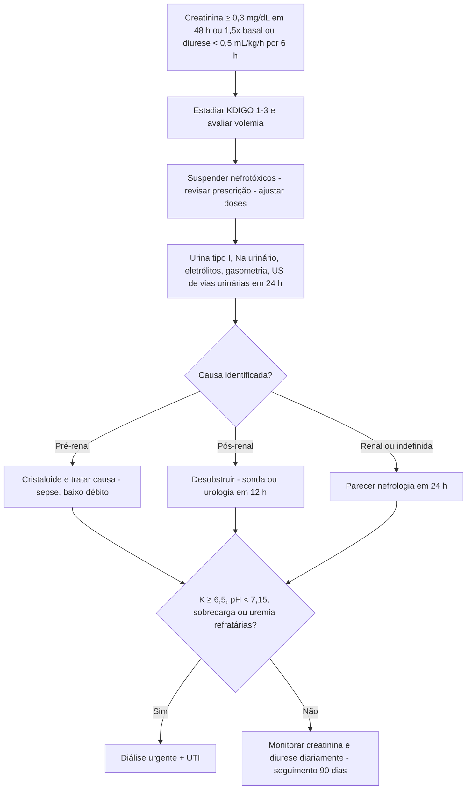

# PROT-010 — Protocolo de Lesão Renal Aguda (LRA)

## Objetivo
Padronizar a detecção precoce, o estadiamento, a investigação etiológica e o manejo da lesão renal aguda (LRA) em adultos internados no Hospital Universitário FIAP (HU-FIAP), reduzindo a exposição a nefrotóxicos, a progressão para estágios avançados e a necessidade de terapia renal substitutiva (TRS) não planejada.

## Definições e critérios diagnósticos
- **LRA (KDIGO 2012):** qualquer um dos critérios: aumento da creatinina sérica **≥ 0,3 mg/dL em 48 h**; aumento **≥ 1,5× o valor basal** em até 7 dias; ou diurese **< 0,5 mL/kg/h por 6 h**.
- **Estágio 1:** creatinina 1,5–1,9× basal ou ≥ 0,3 mg/dL; diurese < 0,5 mL/kg/h por 6–12 h.
- **Estágio 2:** creatinina 2,0–2,9× basal; diurese < 0,5 mL/kg/h por ≥ 12 h.
- **Estágio 3:** creatinina ≥ 3× basal, ou ≥ 4,0 mg/dL, ou início de TRS; diurese < 0,3 mL/kg/h por ≥ 24 h ou anúria ≥ 12 h.
- **Creatinina basal:** menor valor dos últimos 3–12 meses; se desconhecida, estimar pela MDRD assumindo TFG 75 mL/min/1,73 m².
- **Classificação etiológica:** pré-renal (hipovolemia, baixo débito, sepse inicial, IECA/BRA + AINE), renal intrínseca (necrose tubular aguda isquêmica ou tóxica, nefrite intersticial, glomerulonefrite, rabdomiólise, contraste) e pós-renal (obstrução prostática, litíase, bexiga neurogênica, sonda obstruída).

## Avaliação inicial
1. Confirmar LRA comparando com creatinina basal e verificar diurese das últimas 6–24 h (balanço hídrico rigoroso; sonda vesical de demora somente se oligúria não esclarecida ou retenção).
2. Volemia à beira-leito: PA, FC, turgor, mucosas, turgência jugular, edema, tempo de enchimento capilar, peso.
3. Revisão completa da prescrição: AINE, IECA/BRA, diuréticos, aminoglicosídeos, vancomicina, anfotericina, contraste iodado nos últimos 7 dias, metformina, lítio, quimioterápicos.
4. Buscar causas obstrutivas (globo vesical, prostatismo) e sinais sistêmicos (rash, artrite, hemoptise).
5. Acionar nefrologia em até 24 h para estágio ≥ 2, causa não esclarecida, suspeita de glomerulonefrite ou qualquer indicação de diálise.

## Exames recomendados
- **Laboratório:** creatinina e ureia seriadas (a cada 24 h; 12/12 h em estágio 3), sódio, potássio, cloro, bicarbonato/gasometria venosa, cálcio, fósforo, magnésio, ácido úrico, hemograma, CPK se suspeita de rabdomiólise, glicemia.
- **Urina:** urina tipo I com sedimento (cilindros granulosos = NTA; hemáceas dismórficas = glomerular; leucócitos/eosinófilos = nefrite intersticial), sódio urinário e FENa (< 1% pré-renal; > 2% NTA) ou FEureia (< 35% pré-renal se em uso de diurético), proteinúria/creatininúria.
- **Ultrassom de rins e vias urinárias em até 24 h** para todo paciente com LRA sem causa evidente, estágio ≥ 2 ou suspeita de obstrução (dilatação pielocalicial, resíduo pós-miccional > 150 mL).
- Conforme suspeita: complemento, FAN, ANCA, anti-MBG, eletroforese de proteínas; biópsia renal a critério da nefrologia.

## Conduta
1. **Corrigir a causa:** volume com cristaloide balanceado (bolus 500 mL reavaliados) se hipovolemia; tratar sepse (PROT-001); desobstruir (sonda vesical, nefrostomia ou cateter duplo J com urologia em até 12 h).
2. **Suspender nefrotóxicos:** AINE, IECA/BRA (reintroduzir após recuperação), aminoglicosídeos, contraste iodado eletivo; substituir vancomicina quando possível; suspender metformina se TFG < 30 mL/min.
3. **Ajustar doses** pela TFG com farmácia clínica: antibióticos (beta-lactâmicos, vancomicina por nível sérico), enoxaparina (1 mg/kg 1x/dia se ClCr < 30; HNF em diálise — PROT-006), gabapentina, digoxina, insulina (PROT-011).
4. **Evitar hipervolemia:** não usar diurético "para tratar LRA"; furosemida 40–80 mg IV apenas se sobrecarga volêmica sintomática.
5. **Contraste:** se indispensável, SF 0,9% 1–3 mL/kg/h por 3–6 h antes e 6 h depois se TFG < 45 mL/min; menor volume de contraste iso-osmolar.
6. **Distúrbios associados:** hipercalemia (PROT-012); bicarbonato IV se pH < 7,2 e HCO3 < 18 mEq/L; restrição de K e fósforo; nutrição 25–30 kcal/kg/dia e 1,0–1,5 g/kg/dia de proteína.
7. **Monitorização:** creatinina e eletrólitos diários, diurese horária se estágio ≥ 2, peso diário, glicemia.
8. **Diálise urgente (acionar nefrologia imediatamente):** K ≥ 6,5 mEq/L refratário ao tratamento clínico; acidose metabólica com pH < 7,15 refratária; sobrecarga volêmica/edema pulmonar refratário a diurético; uremia sintomática (pericardite, encefalopatia, sangramento urêmico); intoxicações dialisáveis (lítio, metanol, etilenoglicol, salicilato, metformina com acidose láctica).
9. **Seguimento:** reavaliar creatinina em 7 dias e em 90 dias após a alta em ambulatório de nefrologia (risco de DRC).

## Medicamentos e doses usuais
| Medicamento | Dose | Via | Observações |
|---|---|---|---|
| Ringer lactato / SF 0,9% | 500 mL em 15–30 min, reavaliar; 1–3 mL/kg/h pré e pós-contraste | IV | Evitar sobrecarga; preferir balanceado exceto hipercalemia grave |
| Furosemida | 40–80 mg em bolus; infusão 5–20 mg/h | IV | Apenas sobrecarga volêmica; não altera evolução da LRA |
| Bicarbonato de sódio 8,4% | 50–100 mEq em 30–60 min | IV | pH < 7,2 e HCO3 < 18; monitorar sódio e cálcio iônico |
| Gluconato de cálcio 10% | 10 mL em 2–5 min | IV | Hipercalemia com alteração no ECG (PROT-012) |
| Insulina regular + glicose 50% | 10 U + 50 mL (25 g) | IV | Redistribuição de K; glicemia capilar a cada 1 h por 4–6 h |
| Enoxaparina | 40 mg 1x/dia profilático; 1 mg/kg 1x/dia terapêutico se ClCr < 30 | SC | Preferir HNF 5.000 UI 8/8 h se ClCr < 15 ou diálise |
| Vancomicina | Ataque 20–25 mg/kg; manutenção guiada por nível sérico 15–20 mcg/mL | IV | Coletar vale antes da 4ª dose; evitar associar com piperacilina-tazobactam |

## Critérios de gravidade e alerta
- Creatinina ≥ 3× basal ou ≥ 4,0 mg/dL; aumento > 0,5 mg/dL/dia.
- Diurese < 0,3 mL/kg/h por 24 h ou anúria por 12 h.
- K ≥ 6,0 mEq/L ou qualquer alteração eletrocardiográfica de hipercalemia.
- pH < 7,20 ou HCO3 < 15 mEq/L.
- Ureia > 200 mg/dL, pericardite, rebaixamento do sensório ou convulsão (uremia).
- Sobrecarga volêmica com SpO2 < 90% ou necessidade de VNI.
- LRA associada a sepse, rabdomiólise (CPK > 5.000 U/L), síndrome hepatorrenal ou pós-operatório de cirurgia cardíaca.

## Critérios de internação, UTI e alta
- **Internação:** LRA estágio ≥ 2; estágio 1 sem causa reversível identificada, com oligúria, hipercalemia ou em paciente com DRC prévia/transplantado.
- **UTI:** indicação de diálise urgente, K ≥ 6,5, pH < 7,15, edema pulmonar, instabilidade hemodinâmica, LRA em sepse/choque, necessidade de diálise contínua.
- **Enfermaria:** LRA estágio 1–2 estável, sem distúrbio eletrolítico grave, com diurese preservada.
- **Alta:** creatinina em queda por ≥ 48 h (ou estável e próxima do basal), K < 5,5 mEq/L, sem sobrecarga, sem necessidade de diálise nos últimos 7 dias (ou programa ambulatorial definido), prescrição revisada (nefrotóxicos suspensos, doses ajustadas, plano de reintrodução de IECA/BRA), consulta de nefrologia em 7–14 dias e reavaliação de creatinina em 90 dias.

## Fluxograma

## Perguntas frequentes da equipe
**P:** Creatinina subiu de 0,9 para 1,3 mg/dL em 36 h. É LRA?
**R:** Sim, aumento ≥ 0,3 mg/dL em 48 h caracteriza LRA estágio 1 (KDIGO). Revise volemia e prescrição imediatamente, mesmo com valor absoluto "normal".

**P:** Posso manter o IECA em paciente com LRA estágio 1 por desidratação?
**R:** Suspenda temporariamente e reintroduza após recuperação da função renal, especialmente em IC ou DRC proteinúrica (ver PROT-009).

**P:** Devo prescrever furosemida para "forçar" diurese?
**R:** Não. O diurético não previne nem trata LRA; use apenas para sobrecarga volêmica sintomática e reavalie a resposta em 2 h.

**P:** Quando pedir o ultrassom?
**R:** Em até 24 h em qualquer LRA sem causa evidente, estágio ≥ 2, história urológica ou anúria súbita; é exame barato e exclui obstrução tratável.

**P:** Quais critérios definem diálise de urgência?
**R:** K ≥ 6,5 refratário, pH < 7,15 refratário, sobrecarga volêmica refratária, uremia sintomática e intoxicações dialisáveis. A decisão é sempre compartilhada com a nefrologia.

## Referências
1. KDIGO Clinical Practice Guideline for Acute Kidney Injury. Kidney Int Suppl. 2012;2:1-138.
2. Ostermann M, et al. Controversies in acute kidney injury: conclusions from a KDIGO Conference. Kidney Int. 2020.
3. Sociedade Brasileira de Nefrologia. Diretrizes de Injúria Renal Aguda. 2022.
4. Comissão de Protocolos Clínicos HU-FIAP. Ata de revisão PROT-010, abril/2026.

---
*Protocolo institucional fictício para fins acadêmicos (Tech Challenge FIAP). Não substitui diretrizes oficiais nem julgamento clínico.*
