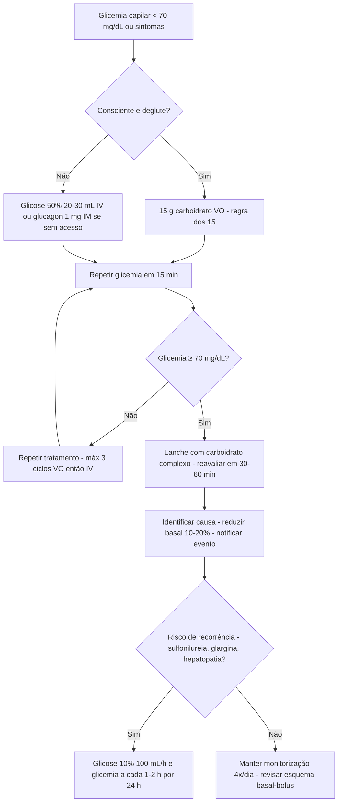

# PROT-011 — Protocolo de Hipoglicemia e Controle Glicêmico do Paciente Internado

## Objetivo
Padronizar a prevenção, o reconhecimento e o tratamento da hipoglicemia, bem como o controle glicêmico de pacientes adultos internados no Hospital Universitário FIAP (HU-FIAP), reduzindo eventos de hipoglicemia grave, hiperglicemia persistente e o uso isolado de esquemas corretivos ("sliding scale"), com foco em segurança na prescrição de insulina.

## Definições e critérios diagnósticos
- **Hipoglicemia nível 1:** glicemia **< 70 mg/dL** e ≥ 54 mg/dL (alerta; tratar e investigar causa).
- **Hipoglicemia nível 2:** glicemia **< 54 mg/dL** (clinicamente significativa, risco neurológico).
- **Hipoglicemia nível 3 (grave):** evento com alteração do estado mental ou físico que **necessita de ajuda de terceiros** para recuperação, independentemente do valor.
- **Hiperglicemia hospitalar:** glicemia > 140 mg/dL em qualquer medida; HbA1c ≥ 6,5% indica diabetes prévio não diagnosticado.
- **Alvos glicêmicos:** paciente crítico (UTI) **140–180 mg/dL**; paciente não crítico **100–180 mg/dL pré-prandial** e < 180 mg/dL aleatória; alvos mais frouxos (< 200 mg/dL) em cuidados paliativos ou alto risco de hipoglicemia.
- **Sintomas:** adrenérgicos (tremor, sudorese, fome) e neuroglicopênicos (confusão, convulsão, coma); podem faltar em idosos, betabloqueados e sedados.

## Avaliação inicial
1. Glicemia capilar na admissão de todo paciente; se > 140 mg/dL ou diabético conhecido, solicitar HbA1c (se não houver nos últimos 3 meses) e iniciar monitorização.
2. Registrar: tipo de diabetes, esquema domiciliar e doses, função renal (PROT-010), uso de corticoide, dieta (VO/NPO/enteral/parenteral) e horário das refeições.
3. Fatores de risco para hipoglicemia: idade > 70 anos, TFG < 45 mL/min, jejum imprevisto, hepatopatia, sepse, suspensão de corticoide, insulina prandial sem ingestão.
4. Monitorização capilar: pré-refeições e ao deitar (4x/dia) em dieta oral; a cada 4–6 h em NPO ou nutrição enteral contínua; a cada 1 h em insulina IV.
5. Na hipoglicemia: confirmar com glicemia capilar (ou tratar imediatamente se sintomático), avaliar nível de consciência e via oral.

## Exames recomendados
- Glicemia capilar conforme rotina acima; glicemia plasmática em valores extremos (< 40 ou > 500 mg/dL) ou discrepância clínica.
- HbA1c, creatinina, potássio, sódio, função hepática.
- Hipoglicemia recorrente sem insulina/secretagogo: cortisol, insulina e peptídeo C durante o evento, revisão de fármacos (quinolonas, tramadol), sepse (PROT-001).
- Gasometria e cetonemia se glicemia > 250 mg/dL persistente (excluir cetoacidose — PROT-004).

## Conduta
1. **Consciente e com via oral — "regra dos 15":** **15 g de carboidrato de rápida absorção** VO (150 mL de suco ou refrigerante comum, 1 colher de sopa de açúcar em água); **reavaliar glicemia em 15 min**; repetir até ≥ 70 mg/dL (máx. 3 ciclos, depois IV). Em seguida, lanche com carboidrato complexo se a próxima refeição demorar > 1 h.
2. **Rebaixamento, convulsão ou sem VO:** **glicose 50% 20–30 mL IV** em bolus (ou glicose 25% 40–60 mL), repetir em 15 min até ≥ 70 mg/dL; manter glicose 5–10% 100 mL/h se risco de recorrência (sulfonilureia, insulina de longa ação, hepatopatia). Lavar a veia após glicose hipertônica.
3. **Sem acesso venoso:** **glucagon 1 mg IM/SC** (efeito em 10–15 min; menos eficaz em hepatopata e jejum prolongado), puncionando acesso em paralelo.
4. **Após qualquer hipoglicemia:** reavaliar em 30–60 min, identificar a causa, reduzir 10–20% a basal (ou suspender a prandial correspondente), notificar o evento; nível 2 ou 3 exige revisão da prescrição no mesmo turno.
5. **Hiperglicemia — basal-bolus:** dose total diária **0,3–0,5 U/kg/dia** (0,2–0,3 em idosos, TFG < 45, magros); 50% basal (glargina 1x/dia ou NPH 2/3 manhã – 1/3 noite) e 50% prandial dividida nas 3 refeições + correção. Titular 10–20% a cada 24–48 h. **Não usar sliding scale isolado** por mais de 24 h.
6. **Jejum/NPO:** manter **50–80% da insulina basal**, **suspender toda insulina prandial**, manter correção a cada 4–6 h; glicose 5% 100 mL/h se NPO > 12 h em DM1.
7. **Corticoide (prednisona ≥ 20 mg/dia):** NPH matinal 0,1 U/kg por 10 mg de prednisona (máx. 0,4 U/kg), reduzida junto com o desmame.
8. **Nutrição enteral contínua:** NPH 8/8 h ou 12/12 h (ou basal + regular 6/6 h); se a dieta parar, glicose 10% na mesma velocidade.
9. **Insulina IV contínua:** UTI com glicemia **> 180 mg/dL persistente** (2 medidas), cetoacidose, estado hiperosmolar ou pós-operatório cardíaco; 0,05–0,1 U/kg/h, glicemia horária; transição para SC com 2 h de sobreposição.
10. **Antidiabéticos orais:** suspender metformina em TFG < 30, contraste, sepse e instabilidade; suspender iSGLT2 em jejum/cirurgia e cetoacidose; evitar sulfonilureias em internados.

## Medicamentos e doses usuais
| Medicamento | Dose | Via | Observações |
|---|---|---|---|
| Carboidrato simples | 15 g (150 mL suco/refrigerante; 1 colher sopa açúcar) | VO | Reavaliar em 15 min; até 3 ciclos |
| Glicose 50% | 20–30 mL (10–15 g) em bolus; repetir em 15 min | IV | Veia calibrosa; lavar com SF; 25% em idosos com acesso frágil |
| Glicose 10% | 100 mL/h de manutenção | IV | Risco de recorrência: sulfonilureia, glargina, hepatopata |
| Glucagon | 1 mg | IM / SC | Sem acesso venoso; náusea frequente; menos eficaz em hepatopata |
| Insulina glargina | 0,15–0,25 U/kg/dia (50% da DTD) | SC | Basal 1x/dia; reduzir 20% em TFG < 45 |
| Insulina NPH | 2/3 manhã e 1/3 noite; 0,1 U/kg por 10 mg de prednisona | SC | Alternativa à glargina; corticoide matinal |
| Insulina regular / lispro / asparte | 0,05–0,08 U/kg por refeição + correção | SC | Suspender se NPO ou ingestão < 50% da refeição |
| Insulina regular IV | 0,05–0,1 U/kg/h; titular por protocolo de UTI | IV contínua | Glicemia horária; glicose 5–10% se < 100 mg/dL |

## Critérios de gravidade e alerta
- Glicemia < 54 mg/dL (nível 2) ou qualquer evento nível 3.
- Hipoglicemia recorrente (≥ 2 episódios em 24 h) ou refratária após 3 ciclos da regra dos 15.
- Hipoglicemia por sulfonilureia ou insulina de longa ação (risco por 24–72 h).
- Glicemia > 250 mg/dL com cetonemia ≥ 1,5 mmol/L, pH < 7,30 ou osmolaridade > 320 mOsm/kg.
- Glicemia > 180 mg/dL em ≥ 2 medidas consecutivas apesar de ajuste (UTI: iniciar IV).
- Rebaixamento do sensório, convulsão ou déficit focal associado a disglicemia.

## Critérios de internação, UTI e alta
- **Internação:** hipoglicemia grave por sulfonilureia ou insulina de longa ação (observar ≥ 24 h), hipoglicemia sem causa aparente, hiperglicemia > 300 mg/dL sintomática ou com cetose.
- **UTI:** cetoacidose moderada/grave, estado hiperosmolar, necessidade de insulina IV contínua, hipoglicemia com coma/convulsão, instabilidade hemodinâmica.
- **Enfermaria:** hipoglicemia resolvida com causa identificada, hiperglicemia controlável com esquema SC.
- **Alta:** ≥ 24 h sem hipoglicemia nível 2/3, glicemias 100–180 mg/dL com o esquema domiciliar, paciente/cuidador treinado na regra dos 15, prescrição simplificada (evitar sulfonilureia em idosos), HbA1c conhecida e retorno em 2–4 semanas.

## Fluxograma

## Perguntas frequentes da equipe
**P:** Paciente ficará em jejum para endoscopia amanhã. Suspendo toda a insulina?
**R:** Não. Mantenha 50–80% da basal (glargina ou NPH), suspenda a prandial e mantenha correção a cada 4–6 h. Em DM1, nunca suspender a basal totalmente.

**P:** Posso prescrever apenas "insulina regular conforme glicemia" (sliding scale)?
**R:** Apenas nas primeiras 24 h para avaliar necessidade. Depois, converter em esquema basal-bolus com a soma das correções do dia anterior; sliding scale isolado aumenta hiperglicemia e hipoglicemia.

**P:** Hipoglicemia de 48 mg/dL em idoso em uso de glibenclamida. Resolveu com suco; posso dar alta?
**R:** Não. Sulfonilureia causa hipoglicemia recorrente por 24–72 h; observar com glicose 10% de manutenção e glicemia a cada 1–2 h, suspendendo a droga definitivamente.

**P:** Paciente iniciou prednisona 40 mg e as glicemias da tarde estão em 280 mg/dL. Como ajustar?
**R:** Adicione NPH matinal 0,4 U/kg (0,1 U/kg por 10 mg de prednisona), titule conforme glicemia pré-jantar e reduza proporcionalmente ao desmame do corticoide.

**P:** Qual o alvo na UTI e quando iniciar insulina IV?
**R:** 140–180 mg/dL. Inicie infusão contínua se ≥ 2 glicemias > 180 mg/dL, com medida horária e glicose 5–10% associada se a glicemia cair abaixo de 100 mg/dL.

## Referências
1. American Diabetes Association. Standards of Care in Diabetes — 16. Diabetes Care in the Hospital. Diabetes Care. 2025.
2. Sociedade Brasileira de Diabetes. Diretriz da SBD: Controle glicêmico no paciente hospitalizado. 2023.
3. Umpierrez GE, et al. Management of Hyperglycemia in Hospitalized Adult Patients in Non-Critical Care Settings: Endocrine Society Guideline. J Clin Endocrinol Metab. 2022.
4. International Hypoglycaemia Study Group. Glucose concentrations of less than 3.0 mmol/L should be reported in clinical trials. Diabetes Care. 2017.
5. Comissão de Protocolos Clínicos HU-FIAP. Ata de revisão PROT-011, maio/2026.

---
*Protocolo institucional fictício para fins acadêmicos (Tech Challenge FIAP). Não substitui diretrizes oficiais nem julgamento clínico.*
