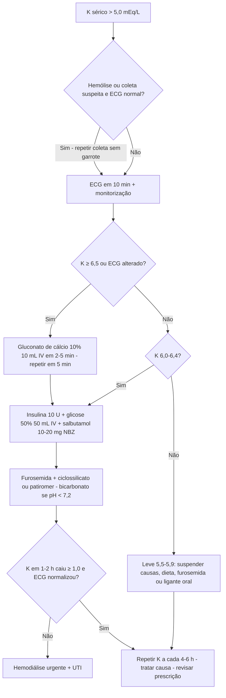

# PROT-012 — Protocolo de Hipercalemia

## Objetivo
Padronizar o reconhecimento, a estratificação e o tratamento da hipercalemia em adultos no Hospital Universitário FIAP (HU-FIAP), garantindo estabilização cardíaca imediata nos casos graves, redução segura do potássio sérico, identificação da causa e prevenção de recorrência, com tempo entre resultado crítico e primeira medida terapêutica ≤ 30 minutos.

## Definições e critérios diagnósticos
- **Hipercalemia:** potássio sérico **> 5,0 mEq/L** (referência institucional 3,5–5,0).
- **Leve:** 5,5–5,9 mEq/L sem alterações eletrocardiográficas.
- **Moderada:** 6,0–6,4 mEq/L sem alterações eletrocardiográficas.
- **Grave:** **≥ 6,5 mEq/L** ou **qualquer valor com alterações no ECG** atribuíveis à hipercalemia, ou sintomas (fraqueza muscular ascendente, parestesias, bradiarritmia).
- **Alterações no ECG:** onda T apiculada → prolongamento do PR e achatamento da onda P → alargamento do QRS (> 120 ms) → onda senoidal → FV/assistolia. ECG normal não exclui risco.
- **Pseudo-hipercalemia:** hemólise, garroteamento prolongado, leucocitose > 100.000 ou plaquetas > 1.000.000/mm³, coleta em membro com infusão de K. Repetir sem garrote (ou gasometria) antes de tratar, **exceto se ECG alterado**.
- **Causas frequentes:** LRA/DRC (PROT-010), IECA/BRA/espironolactona/AINE/trimetoprima, acidose, hipoaldosteronismo, lise celular (rabdomiólise, lise tumoral), hiperglicemia com deficiência de insulina.

## Avaliação inicial
1. Ao receber resultado de K ≥ 6,0 mEq/L (valor crítico do laboratório), o médico é comunicado em até 15 min e deve avaliar o paciente imediatamente.
2. **ECG de 12 derivações em até 10 min** e monitorização cardíaca contínua para K ≥ 6,0 ou qualquer sintoma.
3. Sinais vitais, nível de consciência, força muscular, diurese das últimas 6 h, volemia.
4. Revisar prescrição e dieta: suplementos e soluções com K, IECA/BRA, espironolactona, AINE, SMX-TMP, betabloqueador, digoxina.
5. Confirmar a amostra (hemólise?) sem atrasar o tratamento em casos graves.

## Exames recomendados
- Potássio sérico repetido (gasometria venosa fornece resultado em minutos), sódio, cloro, bicarbonato, creatinina, ureia, glicemia, cálcio, magnésio, fósforo.
- ECG inicial e após cada intervenção de estabilização; repetir K **1–2 h após o tratamento** e depois a cada 4–6 h até < 5,5 mEq/L por duas medidas.
- Conforme suspeita: CPK (rabdomiólise), DHL/ácido úrico (lise tumoral), cortisol/aldosterona.
- Glicemia capilar a cada 1 h por 4–6 h após insulina IV (hipoglicemia tardia ocorre em até 20% — PROT-011).

## Conduta
1. **Estabilização da membrana (grave ou ECG alterado):** **gluconato de cálcio 10% 10 mL IV em 2–5 min**; repetir em 5 min se o ECG não melhorar (até 3 doses). Efeito em 1–3 min, duração 30–60 min; não reduz o K. Em uso de digoxina, infundir em 20–30 min.
2. **Redistribuição intracelular:** **insulina regular 10 U IV** + **glicose 50% 50 mL (25 g)**; reduzir para **5 U** se glicemia < 250 mg/dL em DRC, idoso ou baixo peso; se glicemia > 250 mg/dL, insulina sem glicose. Início em 15 min, queda de 0,6–1,0 mEq/L, duração 4–6 h. Associar **salbutamol 10–20 mg em nebulização** (queda adicional de 0,5–1,0 mEq/L; cautela em coronariopatia). **Bicarbonato 8,4% 50–100 mEq IV** apenas se acidose (pH < 7,2 ou HCO3 < 18).
3. **Remoção de potássio:** **furosemida 40–80 mg IV** (se diurese preservada; repor volume se hipovolêmico); **ciclossilicato de zircônio 10 g VO 3x/dia por 48 h** (ação em 1 h) ou **patiromer 8,4–16,8 g 1x/dia** (4–7 h); **poliestirenossulfonato de cálcio 30 g VO/retal** se indisponíveis (evitar em íleo/pós-operatório). **Hemodiálise** se K ≥ 6,5 refratário, DRC dialítica, LRA anúrica ou lise maciça — acionar nefrologia (PROT-010).
4. **Leve/moderada sem ECG alterado:** suspender fontes de K e drogas causais, dieta pobre em K (< 2 g/dia), furosemida se volemia permitir, resina/ligante oral, repetir K em 2–4 h; considerar insulina/glicose se K ≥ 6,0.
5. **Suspender/ajustar:** IECA/BRA, espironolactona, AINE, SMX-TMP, suplementos e soluções com K; reintroduzir após normalização (em IC ou DRC proteinúrica, preferir associar ligante de K — PROT-009).
6. **Tratar a causa:** LRA (volume, obstrução), acidose, hiperglicemia, rabdomiólise (hidratação vigorosa), lise tumoral (rasburicase), hipoaldosteronismo (fludrocortisona).
7. **Monitorização:** ECG contínuo até K < 6,0 e QRS normal; K em 1–2 h, 4–6 h e 12 h; glicemia horária por 4–6 h.

## Medicamentos e doses usuais
| Medicamento | Dose | Via | Observações |
|---|---|---|---|
| Gluconato de cálcio 10% | 10 mL (1 g) em 2–5 min; repetir em 5 min até 3x | IV | Não reduz K; primeiro passo se ECG alterado ou K ≥ 6,5 |
| Insulina regular + glicose 50% | 10 U + 50 mL (25 g); 5 U se glicemia < 250 e DRC/idoso | IV | Glicemia capilar a cada 1 h por 4–6 h |
| Salbutamol | 10–20 mg nebulização (ou 4–8 jatos 100 mcg) | Inalatório | Efeito em 30 min; taquicardia; não usar isolado |
| Bicarbonato de sódio 8,4% | 50–100 mEq em 30–60 min | IV | Apenas se pH < 7,2; sobrecarga de sódio |
| Furosemida | 40–80 mg (dobrar em DRC) | IV | Exige diurese; repor volume se hipovolêmico |
| Ciclossilicato de zircônio sódico | 10 g 3x/dia por 48 h, depois 5–10 g/dia | VO | Início em 1 h; edema por sódio em doses altas |
| Patiromer | 8,4–16,8 g 1x/dia | VO | Início em 4–7 h; separar 3 h de outros fármacos |
| Poliestirenossulfonato de cálcio | 30 g 1–3x/dia (VO ou enema de retenção) | VO / Retal | Evitar em íleo/pós-operatório; constipação |

## Critérios de gravidade e alerta
- K ≥ 6,5 mEq/L em qualquer circunstância.
- Qualquer alteração no ECG: T apiculada difusa, PR > 200 ms, QRS > 120 ms, bradicardia < 50 bpm, bloqueio AV, onda senoidal.
- Aumento rápido de K (> 1,0 mEq/L em 24 h) ou K ≥ 6,0 com LRA oligúrica/anúrica.
- Fraqueza muscular, parestesias, dispneia por fraqueza respiratória.
- Falha de queda ≥ 1,0 mEq/L após 2 h de tratamento clínico completo.
- Associação com pH < 7,20, rabdomiólise (CPK > 5.000 U/L) ou lise tumoral.

## Critérios de internação, UTI e alta
- **Internação:** K ≥ 6,0 mEq/L; K 5,5–5,9 com DRC avançada, LRA ou uso de drogas causais que exigem ajuste e controle em 24 h.
- **UTI/monitorização intensiva:** K ≥ 6,5 mEq/L, alterações no ECG, necessidade de diálise de urgência, arritmia ou instabilidade hemodinâmica, necessidade de repetir estabilização com cálcio.
- **Enfermaria com telemetria:** K 6,0–6,4 sem alteração no ECG, com resposta ao tratamento inicial.
- **Alta:** K < 5,5 mEq/L em duas medidas com intervalo ≥ 6 h sem medidas IV, ECG normal, causa identificada e corrigida, prescrição revisada (drogas suspensas ou plano de reintrodução), orientação dietética, retorno com dosagem de K em 3–7 dias.

## Fluxograma

## Perguntas frequentes da equipe
**P:** K de 6,8 mEq/L, mas a amostra veio hemolisada e o ECG é normal. Trato ou repito?
**R:** Repita imediatamente (gasometria venosa dá resultado em minutos) mantendo o paciente monitorizado; se houver qualquer alteração no ECG ou sintoma, trate sem esperar.

**P:** Posso dar insulina sem glicose?
**R:** Apenas se glicemia > 250 mg/dL. Caso contrário, sempre associar 25 g de glicose e monitorar glicemia horária por 4–6 h; em DRC ou glicemia < 250, usar 5 U.

**P:** O gluconato de cálcio baixa o potássio?
**R:** Não. Ele protege o miocárdio por 30–60 min enquanto as medidas de redistribuição e remoção agem. Repita se o ECG não melhorar em 5 min.

**P:** Quando a resina (poliestirenossulfonato) é suficiente como tratamento único?
**R:** Somente em hipercalemia leve (5,5–5,9) sem alteração no ECG e com causa reversível. Seu efeito é lento (> 2–6 h) e incerto; prefira ciclossilicato de zircônio quando disponível.

**P:** Paciente com IC usa espironolactona e IECA e apresentou K 5,8. Suspendo tudo para sempre?
**R:** Suspenda temporariamente, corrija a causa (desidratação, AINE) e reintroduza de forma escalonada com K de controle em 1 semana, associando ligante de K se necessário para manter a GDMT (PROT-009).

## Referências
1. KDIGO Clinical Practice Guideline for the Management of Potassium Disorders — Controversies Conference Report. Kidney Int. 2020.
2. Lindner G, et al. Acute hyperkalemia in the emergency department: a summary from a Kidney Disease: Improving Global Outcomes conference. Eur J Emerg Med. 2020.
3. UK Kidney Association. Clinical Practice Guidelines: Treatment of Acute Hyperkalaemia in Adults. 2023.
4. Sociedade Brasileira de Nefrologia. Recomendações para o manejo da hipercalemia. 2021.
5. Comissão de Protocolos Clínicos HU-FIAP. Ata de revisão PROT-012, maio/2026.

---
*Protocolo institucional fictício para fins acadêmicos (Tech Challenge FIAP). Não substitui diretrizes oficiais nem julgamento clínico.*
