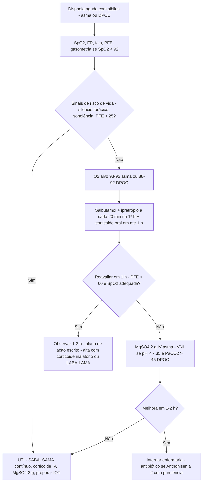

# PROT-013 — Protocolo de Exacerbação de Asma e DPOC

## Objetivo
Padronizar a avaliação de gravidade, o tratamento inicial e os critérios de internação e alta das exacerbações de asma e DPOC em adultos no Hospital Universitário FIAP (HU-FIAP), reduzindo o tempo até o primeiro broncodilatador (meta ≤ 15 min), a necessidade de intubação e as readmissões em 30 dias.

## Definições e critérios diagnósticos
- **Exacerbação de asma:** piora aguda ou subaguda de dispneia, tosse, sibilância e aperto torácico com queda da função pulmonar (PFE ou VEF1) que exige mudança de tratamento.
- **Gravidade da asma (GINA):** *leve/moderada* — fala frases, FR < 30, FC 100–120, SpO2 90–95%, PFE > 50% do previsto/melhor; *grave* — fala palavras, senta inclinado, FR > 30, musculatura acessória, FC > 120, **SpO2 < 90%**, **PFE ≤ 50%**; *quase fatal* — sonolência, confusão, **silêncio torácico**, bradicardia, cianose, **PFE < 25%** ou incapaz de realizar, PaCO2 normal ou elevada.
- **Exacerbação de DPOC (GOLD):** piora aguda de dispneia, volume ou purulência do escarro além da variação diária, exigindo terapia adicional; *leve* (SABA), *moderada* (SABA + corticoide e/ou antibiótico), *grave* (PS/internação); insuficiência respiratória se FR > 30, SpO2 < 88% com O2 ou PaCO2 > 45 mmHg com pH < 7,35.
- **Critérios de Anthonisen:** aumento da dispneia, do volume do escarro e purulência — tipo I (3), tipo II (2), tipo III (1). Antibiótico quando **≥ 2 critérios incluindo purulência** ou suporte ventilatório.
- **Diferenciais:** IC (PROT-009), TEP, pneumotórax, pneumonia, anafilaxia (PROT-007), obstrução alta.

## Avaliação inicial
1. Triagem: sinais vitais, SpO2, FR, capacidade de falar, consciência, musculatura acessória, ausculta (sibilos x silêncio).
2. **PFE** antes e 1 h após o broncodilatador inicial (asma), em % do previsto ou do melhor pessoal.
3. História: intubação/UTI prévias, ≥ 2 cursos de corticoide oral/ano, uso de > 1 frasco de SABA/mês, má adesão ao corticoide inalatório, tabagismo, exacerbações de DPOC no último ano, O2 domiciliar, cardiopatia.
4. Identificar o gatilho: infecção viral, bacteriana, exposição ambiental, suspensão de medicação, betabloqueador, AINE.
5. Reavaliação clínica **a cada 20 min na 1ª hora** e após 1–3 h para decisão de internação.

## Exames recomendados
- **Asma:** PFE e SpO2 bastam nas crises leves/moderadas; gasometria se SpO2 < 92%, PFE < 50% ou falha de resposta; radiografia se suspeita de pneumonia/pneumotórax.
- **DPOC:** gasometria arterial se SpO2 < 92%, sonolência ou suspeita de hipercapnia; radiografia de tórax, ECG, hemograma, PCR, eletrólitos, glicemia, creatinina; BNP/troponina se suspeita cardíaca; cultura de escarro se exacerbação grave ou falha de antibiótico.
- Eosinófilos (DPOC): < 100 células/µL sugerem menor benefício do corticoide.

## Conduta
**Asma**
1. **Oxigênio** titulado para **SpO2 93–95%** (evitar hiperóxia).
2. **Salbutamol** 4–10 jatos com espaçador ou **2,5–5 mg em nebulização a cada 20 min na 1ª hora**, depois 1/1 h a 4/4 h. Associar **ipratrópio 0,5 mg** a cada 20 min por 3 doses em crise moderada/grave.
3. **Corticoide sistêmico em até 1 h:** **prednisolona 40–50 mg VO por 5–7 dias** (sem desmame) ou **hidrocortisona 200 mg IV** se não deglute. Manter/iniciar corticoide inalatório na alta.
4. **Sulfato de magnésio 2 g IV em 20 min** em crise grave ou PFE < 50% após 1 h de tratamento; dose única. Aminofilina e antibiótico não são rotina.
5. **Falha (PFE < 50% ou SpO2 < 90% após 1–2 h), sonolência ou PaCO2 > 42 mmHg:** UTI; VNI só em ambiente monitorizado; IOT se exaustão ou rebaixamento (cetamina na indução; ventilar com baixa frequência e tempo expiratório longo).

**DPOC**
1. **Oxigênio controlado** para **SpO2 88–92%** (cânula 1–3 L/min ou Venturi 24–28%); gasometria 30–60 min após início/ajuste pelo risco de hipercapnia.
2. **Broncodilatador:** SABA (salbutamol 2,5–5 mg NBZ ou 4–8 jatos) + SAMA (ipratrópio 0,5 mg) a cada 20 min na 1ª hora, depois 4/4 h a 6/6 h; manter LABA/LAMA domiciliares assim que possível.
3. **Prednisona 40 mg VO por 5 dias**; cursos mais longos não trazem benefício.
4. **Antibiótico por 5–7 dias** se Anthonisen ≥ 2 com purulência ou VNI/IOT: **amoxicilina-clavulanato 875/125 mg 12/12 h** ou **azitromicina 500 mg/dia por 3–5 dias**; levofloxacino 750 mg/dia se falha, VEF1 < 50% ou ≥ 2 exacerbações/ano; cobrir pseudomonas se isolamento prévio.
5. **VNI (BiPAP):** se **pH < 7,35 e PaCO2 > 45 mmHg**, fadiga ou hipoxemia persistente; IPAP 10–20 cmH2O, EPAP 4–6; gasometria em 1 h. **IOT** se pH < 7,25 após 1–2 h de VNI, rebaixamento ou instabilidade.
6. Profilaxia de TEV (PROT-006), fisioterapia respiratória, tratar comorbidades, iniciar cessação do tabagismo.

## Medicamentos e doses usuais
| Medicamento | Dose | Via | Observações |
|---|---|---|---|
| Salbutamol | 4–10 jatos com espaçador ou 2,5–5 mg NBZ a cada 20 min na 1ª h; depois 1/1 h a 4/4 h | Inalatório | Taquicardia, tremor, hipocalemia; monitorar K |
| Ipratrópio | 0,5 mg NBZ (ou 4–8 jatos) a cada 20 min x3, depois 4/4 h a 6/6 h | Inalatório | Associar em crises moderadas/graves e em toda DPOC |
| Prednisolona / prednisona | 40–50 mg 1x/dia por 5–7 dias (asma); 40 mg por 5 dias (DPOC) | VO | Sem desmame; glicemia em diabéticos (PROT-011) |
| Hidrocortisona | 200 mg dose inicial, depois 100 mg 6/6 h | IV | Se impossibilidade de VO |
| Sulfato de magnésio 50% | 2 g diluídos em 100 mL SF em 20 min | IV | Asma grave; dose única; hipotensão se rápido |
| Amoxicilina-clavulanato | 875/125 mg 12/12 h por 5–7 dias | VO | DPOC com Anthonisen ≥ 2 com purulência |
| Azitromicina | 500 mg 1x/dia por 3–5 dias | VO | Alternativa; prolonga QT |

## Critérios de gravidade e alerta
- SpO2 < 90% em ar ambiente (asma) ou < 88% com O2 (DPOC); PaO2 < 60 mmHg.
- PFE < 50% do previsto/melhor (grave) ou < 25% (quase fatal); ausência de melhora do PFE > 60% após 1 h.
- FR > 30 irpm, FC > 120 bpm, fala entrecortada, musculatura acessória, silêncio torácico, sonolência ou confusão.
- PaCO2 > 45 mmHg com pH < 7,35 (DPOC) ou PaCO2 ≥ 42 mmHg na asma (sinal de fadiga).
- História de intubação prévia, UTI ou uso de > 1 frasco de SABA/mês.

## Critérios de internação, UTI e alta
- **Internação:** asma com PFE < 60% após 1–3 h ou necessidade de O2; DPOC com dispneia em repouso, SpO2 < 88%, hipercapnia nova, falha ambulatorial, comorbidade grave ou sem suporte domiciliar.
- **UTI:** VNI com pH < 7,30 ou falha em 1–2 h, IOT, PFE < 25%, PaCO2 > 45 (asma) ou pH < 7,25 (DPOC), rebaixamento, instabilidade.
- **Enfermaria:** responsivos parciais, sem hipercapnia ou com VNI estável em unidade habilitada.
- **Alta:** asma — PFE > 60–80% do melhor, SpO2 ≥ 94% em ar ambiente, SABA < 4/4 h, técnica inalatória verificada, corticoide inalatório prescrito e **plano de ação escrito**; DPOC — SABA < 4/4 h, caminha, come e dorme sem dispneia, SpO2/gasometria estáveis por 12–24 h, LABA/LAMA revisados, vacinação e reabilitação orientadas; retorno em 7–14 dias (asma) ou 1–4 semanas (DPOC).

## Fluxograma

## Perguntas frequentes da equipe
**P:** Paciente com DPOC e SpO2 85%; coloco máscara com reservatório?
**R:** Não. Use O2 controlado (cânula 1–3 L/min ou Venturi 24–28%) para SpO2 88–92% e repita a gasometria em 30–60 min; hiperóxia agrava a hipercapnia.

**P:** Toda exacerbação de DPOC precisa de antibiótico?
**R:** Não. Prescreva se ≥ 2 critérios de Anthonisen incluindo purulência ou necessidade de VNI/IOT; sem purulência, broncodilatador e corticoide.

**P:** Quanto tempo de corticoide oral na asma?
**R:** Prednisolona 40–50 mg por 5–7 dias, sem desmame, mantendo ou aumentando o corticoide inalatório na alta.

**P:** Quando usar sulfato de magnésio?
**R:** Em asma grave (PFE < 50% ou SpO2 < 90%) ou sem resposta após 1 h de SABA + corticoide: 2 g IV em 20 min, dose única.

**P:** Em que ponto inicio VNI no DPOC?
**R:** pH < 7,35 com PaCO2 > 45 mmHg, fadiga ou hipoxemia persistente apesar de O2 controlado; gasometria em 1 h e IOT se pH < 7,25 ou deterioração.

## Referências
1. Global Initiative for Asthma (GINA). Global Strategy for Asthma Management and Prevention. 2024.
2. Global Initiative for Chronic Obstructive Lung Disease (GOLD). Global Strategy for the Diagnosis, Management, and Prevention of COPD. 2025 Report.
3. Sociedade Brasileira de Pneumologia e Tisiologia. Recomendações para o manejo da asma e da DPOC. J Bras Pneumol. 2020–2021.
4. Anthonisen NR, et al. Antibiotic therapy in exacerbations of chronic obstructive pulmonary disease. Ann Intern Med. 1987.
5. Comissão de Protocolos Clínicos HU-FIAP. Ata de revisão PROT-013, junho/2026.

---
*Protocolo institucional fictício para fins acadêmicos (Tech Challenge FIAP). Não substitui diretrizes oficiais nem julgamento clínico.*
