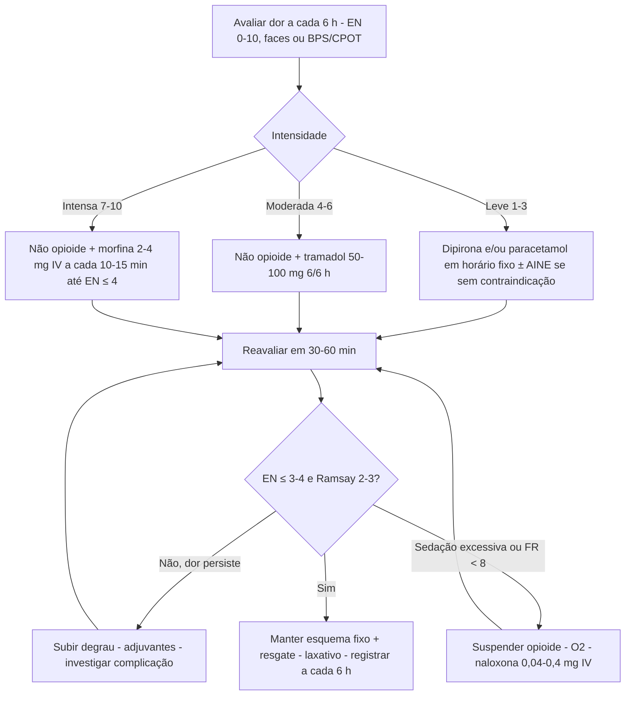

# PROT-014 — Protocolo de Avaliação e Manejo da Dor Aguda

## Objetivo
Padronizar a avaliação, o registro e o tratamento da dor aguda em adultos internados no Hospital Universitário FIAP (HU-FIAP), garantindo analgesia multimodal eficaz e segura, uso racional de opioides, reavaliação em tempo definido e monitorização de efeitos adversos (sedação, depressão respiratória, náusea, constipação).

## Definições e critérios diagnósticos
- **Dor aguda:** início recente (< 30 dias), associada a lesão tecidual identificável (trauma, cirurgia, inflamação, procedimento), com resolução esperada após a cura da causa.
- **Dor como 5º sinal vital:** intensidade avaliada e registrada junto aos sinais vitais, **no mínimo a cada 6 h**, e **30–60 min após cada intervenção analgésica**.
- **Escalas:** Escala Numérica (EN 0–10) ou EVA em comunicativos; Escala de Faces em déficit cognitivo leve ou baixa escolaridade; **BPS (3–12; dor se ≥ 5)** ou **CPOT (0–8; dor se ≥ 3)** em sedados/intubados; PAINAD em demência avançada.
- **Intensidade:** **leve 1–3**, **moderada 4–6**, **intensa 7–10**. Dor intensa é valor crítico e deve ser comunicada ao médico imediatamente.
- **Sedação (Ramsay):** 1 ansioso, 2 tranquilo, 3 responde a comandos, 4 resposta rápida a estímulo, 5 resposta lenta, 6 sem resposta; alvo com opioide: Ramsay 2 (RASS 0 a −1).

## Avaliação inicial
1. Perguntar e registrar intensidade (0–10), localização, qualidade (nociceptiva somática/visceral x neuropática), irradiação, fatores de melhora/piora, impacto em sono e mobilização.
2. Identificar contraindicações: alergia, úlcera/sangramento digestivo, LRA/DRC (PROT-010), IC (PROT-009), hepatopatia, anticoagulação, idade > 75 anos, apneia do sono, uso crônico de opioide.
3. Estabelecer **meta analgésica** com o paciente (EN ≤ 3 em repouso e ≤ 4 em movimento) e explicar o plano.
4. Avaliar sedação basal (Ramsay/RASS), FR e SpO2 antes de opioides; evitar duplicidade de analgésicos na prescrição.

## Exames recomendados
- Não há exames obrigatórios para iniciar analgesia; a investigação é dirigida à causa da dor.
- Creatinina antes de AINE em idosos, diabéticos ou em uso de IECA/BRA/diurético; função hepática antes de paracetamol em doses plenas em etilista ou hepatopata.
- Hemograma e coagulograma se suspeita de sangramento ou antes de AINE em anticoagulados.
- Glicemia capilar em uso de corticoide adjuvante (PROT-011).

## Conduta
1. **Escada analgésica (OMS adaptada):** *degrau 1 (EN 1–3)* — dipirona e/ou paracetamol ± AINE; *degrau 2 (EN 4–6)* — não opioide + tramadol/codeína; *degrau 3 (EN 7–10)* — não opioide + morfina IV titulada ± adjuvantes. Na dor intensa pós-operatória/traumática, iniciar no degrau 3 e reduzir conforme melhora.
2. **Analgesia multimodal:** associar mecanismos diferentes (dipirona + paracetamol + AINE + bloqueio regional) para poupar 30–50% de opioide; analgésico de base em horário fixo, nunca apenas "se dor".
3. **Não opioides:** dipirona 1 g 6/6 h IV/VO; paracetamol 500–1000 mg 6/6 h (máx. 4 g/dia; **2–3 g/dia em hepatopata, etilista ou desnutrido**); AINE por **≤ 3–5 dias** — cetoprofeno 100 mg 12/12 h IV ou ibuprofeno 400–600 mg 8/8 h VO — **evitar em LRA/DRC, IC, úlcera/sangramento, anticoagulados e idoso frágil**; protetor gástrico se > 65 anos.
4. **Opioide fraco:** tramadol 50–100 mg 6/6 h VO/IV (máx. 400 mg/dia; 200 mg em > 75 anos ou ClCr < 30); evitar em epilepsia e com ISRS/IMAO. Alternativa: codeína 30–60 mg 6/6 h.
5. **Opioide forte:** morfina **2–4 mg IV a cada 10–15 min** até EN ≤ 4 ou Ramsay 3 (máx. usual 10–15 mg na 1ª hora), depois 5–10 mg VO/SC 4/4 h; reduzir 50% em idosos, DRC e hepatopatas; fentanil 25–50 mcg IV se ClCr < 30. Evitar meperidina e associação de opioide fraco com forte.
6. **Adjuvantes:** gabapentina 300 mg ou pregabalina 75 mg à noite em dor neuropática, dexametasona 4–8 mg, calor/frio local, posicionamento e mobilização precoce.
7. **Reavaliação em 30–60 min** após cada dose (15 min após opioide IV) e a cada 6 h: intensidade, Ramsay/RASS, FR, SpO2, náusea, retenção urinária, evacuação.
8. **Efeitos adversos do opioide:** laxativo profilático (lactulose 15–30 mL 12/12 h) desde a 1ª dose; ondansetrona 4–8 mg se náusea; evitar benzodiazepínico concomitante (PROT-015).
9. **Depressão respiratória (FR < 8 irpm, SpO2 < 90%, Ramsay ≥ 5):** suspender opioide, O2, **naloxona 0,04–0,4 mg IV** (0,4 mg em 10 mL, 1–2 mL a cada 2–3 min até FR ≥ 10); infusão se opioide de ação longa; notificar.
10. **Desescalonamento:** reduzir opioide 25–50% a cada 24–48 h quando EN ≤ 3; na alta, menor quantidade possível (≤ 3–5 dias).

## Medicamentos e doses usuais
| Medicamento | Dose | Via | Observações |
|---|---|---|---|
| Dipirona | 1 g 6/6 h (máx. 4–6 g/dia) | IV lenta / VO | Hipotensão se IV rápida; alergia/agranulocitose rara |
| Paracetamol | 500–1000 mg 6/6 h (máx. 4 g/dia; 2–3 g em hepatopata) | VO | Verificar associações contendo paracetamol |
| Cetoprofeno | 100 mg 12/12 h por ≤ 3–5 dias | IV | Evitar em LRA/IC/úlcera/idoso frágil; proteção gástrica |
| Ibuprofeno | 400–600 mg 8/8 h (máx. 2,4 g/dia) | VO | Mesmas restrições dos AINEs |
| Tramadol | 50–100 mg 6/6 h (máx. 400 mg/dia; 200 mg em > 75 a ou ClCr < 30) | VO / IV lenta | Náusea, convulsão, serotoninérgico |
| Morfina | 2–4 mg IV a cada 10–15 min até alívio; 5–10 mg VO/SC 4/4 h | IV / SC / VO | Reduzir 50% em idoso, DRC, hepatopata; laxativo profilático; fentanil se ClCr < 30 |
| Naloxona | 0,04–0,4 mg IV a cada 2–3 min; infusão 0,4 mg/h se necessário | IV / IM | FR < 8 ou Ramsay ≥ 5; duração menor que a da morfina |

## Critérios de gravidade e alerta
- Dor intensa (EN ≥ 7) não aliviada 60 min após analgesia ou com piora progressiva (suspeitar de complicação: síndrome compartimental, isquemia, perfuração, hemorragia).
- FR < 10 irpm, SpO2 < 92% ou Ramsay ≥ 4 / RASS ≤ −2 em uso de opioide.
- Necessidade de > 3 doses de resgate de morfina em 4 h ou > 30 mg de morfina IV/dia em virgem de opioide.
- Náusea/vômitos incoercíveis, retenção urinária > 8 h, ausência de evacuação > 72 h.
- Creatinina com aumento ≥ 0,3 mg/dL ou sangramento digestivo em uso de AINE.

## Critérios de internação, UTI e alta
- **Internação/prolongamento:** dor intensa que exige opioide IV titulado ou analgesia regional contínua; necessidade de investigar a causa; efeitos adversos graves.
- **UTI/monitorização:** depressão respiratória com naloxona repetida ou em infusão, rebaixamento persistente, PCA em alto risco (apneia do sono, ClCr < 30, > 80 anos), instabilidade hemodinâmica.
- **Enfermaria:** analgesia VO ou IV intermitente com reavaliações a cada 6 h.
- **Alta:** EN ≤ 3–4 com analgésicos orais por 24 h, sem opioide IV por ≥ 12–24 h, evacuando, orientado sobre doses máximas, sinais de alarme e plano de redução do opioide (≤ 3–5 dias).

## Fluxograma

## Perguntas frequentes da equipe
**P:** Posso prescrever analgésico apenas "se dor"?
**R:** Não como único esquema. Dor moderada/intensa exige analgésico de base em horário fixo e resgate definido, com reavaliação 30–60 min após cada dose.

**P:** Qual a dose máxima de paracetamol em paciente cirrótico?
**R:** 2–3 g/dia, evitando associações que contenham paracetamol; ainda assim é mais seguro que AINE no hepatopata.

**P:** Idoso de 82 anos com lombalgia intensa e creatinina 1,6. Posso usar cetoprofeno?
**R:** Evite AINE (LRA, sangramento, IC). Use dipirona + paracetamol e, se necessário, morfina 1–2 mg IV ou tramadol 50 mg, com laxativo e monitorização de sedação.

**P:** Quando administrar naloxona e em que dose?
**R:** FR < 8 irpm, SpO2 < 90% ou Ramsay ≥ 5 em uso de opioide: 0,04–0,4 mg IV em doses fracionadas a cada 2–3 min até FR ≥ 10, sem reverter toda a analgesia; observar ≥ 2 h pelo risco de renarcotização.

**P:** Posso associar tramadol e morfina?
**R:** Não. Opioides fracos e fortes não devem ser combinados; se tramadol for insuficiente, suspenda-o e titule morfina.

## Referências
1. World Health Organization. WHO Guidelines on the management of chronic pain / Cancer pain relief (analgesic ladder). Geneva; 1986 e revisões.
2. Chou R, et al. Management of Postoperative Pain: A Clinical Practice Guideline from the American Pain Society, ASRA and ASA. J Pain. 2016.
3. Sociedade Brasileira para o Estudo da Dor (SBED). Recomendações para avaliação e tratamento da dor aguda hospitalar. 2022.
4. Schug SA, et al. Acute Pain Management: Scientific Evidence. 5th ed. ANZCA & FPM; 2020.
5. Comissão de Protocolos Clínicos HU-FIAP. Ata de revisão PROT-014, junho/2026.

---
*Protocolo institucional fictício para fins acadêmicos (Tech Challenge FIAP). Não substitui diretrizes oficiais nem julgamento clínico.*
