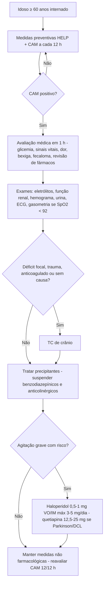

# PROT-015 — Protocolo de Prevenção e Manejo do Delirium no Idoso Hospitalizado

## Objetivo
Padronizar o rastreio, a prevenção multicomponente, o diagnóstico e o manejo do delirium em pacientes com 60 anos ou mais internados no Hospital Universitário FIAP (HU-FIAP), reduzindo incidência, duração, uso de contenção física e de antipsicóticos, tempo de internação e declínio funcional, com rastreio documentado em 100% dos idosos a cada 12 h.

## Definições e critérios diagnósticos
- **Delirium:** síndrome neuropsiquiátrica aguda caracterizada por alteração da atenção e da consciência, com curso flutuante, secundária a condição clínica, intoxicação ou abstinência (DSM-5).
- **CAM — positivo se 1 + 2 + (3 ou 4):** (1) **início agudo e curso flutuante**; (2) **desatenção** (não recita meses de trás para frente; erra > 2 no teste da letra "A"); (3) **pensamento desorganizado**; (4) **nível de consciência alterado** (hiperalerta, letárgico, torporoso). Na UTI, CAM-ICU com RASS.
- **Subtipos:** *hiperativo* (agitação, 25%), *hipoativo* (sonolência, apatia — 50%, subdiagnosticado, pior prognóstico), *misto*.
- **Predisponentes:** idade ≥ 75 anos, demência, déficit sensorial, fragilidade, polifarmácia (≥ 5 fármacos), etilismo, delirium prévio.
- **Precipitantes:** infecção (ITU — PROT-016, pneumonia, sepse — PROT-001), desidratação, dor (PROT-014), retenção urinária, fecaloma, hipóxia, distúrbios eletrolíticos e glicêmicos (PROT-011), LRA/uremia (PROT-010), cirurgia, privação de sono, contenção, sonda vesical e **medicamentos** (benzodiazepínicos, anticolinérgicos, opioides, corticoides, anti-histamínicos).
- **Diferenciais:** demência (curso crônico), depressão, psicose, afasia, encefalopatia de Wernicke, estado de mal não convulsivo.

## Avaliação inicial
1. Na admissão de todo paciente ≥ 60 anos: cognição basal (informante, Mini-Cog), funcionalidade, sensório, álcool/benzodiazepínicos e lista de medicamentos.
2. **Rastreio com CAM a cada 12 h** pela enfermagem (ou 4-AT na admissão), registrado em prontuário; CAM positivo aciona avaliação médica em até 1 h.
3. Precipitantes à beira-leito: sinais vitais, SpO2, glicemia capilar, dor (PAINAD), globo vesical (resíduo > 300 mL ao US), constipação > 3 dias, hidratação, infecção, exame neurológico (déficit focal).
4. Revisar prescrição com farmácia clínica pelos **critérios de Beers/STOPP**: suspender/substituir benzodiazepínicos, anticolinérgicos (prometazina, amitriptilina, biperideno, oxibutinina), zolpidem, metoclopramida e opioides em excesso.
5. Envolver família/cuidador para história colateral e permanência ampliada.

## Exames recomendados
- **Básicos:** glicemia capilar imediata, hemograma, sódio, potássio, cálcio, ureia/creatinina, função hepática, urina tipo I e urocultura (interpretar com cautela — PROT-016), ECG, gasometria se SpO2 < 92%, radiografia de tórax se suspeita de pneumonia.
- **Conforme suspeita:** hemoculturas, TSH, vitamina B12, amônia, níveis de digoxina/lítio/anticonvulsivante.
- **TC de crânio:** se déficit focal, trauma/queda, anticoagulação, cefaleia, neoplasia, ausência de causa após avaliação inicial ou sem melhora em 48–72 h; não é rotina.
- EEG se suspeita de estado de mal não convulsivo; punção lombar se febre com rigidez de nuca ou suspeita de encefalite.

## Conduta
1. **Prevenção multicomponente (HELP) para todo idoso de risco:** reorientação diária (relógio, calendário, luz natural), **óculos e prótese auditiva**, **mobilização precoce** (fora do leito ≥ 3x/dia), **higiene do sono** (ruído e luz reduzidos, sem procedimentos entre 23 h e 6 h, sem hipnótico), **hidratação e nutrição**, presença de familiar, evitar **contenção** e **sonda vesical**, retirar dispositivos desnecessários, analgesia fixa não opioide.
2. **Tratar precipitantes:** infecção, desidratação, hipóxia, retenção urinária (cateterismo de alívio), fecaloma, distúrbios eletrolíticos, dor (PROT-014), suspender fármacos culpados; abstinência alcoólica: tiamina 300 mg/dia IV antes de glicose e benzodiazepínico apenas nesse cenário.
3. **Agitação — não farmacológico primeiro:** abordagem calma, comunicação simples, familiar presente, ambiente seguro; contenção mecânica só como último recurso, com prescrição, reavaliação a cada 2 h e registro.
4. **Farmacológico — só se agitação grave com risco ao paciente/equipe ou que impeça tratamento essencial:** **haloperidol 0,5–1 mg VO ou IM**, repetir em 30–60 min se necessário, **máx. 3–5 mg/dia**; ECG (evitar se QTc > 470 ms). **Em Parkinson ou demência por corpos de Lewy: quetiapina 12,5–25 mg VO** (máx. 50–100 mg/dia). Suspender 24–48 h após controle; nunca manter na alta sem plano de retirada.
5. **Evitar benzodiazepínicos**, exceto abstinência alcoólica/benzodiazepínica ou contraindicação a antipsicótico; se inevitável, lorazepam 0,5–1 mg.
6. **Delirium hipoativo:** não usar antipsicótico; focar em causa, hidratação, mobilização e prevenção de complicações (broncoaspiração, úlcera por pressão, TEV — PROT-006).
7. Informar a família sobre diagnóstico e flutuação esperada; registrar "delirium" no prontuário e no sumário de alta.
8. CAM a cada 12 h até 48 h negativo; revisar medicamentos antes da alta; acompanhamento cognitivo em 1–3 meses.

## Medicamentos e doses usuais
| Medicamento | Dose | Via | Observações |
|---|---|---|---|
| Haloperidol | 0,5–1 mg, repetir em 30–60 min; máx. 3–5 mg/dia | VO / IM | Apenas agitação grave; ECG (QTc); evitar em Parkinson/DCL |
| Quetiapina | 12,5–25 mg 1–2x/dia; máx. 50–100 mg/dia | VO | Preferida em Parkinson e demência por corpos de Lewy; hipotensão |
| Lorazepam | 0,5–1 mg | VO / IV | Somente abstinência alcoólica ou contraindicação a antipsicótico |
| Tiamina | 300 mg/dia por 3–5 dias (antes de glicose) | IV / IM | Etilistas, desnutridos, vômitos prolongados |
| Melatonina | 3–5 mg às 21 h | VO | Higiene do sono; evidência modesta; sem sedação residual |
| Dipirona / paracetamol | 1 g 6/6 h / 500–1000 mg 6/6 h | VO / IV | Analgesia fixa reduz delirium por dor (PROT-014) |

## Critérios de gravidade e alerta
- CAM positivo com RASS ≥ +2 (agitação com risco de queda, retirada de dispositivos ou agressão) ou RASS ≤ −2 (hipoativo grave com risco de broncoaspiração).
- Glasgow < 13, déficit focal novo, convulsão, febre > 38 °C com rigidez de nuca.
- SpO2 < 92%, glicemia < 70 ou > 300 mg/dL, sódio < 125 ou > 155 mEq/L, cálcio corrigido > 11 mg/dL.
- Sinais de sepse (qSOFA ≥ 2 — PROT-001), LRA estágio ≥ 2 (PROT-010).
- Necessidade de > 3 mg/dia de haloperidol ou de contenção física > 24 h.
- QTc > 470 ms, sinais de síndrome neuroléptica maligna (rigidez, hipertermia, CPK elevada).

## Critérios de internação, UTI e alta
- **Internação:** delirium novo no PS sem causa ambulatorialmente tratável, com precipitante que exija tratamento IV, ou paciente sem cuidador capaz de supervisão.
- **UTI:** Glasgow ≤ 8, estado de mal epiléptico, instabilidade hemodinâmica, sepse grave, sedação IV contínua, delirium tremens.
- **Enfermaria:** quarto próximo ao posto, com acompanhante, sem restrição de visitas; evitar trocas de leito.
- **Alta:** precipitante tratado ou em tratamento oral, CAM negativo ou em clara melhora próximo ao basal, sem antipsicótico ou com retirada em ≤ 7 dias, prescrição revisada (Beers), cuidador orientado, retorno em 1–2 semanas e avaliação cognitiva em 1–3 meses.

## Fluxograma

## Perguntas frequentes da equipe
**P:** Idoso sonolento, pouco responsivo, sem agitação. Pode ser delirium?
**R:** Sim, delirium hipoativo é o subtipo mais frequente e mais grave. Aplique o CAM: início agudo, desatenção e nível de consciência alterado já o confirmam; procure infecção, fármacos e distúrbios metabólicos.

**P:** Posso prescrever diazepam para o paciente "dormir" à noite?
**R:** Não. Benzodiazepínicos precipitam e prolongam delirium. Use higiene do sono, melatonina 3–5 mg e corrija dor/ruído; benzodiazepínico só em abstinência alcoólica.

**P:** Paciente com Parkinson em delirium agitado. Haloperidol?
**R:** Contraindicado (piora motora grave). Use quetiapina 12,5–25 mg VO, reavalie a causa e evite anticolinérgicos.

**P:** Toda confusão aguda precisa de tomografia?
**R:** Não. TC de crânio é indicada se déficit focal, queda/trauma, anticoagulação, cefaleia, neoplasia ou ausência de causa após a avaliação inicial; a maioria dos casos tem causa sistêmica.

**P:** Quando posso suspender a contenção e o antipsicótico?
**R:** Contenção deve ser reavaliada a cada 2 h e retirada assim que o risco cessar; o antipsicótico é suspenso 24–48 h após o controle da agitação e nunca deve seguir na alta sem data de término.

## Referências
1. American Geriatrics Society Expert Panel on Postoperative Delirium in Older Adults. Clinical Practice Guideline. J Am Geriatr Soc. 2015.
2. National Institute for Health and Care Excellence (NICE). Delirium: prevention, diagnosis and management in hospital and long-term care. CG103, atualização 2023.
3. American Geriatrics Society 2023 Updated AGS Beers Criteria for Potentially Inappropriate Medication Use in Older Adults. J Am Geriatr Soc. 2023.
4. Inouye SK, et al. Clarifying confusion: the Confusion Assessment Method. Ann Intern Med. 1990.
5. Comissão de Protocolos Clínicos HU-FIAP. Ata de revisão PROT-015, julho/2026.

---
*Protocolo institucional fictício para fins acadêmicos (Tech Challenge FIAP). Não substitui diretrizes oficiais nem julgamento clínico.*
