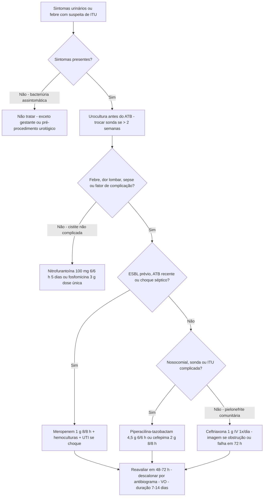

# PROT-016 — Protocolo de Infecção do Trato Urinário e Antibioticoterapia Empírica

## Objetivo
Padronizar o diagnóstico, a coleta de culturas e a antibioticoterapia empírica das infecções do trato urinário (ITU) em adultos no Hospital Universitário FIAP (HU-FIAP), com base no perfil de resistência local, reduzindo o tratamento de bacteriúria assintomática, o uso inadequado de quinolonas e a seleção de germes multirresistentes (stewardship).

## Definições e critérios diagnósticos
- **Cistite não complicada:** disúria, polaciúria, urgência, dor suprapúbica, sem febre, em mulher não gestante, sem alteração anatômica/funcional do trato urinário.
- **Pielonefrite aguda:** febre ≥ 38 °C, dor lombar/Giordano positivo, náuseas/vômitos, com ou sem sintomas de cistite.
- **ITU complicada:** homens, gestantes, diabéticos descompensados, imunossuprimidos, obstrução/cálculo, anomalia anatômica, transplantados, sonda vesical (ITU-AC: sintomas + ≥ 10³ UFC/mL em amostra de cateter trocado), nosocomial (> 48 h de internação) ou com sepse (PROT-001).
- **Bacteriúria assintomática (BA):** ≥ 10⁵ UFC/mL **sem sintomas urinários**; piúria isolada não define infecção. **Não tratar**, exceto gestantes e pré-procedimento urológico com sangramento de mucosa.
- **Laboratório:** leucócitos ≥ 10/campo, esterase ou nitrito positivos; urocultura ≥ 10⁵ UFC/mL (jato médio) ou ≥ 10³ UFC/mL (cateter ou sintomática com germe único).
- **Perfil de resistência local (E. coli, HU-FIAP 2025, fictício):** **ciprofloxacino 22%**, **SMX-TMP 35%**, **ESBL 12%**, nitrofurantoína 4%, fosfomicina 3%, amoxicilina-clavulanato 18%, ceftriaxona 13%, carbapenêmicos < 1%. Como a resistência a quinolona é > 10%, **quinolona não é empírica de 1ª linha** para pielonefrite.

## Avaliação inicial
1. Sintomas locais x sistêmicos, recorrência (≥ 3/ano), antibiótico nos últimos 90 dias, internação recente, culturas prévias (ESBL/KPC), sonda vesical, gestação, DM, imunossupressão, alterações urológicas.
2. Sinais vitais e qSOFA; Giordano; bexiga/próstata (prostatite se dor perineal, febre ou próstata dolorosa).
3. **Urocultura antes do antibiótico** em todos (opcional na cistite não complicada sem recorrência). **Sonda vesical > 2 semanas: trocar a sonda antes de coletar** pela nova; nunca da bolsa coletora.
4. Em idosos com delirium sem sintomas urinários, excluir outras causas antes de atribuir à bacteriúria (PROT-015).
5. Reavaliação em 48–72 h: resposta clínica, resultado da cultura, descalonamento e definição da duração.

## Exames recomendados
- Urina tipo I e **urocultura com antibiograma** (jato médio após higiene; cateterismo de alívio se impossibilidade).
- **Hemoculturas (2 pares)** em pielonefrite internada, sepse, imunossuprimidos e ITU-AC febril.
- Hemograma, PCR, creatinina/ureia (PROT-010), eletrólitos, glicemia, lactato se sepse, beta-hCG em mulheres em idade fértil.
- **Imagem (US de vias urinárias ou TC):** em até 24 h se sepse, suspeita de obstrução/cálculo, ausência de melhora em 48–72 h, homens com pielonefrite, recorrência precoce ou creatinina elevada; TC com contraste se suspeita de abscesso.

## Conduta
1. **Cistite não complicada:** **nitrofurantoína 100 mg 6/6 h por 5 dias** (evitar se ClCr < 30) ou **fosfomicina 3 g VO dose única**; alternativa cefalexina 500 mg 6/6 h por 5–7 dias. Evitar quinolona e SMX-TMP empíricos (resistência 22% e 35%). Sem urocultura de controle se assintomática.
2. **Pielonefrite comunitária ambulatorial:** **ceftriaxona 1 g IV/IM no PS**, depois terapia oral guiada pela cultura (cefuroxima 500 mg 12/12 h, amoxicilina-clavulanato 875/125 mg 12/12 h ou ciprofloxacino 500 mg 12/12 h **apenas se sensível**); total **7–10 dias** (7 com quinolona sensível; 10–14 com beta-lactâmico). Reavaliar em 48–72 h.
3. **Pielonefrite com internação (sem fatores de risco para MDR):** **ceftriaxona 1 g IV 1x/dia** (2 g se > 80 kg ou sepse); transição VO após 48 h afebril e cultura disponível; total 7–10 dias.
4. **ITU complicada / nosocomial / sonda / sepse sem choque:** **piperacilina-tazobactam 4,5 g 6/6 h** (infusão 4 h) ou **cefepima 2 g 8/8 h**, ajustados à função renal (PROT-010); 7 dias se afebril em 72 h, 10–14 dias se resposta lenta ou abscesso.
5. **ESBL prévio (12 meses), cefalosporina/quinolona nos últimos 90 dias ou choque séptico:** **meropenem 1 g 8/8 h** (infusão 3 h), descalonando em 48–72 h (ertapenem 1 g/dia ou amicacina como poupadores, com infectologia). Choque: antibiótico em ≤ 60 min (PROT-001).
6. **ITU associada a cateter:** trocar/retirar a sonda antes do antibiótico; 7 dias se melhora rápida, 10–14 se lenta; **não tratar bacteriúria assintomática em sonda**; revisar diariamente a necessidade do cateter.
7. **Gestante:** tratar BA e cistite com **cefalexina 500 mg 6/6 h por 7 dias** ou **nitrofurantoína 100 mg 6/6 h (evitar após 36 semanas)** ou fosfomicina 3 g; urocultura de controle em 1–2 semanas. Pielonefrite = internação, ceftriaxona 1–2 g IV/dia, 10–14 dias, profilaxia até o parto.
8. **Homens:** sempre ITU complicada; **7–14 dias** (14 se suspeita de prostatite, com quinolona ou SMX-TMP guiados por antibiograma; 2–4 semanas se confirmada); investigar obstrução após o 1º episódio.
9. **Controle do foco:** drenagem de abscesso > 3–5 cm, desobstrução (duplo J/nefrostomia) em até 12 h, retirada de cateter.
10. **Stewardship:** registrar indicação e duração prevista; descalonar em 48–72 h; VO assim que afebril 24–48 h e tolerando dieta.

## Medicamentos e doses usuais
| Medicamento | Dose | Via | Observações |
|---|---|---|---|
| Nitrofurantoína | 100 mg 6/6 h por 5 dias | VO | Cistite; não usar em pielonefrite, ClCr < 30 ou ≥ 36 sem de gestação |
| Fosfomicina trometamol | 3 g dose única (repetir em 48–72 h em ESBL complicada) | VO | Cistite; com estômago vazio |
| Cefalexina | 500 mg 6/6 h por 5–7 dias | VO | Gestante (BA/cistite); alternativa em cistite |
| Ceftriaxona | 1 g 1x/dia (2 g se > 80 kg ou sepse) | IV / IM | Pielonefrite comunitária; resistência local 13% |
| Ciprofloxacino | 500 mg 12/12 h por 7 dias | VO | Apenas se antibiograma sensível — resistência local 22%; prostatite |
| Piperacilina-tazobactam | 4,5 g 6/6 h em infusão de 4 h | IV | ITU complicada/nosocomial/sonda; ajustar se ClCr < 40 |
| Cefepima | 2 g 8/8 h | IV | Alternativa em ITU complicada; neurotoxicidade em DRC |
| Meropenem | 1 g 8/8 h em infusão de 3 h | IV | ESBL prévio, choque séptico; descalonar em 48–72 h |

## Critérios de gravidade e alerta
- Sepse/qSOFA ≥ 2, lactato > 2 mmol/L, PAS < 90 mmHg, FR ≥ 22 irpm, confusão aguda (PROT-001).
- Febre persistente > 72 h de antibiótico adequado (suspeitar de abscesso, obstrução, germe resistente).
- Creatinina ≥ 1,5× basal ou oligúria (PROT-010); hidronefrose ou cálculo obstrutivo na imagem.
- Vômitos incoercíveis; gestante com pielonefrite (risco de parto prematuro e SDRA).
- Imunossuprimido, transplantado renal, neutropênico ou pielonefrite enfisematosa.
- Homem com retenção urinária ou próstata dolorosa (prostatite/abscesso).

## Critérios de internação, UTI e alta
- **Internação:** sepse; vômitos/intolerância oral; gestante com pielonefrite; obstrução ou abscesso; imunossupressão/transplante; falha ambulatorial em 48–72 h; dúvida diagnóstica; idoso frágil ou sem suporte.
- **UTI:** choque séptico, lactato ≥ 4 mmol/L, LRA com indicação de diálise, insuficiência respiratória, pielonefrite enfisematosa/obstrutiva com sepse.
- **Enfermaria:** pielonefrite com necessidade de IV sem instabilidade; ITU complicada em tratamento parenteral.
- **Alta:** afebril ≥ 24–48 h, estável, tolerando VO, antibiótico oral por antibiograma com data de término (total 7–14 dias), obstrução resolvida, creatinina estável, sonda retirada ou com plano, sinais de alarme orientados; urocultura de controle só em gestante ou sintomática.

## Fluxograma

## Perguntas frequentes da equipe
**P:** Idosa assintomática com urocultura positiva encontrada em exame de rotina. Trato?
**R:** Não. Bacteriúria assintomática só é tratada em gestantes ou antes de procedimento urológico; tratar aumenta resistência sem reduzir complicações.

**P:** Posso iniciar ciprofloxacino empírico na pielonefrite?
**R:** Não como 1ª linha: a resistência local de E. coli é 22% (> 10%). Inicie ceftriaxona 1 g IV e use quinolona só se o antibiograma confirmar sensibilidade.

**P:** Paciente com sonda vesical há 3 semanas e febre. Como coletar a urocultura?
**R:** Troque a sonda e colete da nova (nunca da bolsa) antes do antibiótico; colha hemoculturas e inicie piperacilina-tazobactam ou cefepima (meropenem se ESBL prévio ou choque).

**P:** Qual a duração na ITU em homem?
**R:** 7–14 dias; 14 dias se suspeita de prostatite (febre, dor perineal, próstata dolorosa) e 2–4 semanas se confirmada, com fármaco de boa penetração prostática guiado pelo antibiograma.

**P:** Gestante de 37 semanas com cistite. Nitrofurantoína?
**R:** Evite após 36 semanas (risco teórico de hemólise neonatal). Prefira cefalexina 500 mg 6/6 h por 7 dias ou fosfomicina 3 g dose única, com urocultura de controle em 1–2 semanas.

## Referências
1. Gupta K, et al. IDSA/ESCMID International Clinical Practice Guidelines for the Treatment of Acute Uncomplicated Cystitis and Pyelonephritis in Women. Clin Infect Dis. 2011.
2. European Association of Urology (EAU). Guidelines on Urological Infections. 2025.
3. Nicolle LE, et al. IDSA Clinical Practice Guideline for the Management of Asymptomatic Bacteriuria. Clin Infect Dis. 2019.
4. ANVISA / BrCAST. Diretriz Nacional para Programa de Gerenciamento do Uso de Antimicrobianos; pontos de corte BrCAST 2025.
5. Comissão de Protocolos Clínicos HU-FIAP. Ata de revisão PROT-016 e boletim de resistência microbiana, julho/2026.

---
*Protocolo institucional fictício para fins acadêmicos (Tech Challenge FIAP). Não substitui diretrizes oficiais nem julgamento clínico.*
