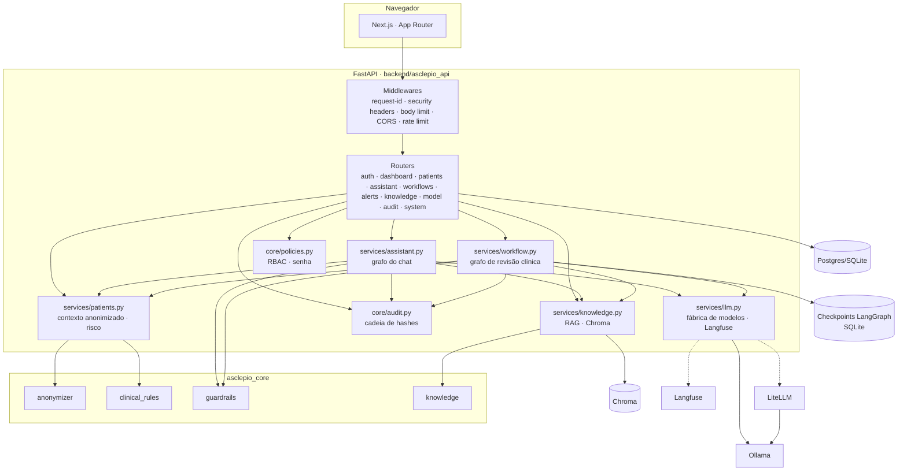
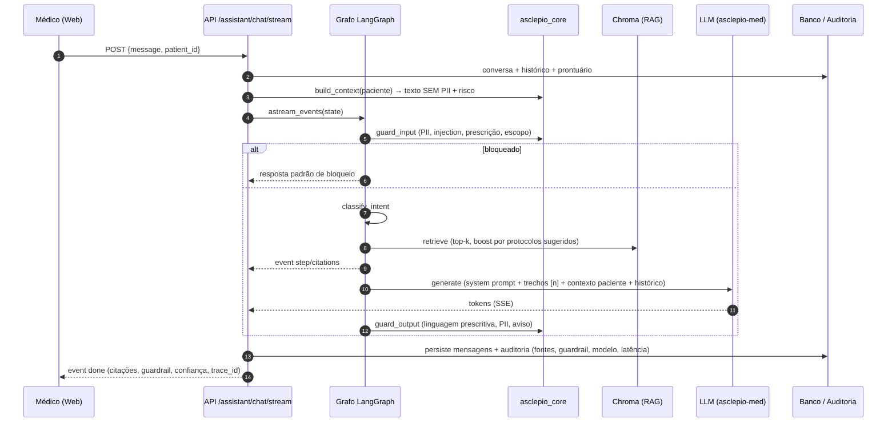
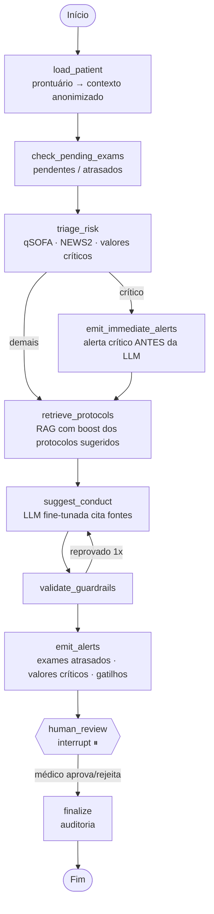

# Arquitetura — Asclépio

## 1. Visão geral

O Asclépio é um **assistente clínico de apoio à decisão** composto por quatro blocos:

| Bloco | Tecnologia | Responsabilidade |
|---|---|---|
| `asclepio_core` | Python puro (pydantic, regex, Faker) | Código compartilhado e **sem dependência de rede**: anonimização de PII, regras clínicas (qSOFA, NEWS2, valores críticos), guardrails, leitura/chunking da base de conhecimento, geração de pacientes sintéticos. |
| `backend` | FastAPI · SQLAlchemy 2 (async) · LangChain 1.x · LangGraph 1.x · Chroma · structlog · slowapi · Prometheus | API REST/SSE, autenticação/autorização, persistência, dois grafos LangGraph (chat e revisão clínica), RAG, auditoria, integração com LLMs. |
| `frontend` | Next.js 16 (App Router) · Tailwind v4 · Recharts · Mermaid | Interface para médicos/enfermagem/auditoria com identidade FIAP. |
| `ml` | transformers · PEFT · TRL · datasets · evaluate | Pipeline de fine-tuning (LoRA), exportação para Ollama e avaliação. |

Serviços de apoio: **Ollama** (serve o `asclepio-med`, o fallback `llama3.1:8b` e os embeddings `nomic-embed-text`), **Postgres** (prontuários, conversas, fluxos, auditoria — SQLite em dev), **LiteLLM** (gateway OpenAI-compatible opcional), **Langfuse** (traces de LLM opcional).

## 2. Diagrama de componentes

## 3. Fluxo do chat (LangGraph)

Grafo (gerado por `graph.get_graph().draw_mermaid()`): [`diagramas/grafo_chat_langgraph.mmd`](diagramas/grafo_chat_langgraph.mmd).

## 4. Fluxo de revisão clínica (LangGraph com validação humana)

Pontos de projeto:
- **Regras antes da LLM**: o risco e os alertas críticos não dependem do modelo — são código determinístico (`asclepio_core.clinical_rules`).
- **Checkpoint persistente**: `AsyncSqliteSaver` em `data/checkpoints/langgraph.sqlite`; o `run_id` é o `thread_id`. A API retoma com `Command(resume=decisão)`.
- **Cada nó registra um passo** (status, duração, resumo, dados) → timeline no frontend e auditoria.
- Grafo gerado: [`diagramas/grafo_revisao_clinica_langgraph.mmd`](diagramas/grafo_revisao_clinica_langgraph.mmd).

## 5. RAG e explicabilidade

1. `asclepio_core.knowledge` lê os `.md` (front matter YAML) e o FAQ JSONL; faz **chunking por seção H2** (máx. 1.400 caracteres, com cabeçalho "Título › Seção").
2. `services/knowledge.py` indexa no **Chroma** (cosine) com embeddings `nomic-embed-text` (Ollama) — ou `DeterministicFakeEmbedding` nos testes. Um *manifest* com hash dos arquivos evita reindexar sem mudanças.
3. A busca devolve `{source_id, title, section, score, chunk}`; os protocolos sugeridos pelas regras clínicas recebem *boost*.
4. O prompt numera os trechos `[n]`; o modelo é instruído a citar e listar "Fontes:". A resposta carrega as citações, e a auditoria guarda os IDs das fontes.
5. Confiança (`alta/media/baixa`) deriva do melhor score e das flags do guardrail.

## 6. Dados

- **Prontuários**: `asclepio_core.synthetic` gera 24 pacientes (cenários dirigidos para os protocolos: sepse, CAD, SCA, AVC, hipercalemia/LRA, IC, hipoglicemia, asma, delirium, anafilaxia, crise hipertensiva, ITU…) com sinais vitais, exames (alguns atrasados/críticos), medicações e evoluções **com PII fictícia** (CPF, telefone, endereço) para demonstrar o anonimizador. O seed ancora os horários no momento da carga.
- **Base de conhecimento**: `data/knowledge_base/` (16 protocolos, 10 modelos, 167 FAQs) — conteúdo fictício/educacional.
- **Dataset SFT**: `data/processed/{train,val,test}.jsonl` gerado por `ml prepare` (ver `DATASET_CARD.md`).

## 7. Observabilidade

- **Logs**: structlog (console em dev, JSON em prod) com `request_id` propagado por `contextvars`; cada evento de auditoria também é logado.
- **Métricas**: `prometheus-fastapi-instrumentator` em `/metrics`.
- **Traces de LLM**: `LLMFactory.run_config()` injeta o `CallbackHandler` do Langfuse (quando habilitado) com `session_id` (conversa/run), `user_id` e tags; o LiteLLM também envia traces (`success_callback: ["langfuse"]`).
- **Health**: `/health` verifica banco, alcance do Ollama, modelo resolvido e nº de chunks indexados.

## 8. Provedores de LLM

`LLM_PROVIDER` = `ollama` (padrão, local) | `litellm` (gateway) | `openai` (qualquer API compatível) | `fake` (testes). A fábrica resolve o modelo pedido (`asclepio-med`) e cai para `LLM_FALLBACK_MODEL` quando ele não existe no Ollama — a UI mostra se o modelo ativo é fine-tunado.

## 9. Deploy

`docker-compose.yml` com perfis: padrão (db, api, web), `ollama` (Ollama + init automático), `gateway` (LiteLLM), `observability` (LiteLLM + Langfuse v3 com ClickHouse/MinIO/Redis, inicialização *headless* com chaves conhecidas), `ml` (pipeline em container). Imagens multi-stage, usuário não-root, healthchecks. `scripts/bootstrap.sh` automatiza tudo.
