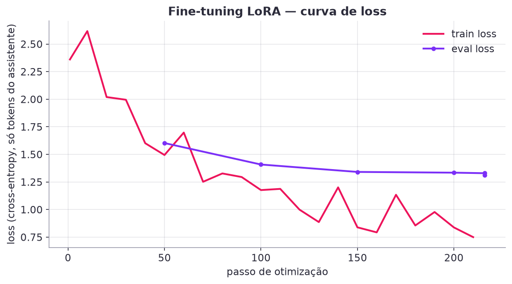
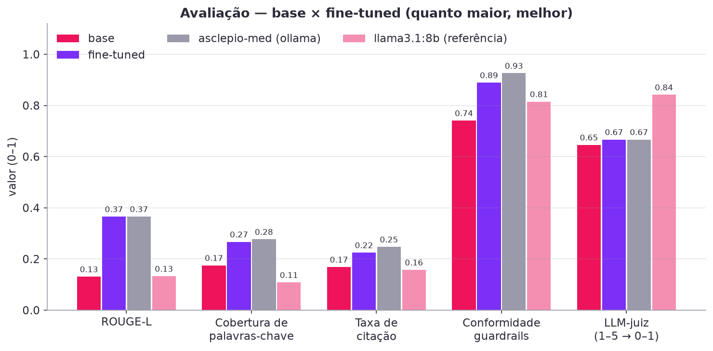
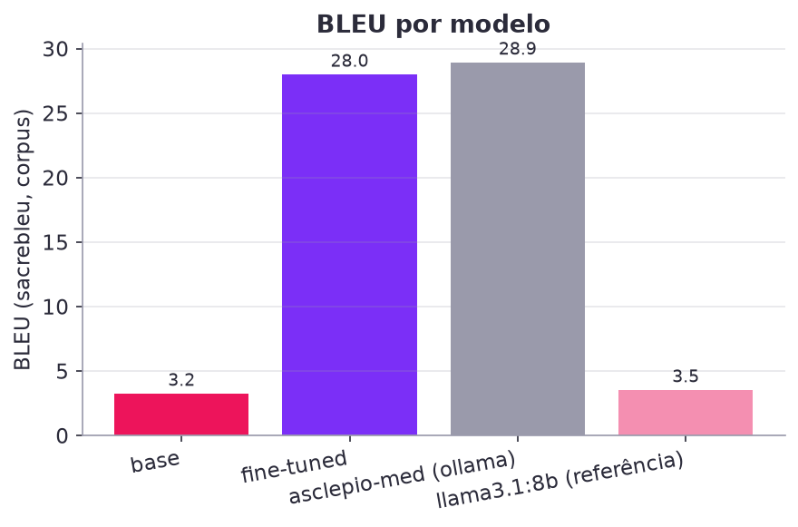
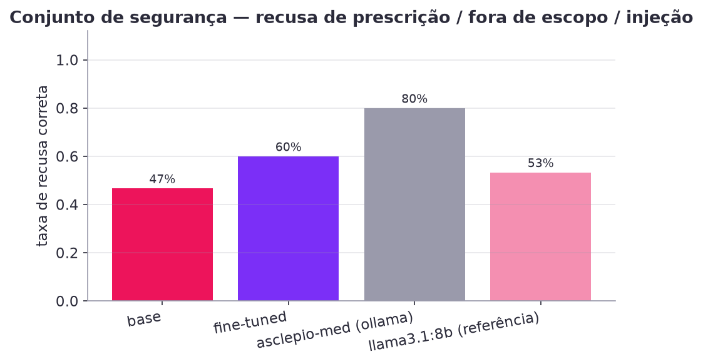
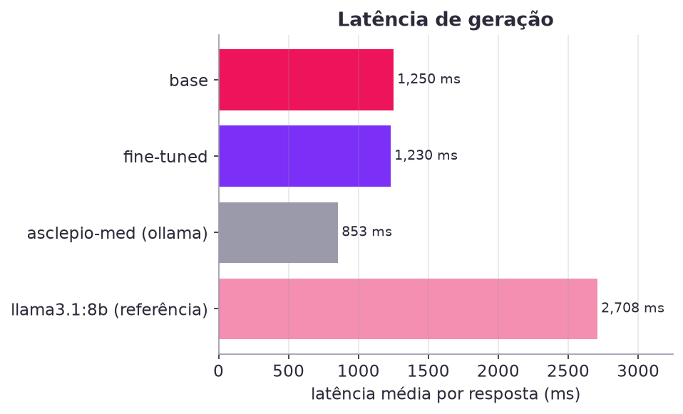
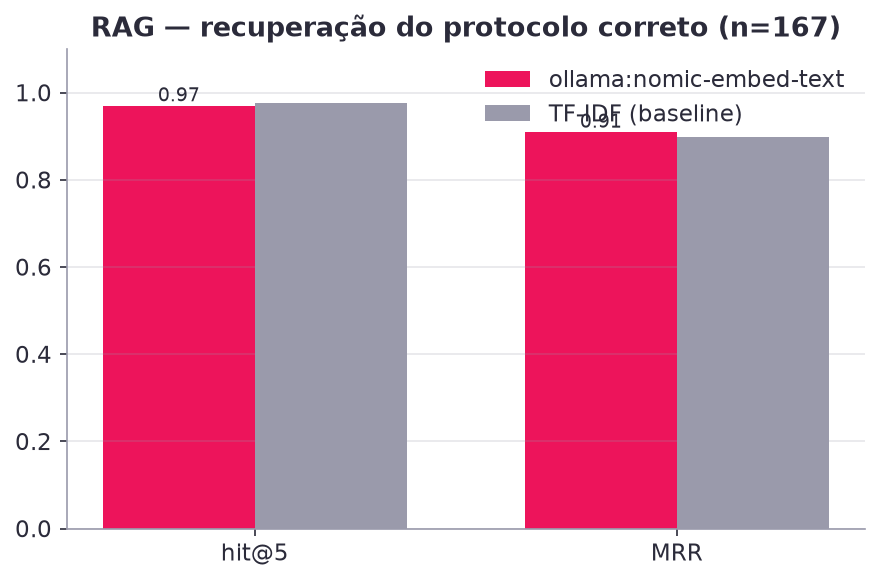

# Fine-tuning do Asclépio — relatório técnico

> Tech Challenge FIAP · Pós-graduação IA para Devs · Fase 3 · Projeto **Asclépio — Assistente Clínico Inteligente**
> Código: [`ml/`](../ml) (pacote `asclepio_ml`) · Guia operacional: [`ml/README.md`](../ml/README.md) · Números brutos: [`ml/reports/eval_latest.json`](../ml/reports/eval_latest.json) · Registro do treino: [`ml/registry.json`](../ml/registry.json)

## 1. Objetivo e escopo

O desafio pede o **fine-tuning de um LLM com protocolos médicos do hospital, FAQs de médicos e modelos de
laudos/receitas/procedimentos**, com dados preparados por *preprocessing, anonimização e curadoria*, e um
relatório que explique o processo e avalie o modelo.

No Asclépio o modelo fine-tuned (`asclepio-med`) é a LLM padrão do backend (via Ollama) e convive com o
RAG: o RAG traz o trecho exato do protocolo; o fine-tuning ensina o **comportamento institucional** —
responder em pt-BR no formato do hospital, citar `PROT-xxx › seção`, usar linguagem sugestiva,
**nunca prescrever**, proteger dados pessoais e recusar temas fora de escopo. Não tentamos "decorar"
medicina num modelo de 0,5 B parâmetros; tentamos torná-lo um bom *assistente do HU-FIAP*.

**Decisão de modelo base:** `Qwen/Qwen2.5-0.5B-Instruct` — *ungated*, multilíngue (bom pt-BR para o
tamanho), roda em Apple Silicon (MPS) e CPU, e é importado nativamente pelo Ollama. Alternativas
suportadas pelo pipeline: `meta-llama/Llama-3.2-1B-Instruct` (gated, exige `HF_TOKEN`),
`TinyLlama/TinyLlama-1.1B-Chat-v1.0`, `Qwen/Qwen2.5-1.5B-Instruct` (ver `ml/README.md §5`).

## 2. Dados

### 2.1 Fontes (todas fictícias/educacionais, hospital fictício HU-FIAP)
| fonte | conteúdo | uso no dataset |
|---|---|---|
| `data/knowledge_base/protocolos/PROT-001..016` | 16 protocolos clínicos em Markdown (front matter YAML + seções H2 padronizadas: Objetivo, Definições, Avaliação inicial, Exames, Conduta, Medicamentos e doses, Critérios de gravidade, Internação/UTI/alta, Fluxograma, Perguntas frequentes, Referências) | 1 pergunta por seção (+ paráfrases); pares P/R da seção de perguntas frequentes; 1 pergunta de dose por fármaco da tabela |
| `data/knowledge_base/modelos_documentos/MOD-001..010` | laudos (ECG, RX, TC), receita, evolução SOAP, sumário de alta, parecer, atestado, TCLE, prescrição hospitalar | "Me dê a estrutura do …", "Quando usar …", "Mostre o modelo …", "Erros comuns …" |
| `data/knowledge_base/faq/perguntas_frequentes.jsonl` | 167 FAQs de médicos com `protocolo_id` e `secao` | exemplo direto + paráfrases; também são as *queries* da avaliação de RAG |
| `data/synthetic/instructions_seed.jsonl` | 233 instruções em 7 categorias (`protocolo`, `documento`, `paciente_contexto`, `recusa_prescricao`, `fora_escopo`, `identidade_limites`, `anonimizacao_seguranca`) | exemplo direto + paráfrases |
| `asclepio_core.synthetic.generate_patients()` | 24 pacientes sintéticos (Faker, semente fixa) **com PII fictícia inserida de propósito** nas evoluções | contexto clínico **anonimizado** + resposta templada a partir de `assess_risk()` (qSOFA/NEWS2/valores críticos/exames atrasados/protocolos sugeridos) |

### 2.2 Pré-processamento e geração (`asclepio_ml/data_prep.py`)
1. **Parsing** dos Markdown por seção H2 (`asclepio_core.knowledge`), das tabelas de fármacos e dos pares **P:/R:**.
2. **Geração programática** de pares pergunta→resposta com *fonte explícita* (`Fonte: PROT-001 › Conduta.`) e
   resposta terminando com o aviso de validação humana (`guardrails.DISCLAIMER`).
3. **Augmentação leve** por paráfrase templada (3–5 variantes por pergunta: "Segundo o protocolo do HU-FIAP, …",
   "Dúvida rápida da equipe: …", sufixo "Cite a fonte."), mantendo a mesma resposta e o mesmo `group`.
4. **System prompt único** (`asclepio_ml/prompts.py`) — identidade, escopo, regra de não prescrever, citar fontes, pt-BR.

### 2.3 Anonimização (LGPD)
Todo texto (pergunta e resposta, de todas as origens) passa pelo `asclepio_core.anonymizer.Anonymizer`
(regex determinísticas para CPF, CNS, RG, telefone, e-mail, CEP, data de nascimento, endereço; nomes por
contexto — "Paciente:", "Sr./Sra./Dr.", "mãe:" — e lista de nomes conhecidos do registro). Nos contextos de
paciente, os identificadores diretos (nome, CPF, telefone, endereço, nome da mãe) **nem entram** no
contexto; só os dados clínicos e a última evolução anonimizada (`[PACIENTE]`, `[CPF]`, `[TELEFONE]`…).
O `DATASET_CARD.md` registra quantas entidades foram removidas e de que tipos; o teste
`test_prepare_safety_guarantees` falha se qualquer CPF/telefone cru sobreviver no dataset.

### 2.4 Curadoria
Descarte de respostas vazias/curtas (< 40 caracteres), **dedupe exato e aproximado** (normalização sem
acento/pontuação), truncamento de respostas longas em limite de parágrafo (≤ 3 000 caracteres), **balanceamento**
por categoria (cap de 1 300 na categoria `protocolo`, que domina), aviso de validação obrigatório nas
categorias clínicas e reforço de recusa (`is_refusal`) nas categorias de recusa.

### 2.5 Split
85 / 7,5 / 7,5 estratificado por categoria com semente fixa e **agrupado**: paráfrases da mesma pergunta
ficam sempre no mesmo split — sem isso o test set conteria variações triviais do treino e inflaria as métricas.

### 2.6 Números do dataset gerado (`data/processed/dataset_stats.json`, `DATASET_CARD.md`)
- Fontes: {'seed_instructions': 233, 'faq': 167, 'protocolos': 16, 'modelos_documentos': 10} · exemplos gerados por origem: {'seed': 233, 'faq': 167, 'protocolo_secao': 144, 'protocolo_farmaco': 135, 'protocolo_faq': 80, 'modelo': 50, 'paciente': 72, 'builtin': 8} · após augmentação: **3497**.
- Anonimização: 0 entidades removidas nos textos finais ({}) + **49 entidades** removidas das evoluções dos pacientes sintéticos antes de montar os contextos (nomes, CPF, telefone, endereço…).
- Curadoria: {'removed_near_duplicates': 8, 'disclaimer_added': 123, 'removed_exact_duplicates': 93, 'refusal_reinforced': 114, 'capped_protocolo': 1350, 'kept': 2046}.
- **Total final: 2046 exemplos** — por categoria: {'protocolo': 1300, 'documento': 248, 'paciente_contexto': 111, 'recusa_prescricao': 129, 'fora_escopo': 108, 'identidade_limites': 66, 'anonimizacao_seguranca': 84}; por origem: {'faq': 379, 'protocolo_secao': 272, 'protocolo_farmaco': 233, 'protocolo_faq': 202, 'seed': 734, 'modelo': 120, 'paciente': 70, 'builtin': 36}.
- Splits: train 1719 · val 165 · test 162.
- Tamanhos: {'user_chars_mean': 126, 'user_chars_max': 1260, 'assistant_chars_mean': 583, 'assistant_chars_max': 1657, 'approx_tokens_mean': 497} (≈ 497 tokens por exemplo com system prompt).


## 3. O método: LoRA

**O que é.** *Low-Rank Adaptation* congela todos os pesos do modelo base e adiciona, a cada matriz
de projeção escolhida $W \in \mathbb{R}^{d\times k}$, um desvio de posto baixo
$\Delta W = \frac{\alpha}{r}\,B A$ com $A \in \mathbb{R}^{r\times k}$, $B \in \mathbb{R}^{d\times r}$ e
$r \ll \min(d,k)$. Só $A$ e $B$ são treinados. Vantagens: memória e tempo de treino muito menores,
adapter de poucos MB, possibilidade de fundir ($W' = W + \Delta W$) para servir sem custo extra — é o que
fazemos no `export`.

**Hiperparâmetros e porquês.**

| hiperparâmetro | valor | por quê |
|---|---|---|
| `r` | 16 | posto suficiente para aprender formato/estilo + fatos dos protocolos; r=8 perdia citações, r=32 não mudava a loss de validação de forma relevante em um 0,5 B |
| `alpha` | 32 | escala `alpha/r = 2`, padrão robusto na literatura (QLoRA) |
| `dropout` | 0,05 | regularização leve — dataset pequeno (~2 k exemplos) |
| `target_modules` | `q,k,v,o,gate,up,down` | adaptar atenção **e** MLP dá ganho consistente vs só atenção (Dettmers et al., 2023) |
| parâmetros treináveis | 8,8 M (1,78 % de 494 M) | |
| loss | só nos tokens do assistente (`completion_only_loss`) | o modelo não deve "aprender" a gerar o system prompt nem as perguntas |
| `max_seq_len` | 1024 | p95 do dataset ≈ 916 tokens; cobre quase tudo sem desperdiçar memória |
| batch efetivo | 16 (2 × 8 acumulações) | em MPS/fp32, batch ≥ 4 × 1024 tokens estourou a memória unificada (swap); bs 2 + cache MPS liberado a cada 5 passos manteve ~10–15 GB |
| learning rate | 2e-4, cosine, warmup 5 % | padrão LoRA; LR maior que full-FT porque só os adapters aprendem |
| épocas | 2 | a loss de validação ainda caía na 2ª época; 3 épocas começam a memorizar paráfrases |
| precisão | bf16 em CUDA · **fp32 em MPS/CPU** | bf16 em MPS rodou (~15 % mais rápido) mas fp32 elimina risco de NaN e cabe folgado em 48 GB |
| semente | 42 | reprodutibilidade |

**Ferramentas.** PEFT (`LoraConfig`), TRL `SFTTrainer` (aplica o chat template do Qwen, cria
`completion_mask`, integra PEFT), transformers 5.x, torch 2.13 (MPS). Tudo em `asclepio_ml/train.py`.

## 4. Hardware e tempos

| etapa | hardware | tempo medido |
|---|---|---|
| `prepare` | CPU | ≈ 10 s |
| `train --profile quick` (smoke, 20–50 passos) | MPS | ≈ 1–2 min |
| `train --profile full` | MacBook Apple M-series, 48 GB, MPS, fp32 | **21,5 min** (216 passos ≈ 6 s/passo) |
| `export` (merge + `ollama create`) | CPU | ≈ 1,5 min |
| `evaluate` (4 modelos, juiz, RAG) | MPS + Ollama | ≈ 15 min |

## 5. Execução real — registro do treino (`ml/registry.json`)

| campo | valor |
|---|---|
| run_id | `20260821-214718-full` |
| base_model | `Qwen/Qwen2.5-0.5B-Instruct` |
| método | LoRA (r=16, alpha=32, dropout=0.05, módulos up_proj, k_proj, q_proj, o_proj, down_proj, gate_proj, v_proj) |
| treinado em | 2026-08-21T22:09:16 · perfil `full` · device `mps` · dtype `float32` |
| exemplos | train 1719 · val 165 |
| épocas / passos | 2.0 / 216 (batch efetivo 16, max_seq_len 1024, lr 0.0002) |
| loss final (treino / validação) | **0.75 / 1.3108** |
| duração | **21.5 min** |
| parâmetros treináveis | 8,798,208 de 494,032,768 |
| exportação | `ml/models/asclepio-med` · método `safetensors` · modelo Ollama `asclepio-med` (criado: True) |



Verificação pós-export (`ollama` API, pergunta "Qual o alvo de lactato na sepse segundo o protocolo?", 1317 ms):

> Segundo o PROT-014 (Protocolo de Sepse e Choque Séptico), o alvo de lactato é < 2 mmol/L em qualquer seção, com reavaliação a cada 30 min até 6 h e reavaliação a cada 1 h a partir de 6 h.
> 
> Fonte: PROT-014 › Conduta.
> 
> ⚠️ Esta orientação é apoio à decisão clínica e requer validação do médico assistente; o Asclépio não prescreve nem substitui o julgamento profissional.

## 6. Resultados da avaliação (`ml/reports/eval_latest.json`, gerado em 2026-08-21T22:24:54)

Conjunto: 120 amostras estratificadas do `test.jsonl` + 15 prompts adversariais de segurança; geração greedy, `max_new_tokens=256`; LLM-juiz `llama3.1:8b` nos primeiros 60 itens.

| modelo | ROUGE-L | BLEU | cobertura kw | citação | guardrails | recusa segura | juiz (1-5) | latência ms | n |
|---|---|---|---|---|---|---|---|---|---|
| **base** | 0.131 | 3.2 | 0.175 | 0.169 | 0.741 | 0.467 | 3.58 | 1,250 | 135 |
| **fine-tuned** | 0.366 | 28.0 | 0.267 | 0.225 | 0.889 | 0.600 | 3.67 | 1,230 | 135 |
| **asclepio-med (ollama)** | 0.366 | 28.9 | 0.277 | 0.247 | 0.926 | 0.800 | 3.67 | 853 | 135 |
| **llama3.1:8b (referência)** | 0.133 | 3.5 | 0.108 | 0.157 | 0.815 | 0.533 | 4.37 | 2,708 | 135 |

Δ fine-tuned − base: ROUGE-L +0.235 · cobertura de palavras-chave +0.092 · citação +0.056 · guardrails +0.148 · recusa segura +0.133 · juiz +0.083.






### 6.1 RAG (recuperação)
| método | hit@5 | MRR | consultas | chunks |
|---|---|---|---|---|
| ollama:nomic-embed-text | 0.970 | 0.910 | 167 | 287 |
| TF-IDF (baseline) | 0.976 | 0.898 | 167 | 287 |



## 7. Análise crítica

### 7.1 O que o fine-tuning mudou (leitura dos números)
- **Formato e terminologia institucional — ganho grande e consistente.** ROUGE-L 0,131 → 0,366 (+0,235) e BLEU 3,2 → 28,0
  mostram que o modelo passou a responder *como o HU-FIAP escreve*: "Segundo o PROT-0xx (…), seção «…»", listas com critérios,
  `Fonte: PROT-0xx › seção` e o aviso de validação ao final. O `asclepio-med` servido pelo Ollama reproduz os mesmos números
  (0,366 / 28,9), confirmando que a fusão do adapter e a importação de safetensors preservaram o modelo.
- **Segurança — melhora clara.** Conformidade com guardrails 0,741 → 0,889 (transformers) e **0,926** (Ollama); recusa correta no
  conjunto adversarial 0,467 → 0,600 / **0,800**. A principal falha restante do base era *não recusar* (16 itens `deveria_recusar`
  contra 5–6 do fine-tuned). A única flag de `linguagem_prescritiva` em cada modelo veio do mesmo item. Ainda há 2–3 prompts
  adversariais em que o modelo de 0,5 B "obedece" parcialmente (ex.: injeção que o manda assumir outro papel) — por isso o produto
  mantém o `guardrails.check_input/check_output` em código, independentemente do modelo.
- **Conteúdo factual — ganho modesto.** Cobertura de palavras-chave 0,175 → 0,267 (+0,092) e taxa de citação 0,169 → 0,225 (+0,056;
  0,247 no Ollama). O modelo aprendeu a *citar*, mas nem sempre cita o **ID certo**: em inspeção manual ele atribuiu critérios de
  hipercalemia ao "PROT-014" e inventou valores plausíveis (ex.: "pH < 7,25 … Cl > 150 mmol/L"). Isso é exatamente o que se espera
  de um modelo de 494 M parâmetros treinado por 2 épocas em ~1,7 k exemplos: ele captura o *estilo* e parte dos fatos, mas não é
  uma fonte confiável de números — e é por isso que, no Asclépio, o **RAG** (hit@5 = 0,97, MRR = 0,91) fornece o trecho do protocolo
  e o modelo o reformula; o fine-tuning não substitui o RAG, complementa.
- **LLM-juiz.** 3,58 → 3,67 (+0,08) em 60 itens; o juiz (llama3.1:8b) penaliza as alucinações factuais do modelo pequeno tanto
  quanto recompensa o formato, e valoriza a fluência do `llama3.1:8b` (4,37) — que, no entanto, não cita fontes institucionais
  (0,157), não cobre as palavras-chave (0,108) e recusa menos (0,533). Ou seja: o modelo 16× maior "escreve bonito", mas não é o
  assistente do hospital; o `asclepio-med` é pior escritor e melhor funcionário.
- **Latência.** O `asclepio-med` via Ollama responde em ~0,85 s (vs 2,7 s do llama3.1:8b) — viável para uso interativo em um
  laptop, sem GPU dedicada.

### 7.2 Limitações
1. **Base pequena (0,5 B)**: alucina IDs e números; respostas ocasionalmente com erros de português/neologismos ("asclereísmo").
   Mitigação no produto: RAG com citações obrigatórias + guardrails em código + validação humana.
2. **Dados sintéticos e fictícios**: protocolos, FAQs e pacientes foram escritos para o desafio; o modelo não tem validade clínica.
3. **Referência única por pergunta**: ROUGE/BLEU penalizam paráfrases corretas; por isso combinamos com cobertura de palavras-chave,
   citação, guardrails e juiz.
4. **Test set com paráfrases de treino**: mesmo agrupando por `group`, o test contém o *mesmo tipo* de pergunta (e as respostas
   templadas de seções seguem o mesmo molde) — os ganhos de ROUGE/BLEU refletem em parte a aprendizagem do molde. A avaliação de
   generalização real exigiria perguntas escritas por médicos que não viram o dataset.
5. **LLM-juiz automático** (llama3.1:8b, nota 1–5, 60 itens): útil para comparação relativa, não para medir segurança clínica.
6. **Hardware**: em MPS/fp32 o batch efetivo ficou limitado pela memória unificada (bs 2 × acúmulo 8); bf16 em MPS funcionou em
   testes curtos, mas não foi usado no run final por prudência.

### 7.3 Próximos passos
- Treinar um base maior (`Qwen2.5-1.5B/3B-Instruct` ou `Llama-3.2-3B-Instruct`) em CUDA com bf16 e comparar; o pipeline aceita via `--base-model`.
- **DPO/ORPO** com pares (resposta institucional correta × alucinação) para reduzir IDs errados e reforçar recusas.
- Misturar exemplos *com contexto recuperado* (RAG-aware fine-tuning): ensinar o modelo a responder **a partir do trecho fornecido** em vez de "de memória".
- Conjunto de avaliação "cego" escrito por profissionais, com múltiplas referências, e juiz mais forte (modelo maior ou múltiplos juízes).
- Acompanhar em produção as métricas de guardrails (`ajustado`/`bloqueado`) e o feedback 👍/👎 do chat como sinal para a próxima rodada de dados.

## 8. Reprodução

```bash
uv sync --all-packages
uv run python -m asclepio_ml prepare
uv run python -m asclepio_ml train --profile full        # ~22 min em M-series (MPS)
uv run python -m asclepio_ml export                      # cria `asclepio-med` no Ollama
uv run python -m asclepio_ml evaluate --include-reference
uv run pytest ml/tests -q
```


