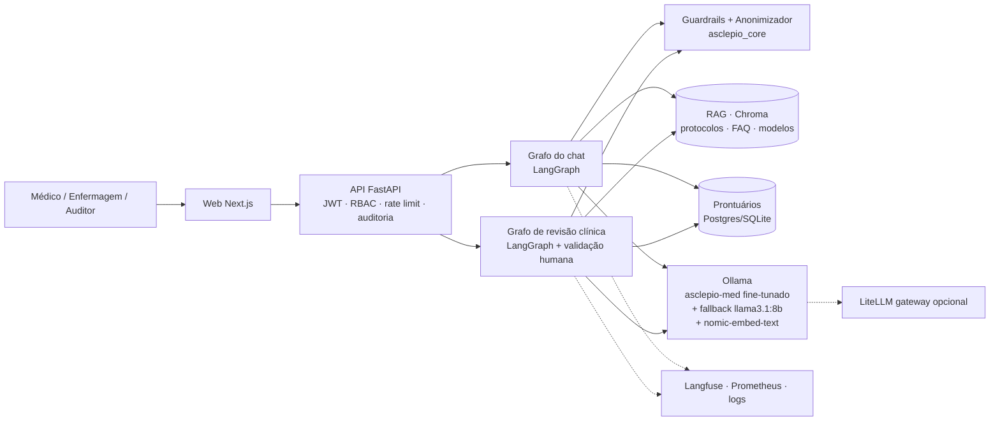
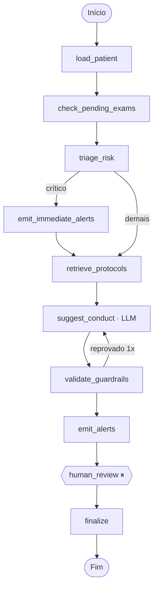

# Relatório Técnico — Asclépio
### Tech Challenge · Fase 3 · FIAP Pós-Tech IA para Devs (8IADT)

> **Hospital Universitário FIAP (fictício)** · Assistente clínico com LLM fine-tunada, LangChain/LangGraph, guardrails, RAG com fontes, anonimização e auditoria.
> Repositório: ver `README.md` · Vídeo: roteiro em `docs/ROTEIRO_VIDEO.md`.

---

## Sumário
1. [Contexto e objetivos](#1-contexto-e-objetivos)
2. [Visão da solução](#2-visão-da-solução)
3. [Dados: base de conhecimento e dados sintéticos](#3-dados-base-de-conhecimento-e-dados-sintéticos)
4. [Pré-processamento, anonimização e curadoria](#4-pré-processamento-anonimização-e-curadoria)
5. [Fine-tuning da LLM](#5-fine-tuning-da-llm)
6. [Assistente médico com LangChain](#6-assistente-médico-com-langchain)
7. [Fluxos automatizados com LangGraph](#7-fluxos-automatizados-com-langgraph)
8. [Segurança, validação e explicabilidade](#8-segurança-validação-e-explicabilidade)
9. [Avaliação do modelo e análise dos resultados](#9-avaliação-do-modelo-e-análise-dos-resultados)
10. [Engenharia: organização, DevEx, testes e operação](#10-engenharia-organização-devex-testes-e-operação)
11. [Limitações e próximos passos](#11-limitações-e-próximos-passos)
12. [Conclusão](#12-conclusão)

---

## 1. Contexto e objetivos

Após automatizar análises de exames e textos clínicos (fases anteriores), o hospital quer um **assistente virtual médico treinado com seus próprios dados** (protocolos, FAQs de médicos, modelos de laudos/receitas/procedimentos), capaz de **auxiliar condutas, responder dúvidas e sugerir procedimentos com base nos protocolos internos**, além de **fluxos de decisão automatizados e seguros** (verificar exames pendentes, sugerir tratamentos, emitir alertas) coordenados com LangChain.

Objetivos de engenharia que adotamos além do edital: ser **didático** (código comentado em pt-BR, docs explicando o porquê), **operável** (`make setup` sobe tudo em Docker), **seguro por construção** (políticas e guardrails em código testável, auditoria imutável) e **honesto na avaliação** (métricas reais base vs fine-tuned, limitações explícitas).

## 2. Visão da solução



O produto combina três mecanismos complementares — e isso é a tese central do projeto:

| Mecanismo | Papel | Por quê |
|---|---|---|
| **Fine-tuning (LoRA)** | Ensina **tom, formato, escopo e vocabulário institucional**: citar fontes, recusar prescrever, encerrar com aviso de validação, conhecer os IDs e a estrutura dos protocolos e modelos de documento. | Modelos genéricos não sabem "como o HU-FIAP fala" nem seus limites. |
| **RAG com citações** | Fornece os **fatos atualizados** (doses, limiares, critérios) dos protocolos, com documento › seção › score. | Conhecimento memorizado por fine-tuning envelhece e alucina números; o RAG é citável e auditável. |
| **Regras + guardrails + humano no circuito** | Decidem risco/alertas de forma determinística e impedem que a LLM prescreva ou saia do escopo; a decisão final é sempre de um médico. | Segurança não pode depender do modelo. |

## 3. Dados: base de conhecimento e dados sintéticos

Todo o conteúdo é **fictício/educacional** (explicitado em cada arquivo), coerente com diretrizes públicas (Surviving Sepsis Campaign, AHA/ACC, SBC, SBD/ADA, GINA/GOLD, AHA/ASA, ATS/IDSA).

| Conjunto | Quantidade | Formato | Uso |
|---|---|---|---|
| Protocolos clínicos (`data/knowledge_base/protocolos/`) | **16** (sepse, SCA, AVC, CAD, PAC, TEV, anafilaxia, crise hipertensiva, IC, LRA, hipoglicemia/controle glicêmico, hipercalemia, asma/DPOC, dor, delirium, ITU) | Markdown com front matter YAML (`id`, `titulo`, `tipo`, `categoria`, `setor`, `versao`, `atualizado_em`, `responsavel`, `tags`) e 11 seções H2 fixas (Objetivo … Fluxograma … Referências) | RAG (chunk por seção) + geração de exemplos de fine-tuning |
| Modelos de documentos (`modelos_documentos/`) | **10** (laudo de ECG, RX tórax, TC crânio, receita, evolução SOAP, sumário de alta, parecer, atestado, TCLE, prescrição padrão) | Markdown, 7 seções (finalidade, quando usar, campos, modelo com placeholders, exemplo, boas práticas, referências) | RAG + fine-tuning (categoria `documento`) |
| FAQ da equipe (`faq/perguntas_frequentes.jsonl`) | **167** pares P/R ligados a protocolo/seção | JSONL | RAG (1 chunk por FAQ) + fine-tuning + **gabarito da avaliação do RAG** |
| Instruções seed (`data/synthetic/instructions_seed.jsonl`) | **233** em 7 categorias (`protocolo`, `documento`, `paciente_contexto`, `recusa_prescricao`, `fora_escopo`, `identidade_limites`, `anonimizacao_seguranca`) | JSONL | Núcleo do dataset SFT |
| Prontuários sintéticos (`asclepio_core.synthetic`) | **24** pacientes com sinais vitais, exames (pendentes/atrasados/críticos), medicações, evoluções — 18 cenários dirigidos aos protocolos + estáveis | Gerados com Faker (pt_BR), semente fixa; PII fictícia **inserida de propósito** nas evoluções | Banco da API, fluxos LangGraph, exemplos `paciente_contexto` |
| Datasets públicos sugeridos no edital (**PubMedQA**, **MedQuAD**) | amostras via `ml prepare --with-public` (75 PubMedQA `pqa_labeled` + 13 MedQuAD após dedupe ≈ 4 % do dataset, teto de 10 %) | HF Datasets (`qiaojin/PubMedQA`, `lavita/MedQuAD`) | Categoria `conhecimento_publico`: respostas marcadas como "conhecimento público, não institucional" + aviso de validação — ensinam o modelo a distinguir protocolo do hospital de literatura geral |

O esquema e a validação dos arquivos estão em `data/knowledge_base/README.md`.

## 4. Pré-processamento, anonimização e curadoria

Pipeline `uv run python -m asclepio_ml prepare` (código em `ml/asclepio_ml/data_prep.py`, reutilizando `asclepio_core`):

1. **Carga** do seed, FAQ, seções de protocolos/modelos (loader com front matter e chunking por H2).
2. **Geração programática** de exemplos: por seção de protocolo ("O que diz o PROT-00X sobre <seção>?"), por FAQ, por modelo de documento e — a partir dos pacientes sintéticos + `assess_risk()` — exemplos `paciente_contexto` cujo gabarito é **calculado por regras** (achados, critérios aplicáveis, sugestões para validação, fontes).
3. **Augmentação leve** por paráfrase templada das perguntas (3–5 variantes).
4. **Anonimização**: todos os textos passam pelo `Anonymizer` (CPF, CNS, RG, telefone, e-mail, CEP, endereço, data de nascimento, nomes por contexto/lista); contagem de entidades removidas vai para o `dataset_stats.json`.
5. **Curadoria**: remoção de vazios/curtos, *dedupe* exato e aproximado (normalização), limite de tamanho, **balanceamento por categoria** (cap), garantia de que respostas clínicas terminam com o aviso de validação (`guardrails.DISCLAIMER`) e que recusas são recusas (`is_refusal`).
6. **Split estratificado** por categoria (85 / 7,5 / 7,5) com semente fixa; formato *chat messages* com o **system prompt do Asclépio** (`ml/asclepio_ml/prompts.py`).
7. **Dataset card** (`data/processed/DATASET_CARD.md`): composição, contagens, % anonimizado, licença/aviso.
8. **Dados públicos** (`--with-public`, usado na execução oficial): amostras de PubMedQA (pergunta + contexto → resposta longa + conclusão) e MedQuAD (P/R de saúde) convertidas para o formato do Asclépio, com fonte explícita ("PubMedQA/MedQuAD — conhecimento público, não institucional"), limitadas a ≤ 10 % para não diluir o comportamento institucional (são em inglês e não citam `PROT-xxx`).

Os mesmos módulos de anonimização e guardrails rodam **em produção** (API) — consistência entre o que o modelo viu no treino e o que encontra em uso.

## 5. Fine-tuning da LLM

**Método**: *Supervised Fine-Tuning* com **LoRA** (PEFT) — adaptadores de baixo posto nas projeções de atenção e MLP (`q,k,v,o,gate,up,down`), treinando ~1 % dos parâmetros, o que permite treinar em um Mac Apple Silicon (MPS) em minutos, sem GPU NVIDIA.

**Modelo base padrão**: `Qwen/Qwen2.5-0.5B-Instruct` (aberto, sem *gating*, suportado pelo Ollama). Alternativas configuráveis: `meta-llama/Llama-3.2-1B/3B-Instruct` (requer token HF), `TinyLlama-1.1B-Chat`. Justificativa no ADR-0003.

**Hiperparâmetros, tempos, loss e hardware reais** estão em `ml/registry.json` e em `docs/FINE_TUNING.md` (gerados pela execução real do pipeline — ver seção 9).

**Exportação**: `merge_and_unload()` → pesos HF → `Modelfile` (system prompt + template + `temperature 0.1`) → `ollama create asclepio-med`. A API detecta o modelo no Ollama e usa fallback `llama3.1:8b` se ele não existir (a UI mostra se o modelo ativo é fine-tunado).

## 6. Assistente médico com LangChain

Implementado como **grafo LangGraph** (`backend/asclepio_api/services/assistant.py`), consumido via REST e **SSE** (streaming de tokens + etapas do grafo):

```
guard_input → classify_intent → retrieve → generate → guard_output → END
      └── (prompt injection) → blocked → END
```

- **Integração da LLM customizada**: `LLMFactory.chat_model()` → `ChatOllama(model="asclepio-med")` (ou LiteLLM/OpenAI-compatible/fake), com callbacks do Langfuse.
- **Consulta a base estruturada**: prontuários em Postgres/SQLite via SQLAlchemy (`services/patients.py`) — sinais vitais, exames, medicações, evoluções, alergias.
- **Contextualização com dados atualizados do paciente**: `build_context()` monta um texto **sem PII** (idade/sexo/setor + clínica + risco calculado por regras + protocolos possivelmente aplicáveis), exibível pelo usuário em "ver contexto anonimizado".
- **RAG**: Chroma (cosine) com `nomic-embed-text`; *boost* para os protocolos sugeridos pelas regras do paciente; trechos numerados `[n]` no prompt; o modelo cita e lista fontes.
- **Memória**: histórico curto da conversa (últimas 6 mensagens) persistido por conversa/usuário.
- **Explicabilidade na resposta**: citações (documento, seção, score, trecho), intenção, guardrail (status/flags/notas), modelo, latência, confiança, PII redigida, `trace_id`.

## 7. Fluxos automatizados com LangGraph

Grafo de **revisão clínica** (`services/workflow.py`), 10 nós, com ramificações condicionais, laço de regeneração e **pausa para validação humana** (`interrupt` + checkpoint SQLite):



| Etapa do edital | Nó(s) |
|---|---|
| Receber informações do paciente | `load_patient` (anonimiza, calcula risco) |
| Verificar exames pendentes | `check_pending_exams` (pendentes/coletados/atrasados por `due_at`) |
| Sugerir tratamentos | `retrieve_protocols` + `suggest_conduct` (LLM fine-tunada cita `[n]`) + `validate_guardrails` |
| Emitir alertas para a equipe | `emit_immediate_alerts` (crítico, antes da LLM) e `emit_alerts` (exames atrasados, valores críticos, gatilhos de protocolo) |
| Coordenação segura | `human_review` (médico aprova/rejeita; enfermagem não pode), `finalize` (auditoria) |

Cada nó grava um **passo** (status, duração, resumo, dados) → timeline na UI e rastreabilidade. O diagrama é gerado pelo próprio LangGraph (`GET /workflows/graph`, `docs/diagramas/`).

## 8. Segurança, validação e explicabilidade

- **Limites de atuação** (`asclepio_core/guardrails.py`): entrada — PII redigida, *prompt injection* bloqueado, pedido de prescrição direta → intenção `prescricao` (recusa + protocolo), fora de escopo → redireciona; saída — linguagem prescritiva imperativa reescrita como sugestão, PII residual redigida, aviso de validação humana obrigatório, sinalização de ausência de fontes. Nos fluxos, a sugestão reprovada é regenerada uma vez.
- **Logging detalhado**: structlog com `request_id` ponta a ponta; **trilha de auditoria append-only com cadeia de hashes** (`GET /audit/verify`), registrando usuário, ação, recurso, fontes usadas, guardrail, modelo, latência, PII redigida; métricas Prometheus; traces no Langfuse.
- **Explainability**: toda resposta traz as fontes (documento › seção › score › trecho); o usuário vê o contexto exato enviado à LLM; a avaliação mede `citation_rate`; a confiança é derivada do score de recuperação e das flags.
- **Autenticação/autorização**: JWT, política de senha, bloqueio por tentativas, RBAC declarativo (ver `docs/POLITICAS.md`).

## 9. Avaliação do modelo e análise dos resultados

<!-- ML_RESULTS_START -->
**Execução real** (`make finetune`, 2026-08-22, Apple Silicon/MPS): LoRA r=16, α=32, dropout 0.05, alvos q_proj, o_proj, v_proj, up_proj, gate_proj, k_proj, down_proj; 8.8 M parâmetros treináveis de 494 M (1.8%); 2 épocas = 226 passos, batch efetivo 16, lr 0.0002, seq. máx. 1024, float32; **1801** exemplos de treino / 165 de validação (inclui amostras PubMedQA/MedQuAD ≤ 10 %); duração **21.74 min**; loss de treino 0.8223 · loss de validação 1.3785. Exportado como safetensors → `ollama create asclepio-med` (ok).


**Avaliação** (2026-08-22T00:20, 120 exemplos de teste *held-out* + 15 prompts de segurança; juiz `llama3.1:8b` em 60 amostras):

| Modelo | ROUGE-L | BLEU | Cobertura de termos | Taxa de citação | Conformidade guardrails | Recusa (seg.) | Juiz LLM (1–5) | Latência média (ms) |
|---|---|---|---|---|---|---|---|---|
| Base · Qwen2.5-0.5B-Instruct | 0.125 | 3.0 | 16.7% | 22.3% | 77.0% | 47% | 3.62 | 1327 |
| **Fine-tuned · asclepio-med (HF merged)** | 0.355 | 26.8 | 23.9% | 31.9% | 95.6% | 87% | 3.68 | 1320 |
| **Fine-tuned · asclepio-med (Ollama)** | 0.364 | 27.6 | 24.1% | 34.0% | 94.8% | 80% | 3.73 | 899 |
| Referência · llama3.1:8b (sem fine-tuning) | 0.124 | 3.8 | 11.8% | 20.2% | 84.4% | 53% | 4.30 | 2701 |


**RAG** (ollama:nomic-embed-text, 287 chunks, 167 perguntas do FAQ como consultas): *hit@5* = **97.0%**, MRR = **0.910** (baseline TF-IDF: hit@5 97.6%, MRR 0.898).


**Leitura dos resultados**
- O fine-tuning **transformou o comportamento** do modelo de 0,5B: ROUGE-L 0.12 → 0.36 (×2.9), BLEU 3.0 → 27.6, cobertura de termos-chave 17% → 24%, taxa de citação 22% → 34%, **conformidade com os guardrails 77% → 95%** e recusa correta no conjunto de segurança 47% → 80%. Ou seja: aprendeu o formato institucional (fonte + aviso de validação), o escopo e os limites — exatamente o objetivo do fine-tuning neste projeto.
- O juiz LLM dá nota ligeiramente maior ao fine-tuned que ao base (3.62 → 3.73) e nota maior ao `llama3.1:8b` (4.30) — um modelo 16× maior raciocina melhor, porém **cita menos, obedece menos aos guardrails (84%) e é ~3× mais lento**. Isso confirma a tese: fine-tuning para forma/segurança + RAG para fatos + guardrails em código; a API permite trocar de modelo quando se quer mais raciocínio.
- O RAG é forte (hit@5 97%) e é ele quem garante os números dos protocolos nas respostas; em produção o `asclepio-med` roda com RAG, o que eleva a qualidade observada além da medida aqui (avaliação sem recuperação, só modelo).
- Limitações: conjunto de teste pequeno e gerado a partir da mesma base (risco de otimismo em ROUGE/BLEU), juiz automático em 60 amostras, modelo pequeno ainda erra detalhes fora do que viu. Tabelas completas, amostras e análise em `docs/FINE_TUNING.md` e `ml/reports/eval_latest.md`.
<!-- ML_RESULTS_END -->

**Metodologia** (`ml/asclepio_ml/evaluate.py`): conjunto de teste *held-out* (estratificado) + conjunto de segurança (pedidos de prescrição, fora de escopo, injeção). Modelos comparados: base (`Qwen2.5-0.5B-Instruct`) × fine-tuned (`asclepio-med`) × referência (`llama3.1:8b`). Métricas: ROUGE-L, BLEU, cobertura de termos-chave (números, fármacos, IDs), taxa de citação, **conformidade com guardrails** (mesmo código do produto), nota de um **LLM-juiz** (rubrica de fidelidade/segurança/clareza), latência. RAG: *hit@5* e MRR com as perguntas do FAQ como consultas e o `protocolo_id` como gabarito.

## 10. Engenharia: organização, DevEx, testes e operação

- **Monorepo** `uv` (core / backend / ml) + frontend Next.js; contrato de API documentado (`docs/CONTRATO_API.md`); ADRs.
- **Testes**: 57+ testes Python (core: anonimização, regras, guardrails, base de conhecimento; API: auth/lockout/RBAC, pacientes sem PII, chat e guardrails, SSE, fluxo completo com aprovação/rejeição, auditoria com detecção de adulteração, RAG, modelo) rodando com `LLM_PROVIDER=fake` — sem rede; testes do pipeline de ML.
- **CI** (GitHub Actions): ruff, pytest com cobertura, eslint/tsc/build, build das imagens, gitleaks e pip-audit. Pre-commit. Dev Container.
- **Operação**: `make setup` → Docker Compose (Postgres, API, Web; perfis Ollama, LiteLLM, Langfuse v3, ML); healthchecks; imagens multi-stage não-root; `.env` com defaults seguros; logs JSON em produção.

## 11. Limitações e próximos passos

- Modelo de 0,5B é limitado em raciocínio clínico; o fine-tuning melhora formato/escopo/segurança, não substitui o RAG. Próximo passo: Llama-3.2-3B/8B com QLoRA em GPU, DPO com preferências de médicos.
- Conteúdo clínico fictício, sem revisão por comissão; guardrails baseados em regras (adicionar classificador treinado e *self-check* do modelo).
- Anonimização por regex + dicionário (adicionar NER clínico pt-BR, ex.: modelos BERTimbau).
- Auth sem MFA/SSO; auditoria local (integrar SIEM); avaliação com mais amostras e juízes humanos.

## 12. Conclusão

O Asclépio atende a todos os requisitos da Fase 3 — fine-tuning com dados institucionais anonimizados e curados, assistente LangChain integrado à LLM customizada e à base estruturada de pacientes, fluxos LangGraph seguros com alertas e validação humana, guardrails, logging/auditoria e explicabilidade — em um pacote reproduzível, dockerizado e documentado, que pode ser demonstrado de ponta a ponta em menos de 15 minutos.
