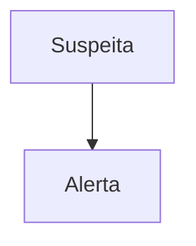

# PROT-001 — Protocolo de Sepse e Choque Séptico

## Objetivo
Padronizar o reconhecimento precoce e o tratamento da sepse no HU-FIAP, reduzindo o tempo porta-antibiótico.

## Definições e critérios diagnósticos
- **Sepse:** disfunção orgânica por resposta desregulada à infecção (aumento ≥ 2 pontos no SOFA).
- **Choque séptico:** sepse com vasopressor para PAM ≥ 65 mmHg e lactato > 2 mmol/L.

## Avaliação inicial
1. Acionar alerta sepse e registrar o tempo zero.
2. Monitorização contínua de PA, FC, FR, SpO2 e temperatura.

## Exames recomendados
- Lactato, 2 pares de hemoculturas antes do antibiótico, hemograma, creatinina.
- Lactato de controle em 2–4 h se inicial > 2 mmol/L.

## Conduta
1. Antibiótico em até 1 hora do reconhecimento.
2. Cristaloide 30 mL/kg nas primeiras 3 h se hipotensão ou lactato ≥ 4 mmol/L.
3. Noradrenalina se PAM < 65 mmHg.

## Medicamentos e doses usuais
| Medicamento | Dose | Via | Observações |
|---|---|---|---|
| Noradrenalina | 0,05–0,1 mcg/kg/min, titular até PAM ≥ 65 mmHg | IV contínua | 1ª linha |
| Hidrocortisona | 50 mg 6/6 h (200 mg/dia) | IV | Choque refratário |
| Ceftriaxona | 1–2 g 1x/dia | IV | PAC sem fatores de risco |

## Critérios de gravidade e alerta
- Lactato > 2 mmol/L (alerta) e ≥ 4 mmol/L (gravidade/UTI).
- PAS < 90 mmHg ou PAM < 65 mmHg.

## Critérios de internação, UTI e alta
- **UTI:** choque séptico; lactato ≥ 4 mmol/L; necessidade de vasopressor.
- **Alta:** afebril ≥ 48 h, estável sem vasopressor ≥ 24 h.

## Fluxograma

## Perguntas frequentes da equipe
**P:** Posso esperar a hemocultura para iniciar o antibiótico?
**R:** Não. Colher antes, mas nunca atrasar o antibiótico além de 45 minutos.

**P:** Qual o alvo de lactato na reavaliação?
**R:** Normalização (< 2 mmol/L) ou queda ≥ 10–20% a cada 2 h.

## Referências
1. Surviving Sepsis Campaign 2021. Material fictício/didático. Dr. João da Silva (revisor).
