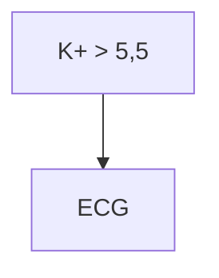

# PROT-012 — Protocolo de Hipercalemia

## Objetivo
Padronizar o manejo da hipercalemia (K+ > 5,5 mmol/L) no adulto internado.

## Definições e critérios diagnósticos
- Leve: 5,5–5,9 mmol/L · Moderada: 6,0–6,4 · Grave: ≥ 6,5 mmol/L ou alterações no ECG.

## Avaliação inicial
1. ECG de 12 derivações imediato.
2. Repetir a dosagem para excluir hemólise.

## Exames recomendados
- Potássio sérico, creatinina, gasometria, ECG.

## Conduta
1. Gluconato de cálcio 10% se alterações no ECG.
2. Insulina regular 10 UI IV com glicose 50% 50 mL.
3. Salbutamol nebulizado 10–20 mg.

## Medicamentos e doses usuais
| Medicamento | Dose | Via | Observações |
|---|---|---|---|
| Gluconato de cálcio 10% | 10 mL em 5–10 min | IV | Estabilização de membrana |
| Insulina regular | 10 UI + glicose 50% 50 mL | IV | Monitorar glicemia |

## Critérios de gravidade e alerta
- K+ ≥ 6,5 mmol/L ou alterações no ECG.

## Critérios de internação, UTI e alta
- **UTI:** hipercalemia grave com alteração eletrocardiográfica.

## Fluxograma

## Perguntas frequentes da equipe
**P:** Preciso de ECG em toda hipercalemia?
**R:** Sim, ECG imediato em todo K+ > 5,5 mmol/L.

## Referências
1. KDIGO. Material fictício/didático.
